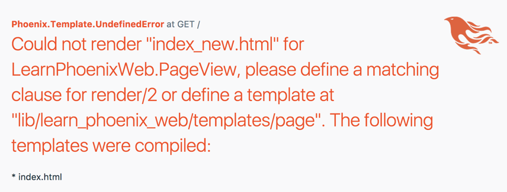
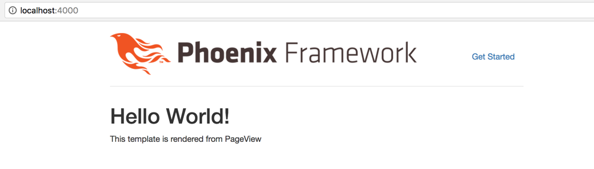
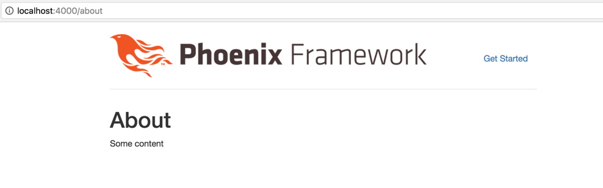

== Control Flow in Phoenix

We haven't done anything with our new Phoenix project yet. Let's try to understand how the welcome page works and then mimic the same to create a new page at http://localhost:4000/about.

My preferred way to read an MVC web app is to start at its router file. This approach makes it easy to understand the control flow of various paths.

The router file for our Phoenix project is at `learn_phoenix_web/router.ex`.

[source,elixir]
.lib/learn_phoenix_web/router.ex
----
defmodule LearnPhoenixWeb.Router do
  ...
  scope "/", LearnPhoenixWeb do
    pipe_through :browser

    # => Focus just on this line below and ignore everything else
    get "/", PageController, :index <1>
  end
  ...
end
----
<1> Router definition for homepage `/`

If you are familiar with any MVC framework, you might have at least guessed what this line of code means:

[source, elixir]
----
get "/", PageController, :index
----

It basically says, for any request coming to `/` path (i.e., homepage), call the `index` function of the `PageController`. The controller functions that are mapped in the router for a specific path are also called controller `actions`.

Our `PageController` defined at `learn_phoenix_web/controllers/page_controller.ex` looks like this now:

[source, elixir]
----
defmodule LearnPhoenixWeb.PageController do
  use LearnPhoenixWeb, :controller

  def index(conn, _params) do
    render conn, "index.html"
  end
end
----

The `index` action receives the control from router and it renders the `index.html` file.

Again if you are coming from Rails or another MVC frameworks, you might guess that this file exists in the `views` folder. However, it turns out that our `learn_phoenix_web/views` folder does not have any html template files. Rather it contains a file called `page_view.ex` which defines `PageView` module.

Looking around in the other generated directories, it's easy to find the `index.html.eex`. It lives inside the directory `learn_phoenix_web/templates/page/`. The contents of the file also confirms that it's the same as the one that we see in the homepage.

[NOTE]
.Naming conventions
====
The render function within the `PageController` knows where to find the template `index.html` in our project directory by following the Phoenix convention.

. The `learn_phoenix_web.ex` file present in our project folder at `lib/` defines the template root folder as `learn_phoenix_web/templates`.
. When the `render` function in the controller is given a template name without any additional clue, Phoenix tries to find the appropriate View module by adding the `View` suffix to the current controller's name.
+
Our controller name in this case is `PageController` so Phoenix will look for the View module in the name `PageView`.
. The View modules know where to find the template files by looking into the subdirectory named after the View module inside the template's root path.
+
Since our View module name is `PageView`, Phoenix will look for templates in the folder `learn_phoenix_web/templates/page/`
====

At this point it might be difficult to understand the purpose of `PageView` module as it is almost empty.

.lib/learn_phoenix_web/views/page_view.ex
[source, elixir]
----
defmodule LearnPhoenixWeb.PageView do
  use LearnPhoenixWeb, :view
  # nothing here
end
----

While it's tempting to conclude that `PageView` does _nothing_, that is not correct. To understand it, let's change the render function call in our `PageController` module as below:

[source, elixir]
----
defmodule LearnPhoenixWeb.PageController do
  use LearnPhoenixWeb, :controller

  def index(conn, _params) do
    render conn, "index_new.html" # Change the template name
  end
end
----

Now if we visit the homepage, we are obviously greeted with an error. This error is however helpful to understand what is happening under the hood.

A layman's translation of the error message is below:

****
* I looked for a `render/2` function in LearnPhoenixWeb.PageView but I couldn't find it.

* I then looked for a template `index_new.html.eex` inside `learn_phoenix_web/templates/page` and I couldn't find it either.

* So I've no other option except throwing this error.
****

[NOTE]
====
It’s common to see function names referred to in the format `render/2` as shown in the error message above.

The number after `/` refers to the number of arguments that the function accepts, which is called the function's arity.
====

Now instead of creating a new template `index_new.html.eex` in the template folder, let's create a new function `render/2` in our `PageView` module as below:

[source, elixir]
.lib/learn_phoenix_web/views/page_view.ex
----
defmodule LearnPhoenixWeb.PageView do
  use LearnPhoenixWeb, :view

  def render("index_new.html", _) do
    {:safe, """
    <h1>Hello World!</h1>
    
This template is rendered from PageView

    """}
  end
end
----

Now going back to our homepage, we should see the new message displayed as given in our `PageView` module.

We will now remove this `render` function from the `PageView` module and add just the html to a new `index_new.html.eex` file inside `learn_phoenix_web/templates/page`. Back to the browser, the result is the same.

So what is happening here? It's Phoenix magic powered by Elixir's metaprogramming feature.

When we call `render(conn, "index_new.html")` from our `PageController` we are calling a function defined in the `Phoenix.Controller` module. It then calls `render("index_new.html", _)` defined inside our `PageView` module.
But we have just removed this function from the module. So it's not there to be called and we expect an error.

Here is the nice little trick that Phoenix does.
During compilation process, it looks for any template files in the template folder ending in `.eex` suffix.
It then takes out the contents of each of these files and creates a `render/2` function in the respective View modules similar to what we have created.

[sidebar]
.Why does Phoenix do this?
--
That little trick aside, why does Phoenix do this? Having HTML in a separate template file it is easy to manage but reading and rendering it for every page request involves a disk-read which is slow. Having the HTML code inside our function definition is ugly and not easy to maintain but a function call is faster than a disk read. Can we have the best of both worlds? The speed of a function call and at the same time the clarity and ease of a template file?

That's pretty much the goal of this Phoenix trick. It allows you to write HTML in template files then converts it to a function during the compilation process. This also explains why we need the `PageView` module even though it looks empty; because it's this module where the template eventually gets converted into a function.
--

To summarize, the sequence of events happening when you visit http://localhost:4000/ are:

* The router checks if the incoming request path is for `/` and calls the `index` action in the `PageController` module.
* The `index` action on the controller calls the `Phoenix.Controller.render(conn, "index.html")` function. Since the module `Phoenix.Controller` is imported in all controllers, we are calling the function `render` without the module name prefix. If you are new to Elixir and don't know what `import` is, you will learn it in the next Chapter.
* `Phoenix.Controller.render/2` calls a similarly named `render/2` function in `PageView` containing the compiled code from the template file `index.html`. The result of this function call is then displayed on the browser.

Now armed with this knowledge, let's create a new page at `/about`. Based on knowledge gained so far, we know we need to do the following  to complete our task:

* Router
** modify router to map the new path `/about` to a function in a `PageController`. Let's call this function `about`
* Controller
** create a new function `about/2` in our controller. It should call the `render/2` function with the template name `about.html`
* View
** since `PageView` module already exists, we don't have to create it again.
** define a new template `about.html.eex` inside `learn_phoenix_web/templates/page` folder and add the HTML content.

Let's modify the router as below to create a static page at http://localhost:4000/about.

.lib/learn_phoenix_web/router.ex
[source, elixir]
----
scope "/", LearnPhoenixWeb do
  pipe_through :browser

  get "/", PageController, :index  # => Add this line below.
  get "/about", PageController, :about
end
----

Modify our `PageController` and add a new function as below:

.lib/learn_phoenix_web/controllers/page_controller.ex
[source, elixir]
----
defmodule LearnPhoenixWeb.PageController do
  use LearnPhoenixWeb, :controller

  (...)

  def about(conn, _params) do
    render conn, "about.html"
  end
end
----

Inside our `learn_phoenix_web/templates/page`, create a new file `about.html.eex` and add some HTML data.

[source, html]
----
<!-- web/templates/page/about.html.eex -->
<h1>About</h1>

Some content

----

Now back to the terminal and run `mix phx.server` if it's not already running. Let's open http://localhost:4000/about in our browser to see the message we added in our template file.

We have now learned how the request for a web page flows through various parts of our Phoenix app and how to create a new static page in our application.
