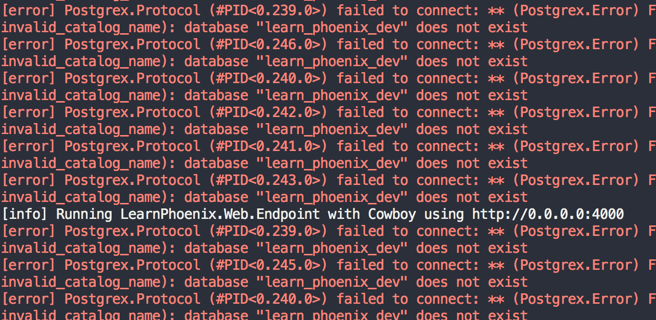

== Create a New Phoenix project

In this section, we will quickly run through the steps required to create a new Phoenix project and add a new page to it.
This exercise is to quickly glance at the various moving parts of Phoenix and not to master them. So don't worry if you find it difficult to understand the code or if all this seems too fast paced. We will spend adequate time in the rest of the book to build understanding.

Let's create a new Phoenix project using the mix generator command `phx.new`. It is the new sub command to `mix` binary that gets added when we installed the Phoenix generator in section 1.1.8.

Open up your terminal and run the following code.

[source,bash]
----
→ mix phx.new learn_phoenix
----

This command creates a new folder `learn_phoenix` in your present working directory. In my case, my `pwd` is `~/pio` and the new Phoenix project is initialized in `~/pio/learn_phoenix` folder.

You will be prompted to either download the dependencies or skip them as below.

[source,bash]
----
Fetch and install dependencies? [Yn]
----

Choose "Y" to download the dependencies. The installer will then proceed to download all required Elixir libraries from https://hex.pm (the official package manager site for Elixir projects). It will also download nodejs packages from https://npm.org, specifically Brunch and its friends which are used for assets management in Phoenix.

[source,bash]
----
* running mix deps.get
* running npm install && node node_modules/brunch/bin/brunch build

We are all set! Run your Phoenix application:

    $ cd learn_phoenix
    $ mix phx.server

You can also run your app inside IEx (Interactive Elixir) as:

    $ iex -S mix phx.server

Before moving on, configure your database in config/dev.exs and run:

    $ mix ecto.create

----

For now, it will suffice to know that the `mix phx.new` command has downloaded several Elixir libraries in your project's `deps` folder and also downloaded several nodejs packages in `assets/node_modules`.

====
NOTE: It's important to note that all dependencies are installed in `deps` folder inside our project folder including `phoenix` i.e., the Phoenix framework is installed locally per project and not system-wide.

However, the Phoenix new project generator that we installed in the previous section is a system-wide installation that gives us the command `mix phx.new`.
====

image::images/_new-project-bb07d.png[]

The contents of the `assets/node_modules` directory is too big to show here in full and not very relevant to what we are learing.

Now run `mix phx.server` from inside the project directory.

.~/pio/learn_phoenix
[source,bash]
----
→ mix phx.server
----

This will take some time as Elixir compiles all the Elixir source code from our project and its dependencies into `.beam` files. Once compiled, you will see the following message on your terminal.

There are several error messages and then a line that reads

----
[info] Running LearnPhoenixWeb.Endpoint with Cowboy using http://0.0.0.0:4000
----

Let's ignore those errors for now and open our browser to http://localhost:4000. We will be greeted with Phoenix welcome page:

image::images/_new-project-5a103.png[]

Now back to the errors that we saw in the terminal. Our application is trying to connect to a Postgres database which doesn’t exist.

Let's fix this error. Hit CTRL+c twice in the terminal running Phoenix server to stop it. Open `config/dev.exs` file in your editor and check if the Postgres login credential given are correct and Phoenix has the privilege to create a new Postgres database.

.config/dev.exs
[source,bash]
----
config :learn_phoenix, LearnPhoenix.Repo,
  adapter: Ecto.Adapters.Postgres,
  username: "postgres",
  password: "postgres",
  database: "learn_phoenix_dev",
  hostname: "localhost",
  pool_size: 10
----

If our local PostgreSQL username is `postgres` and password is `supersecret`, we need to change the database configuration in `config/dev.exs` file (shown above) to reflect the same.

.config/dev.exs
[source,bash]
----
# Change this only if your credentials are different
...
  username: "postgres",
  password: "supersecret",
...
----

However, if you followed the instructions to create Postgres superuser as previously explained in section 1.1.3, you don't have to make any change in the `config/dev.exs` file.

After the database connection details have been configured correctly, we can now run `mix ecto.create` to create a database for our Phoenix app and then run `mix phx.server`. This time we won't see those db connection errors as our Phoenix application is now able to connect to the database.

.~/pio/learn_phoenix
[source,bash]
----
→ mix ecto.create
→ mix phx.server
----
