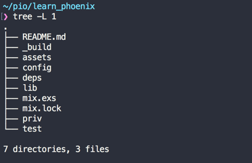
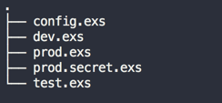
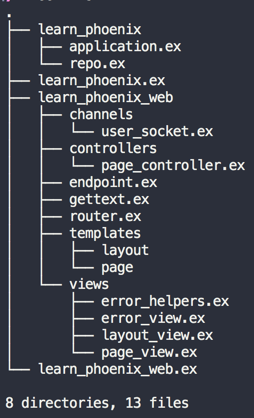

== Phoenix File Structure

Our `learn_phoenix` directory looks like this:

=== Assets and Priv

The top level directory `assets` contains css, js, images, fonts and any other static files within respective sub folders. While the `assets` directory contains the original source code for our assets, the `priv` directory contains the compiled version of the same asset files. The `priv` directory is also the place where translation files and database migration files get stored. We will dig into these files more in the coming chapters.

.What is `priv`?
****
> "priv" is like "OTP" where its name made sense at the beginning but today it has grown beyond that. All it matters now is that we put in the "priv" directory any artifact that you need in production alongside your code.
-- José Valim
****

=== Config

The `config` directory contains files that store various configurations for our project like the database credentials, port number of the web server etc. Phoenix projects by default are configured to support three different environments -- `dev`, `test`, `prod`.

Configuration files for each of these environments are present in the `config` directory as shown below:

=== Test

The `test` directory contains the various test code for our projects. We will create files in this directory when we start with Test Driven Development.

=== Lib

The `lib` folder contains our project's main code.

We will spend most of our time within the `lib` directory. All code that is specific to our project belongs here. This directory contains two subdirectories: first with the same name as our project and the second with a `web` suffix to our project name i.e., `lib/learn_phoenix` and `lib/learn_phoenix_web`

The `learn_phoenix_web` directory is the home of the web interface specific code for our project.
That is, the `learn_phoenix_web` directory contains code for starting web server, defining routes, controllers, HTML templates etc.

All non-web related code go into the `lib/learn_phoenix` directory. This includes the context and schema files for our project. We will look into these in detail in Chapter 3.

[NOTE]
====
Module names are nested in Phoenix just like the folder structure. From now on, we will refer to long module names such as `LearnPhoenixWeb.PageController` by their base name i.e, `PageController` in this case, unless there is any ambiguity in understanding similarly ending module names. We will continue retaining the full name in code examples.
====
