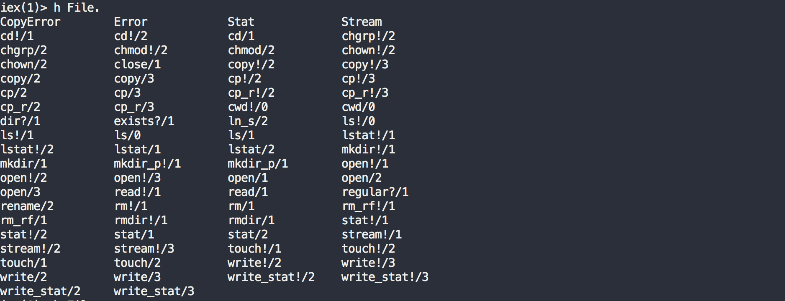
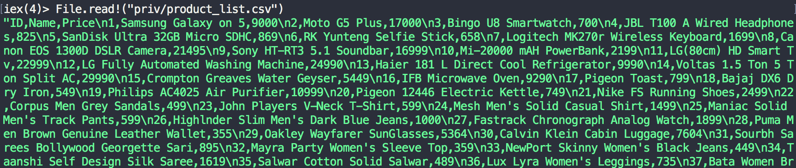
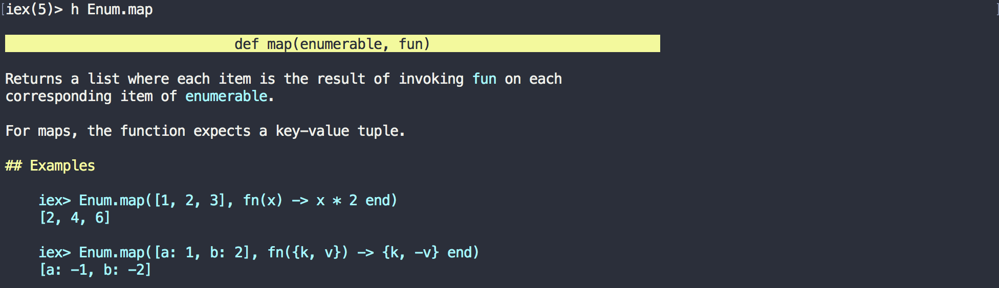

== Adding external library as dependency

Our `list_products/0` function in `LearnPhoenix.Catalog` module currently returns a List of hard-coded product structs.
In this section, let's change this behavior by having the function return a List of products parsed from a CSV file containing information about 100 products.

We will use the `nimble_csv` library to parse the CSV file contents. You can read the docs for `nimble_csv` at http://hexdocs.pm/nimble_csv/NimbleCSV.html

Since our project is going to depend on this library for parsing the CSV file, we need to declare this dependency in our `mix.exs` file. Open the `mix.exs` file and modify `deps` function as below

[source,Elixir]
----
  defp deps do
    [
      (...)
      {:nimble_csv, "~> 0.1.0"}
    ]
  end
----

Now run `mix deps.get` to actually download the `nimble_csv` library from hex.pm website.

----
→ mix deps.get
Running dependency resolution...
Dependency resolution completed:
  nimble_csv 0.1.1
* Getting nimble_csv (Hex package)
  Checking package (https://repo.hex.pm/tarballs/nimble_csv-0.1.1.tar)
  Fetched package
----

Let's open up `iex -S mix` to play with our newly added library. As per the http://hexdocs.pm/nimble_csv/NimbleCSV.html[documentation], the following code parses a CSV string into an Elixir list.

[source,Elixir]
----
iex> alias NimbleCSV.RFC4180, as: CSV
iex> CSV.parse_string "name,age\nchaaru,6\nnittin,13"
[["chaaru", "6"], ["nittin", "13"]]
----

`NimbleCSV.RFC4180` is a module defined by the `nimble_csv` library. We alias it to `CSV` so that it's short and reads better.  We then use the `parse_string/0` function to parse a string containing three lines of CSV content separated by two line breaks `/n`. As seen above,  `parse_string/0`  ignores the first line as the CSV header and returns the rest of the content as a nested list. That is, it returns a List of lines where each line is again a List of all the comma separated values of that line.

Now that we know how to parse a CSV formatted string, our next task is to parse the product information from our CSV file which looks like below:

,===
ID,Name,Price

1,Samsung Galaxy on 5,9000
2,Moto G5 Plus,17000
3,Bingo U8 Smartwatch,700
4,JBL T100 A Wired Headphones,825
5,SanDisk Ultra 32GB Micro SDHC,869
6,RK Yunteng Selfie Stick,658
7,Logitech MK270r Wireless Keyboard,1699
8,Canon EOS 1300D DSLR Camera,21495
9,Sony HT-RT3 5.1 Soundbar,16999
10,Mi-20000 mAH PowerBank,2199
,===

You can https://gist.github.com/shankardevy/7097599b4e4c707a397844da689948d3[download] this CSV on GitHub. Move the downloaded CSV file to  `priv/product_list.csv` within our project.

One of the benefits of the Elixir pipe operator is that it helps us think clearly step by step for any given problem. The mental model of this task represented by Elixir pipes is as follows.

----
read the file contents
|> parse contents
|> convert nested_list to list of product structs
----

The beauty of this mind piping (similar to mind mapping) is that it breaks the problem into smaller units and clearly shows the order in which we need to solve each step. The above pseudo code represents our steps to solve the problem and it's also the structure of our solution. Let's see how. Modify our `list_products/0` function with this pseudo code. We know how to parse a CSV string, so we will replace step 2 pseudo code with real code.

[source,Elixir]
----
  def list_products do
    alias NimbleCSV.RFC4180, as: CSV

    read_the_file_content
    |> CSV.parse_string
    |> convert_to_list_of_product_struct
  end
----

Our imaginary `read_the_file_content` function reads the CSV file and returns the output to `CSV.parse_string/1`. The `CSV.parse_string/1` parses the contents and transforms it into a List of lists. The output from `CSV.parse_string/1` is then piped into `convert_to_list_of_product_struct` which transforms the _"List of lists"_ to _"List of product structs"_.

Elixir's standard library comes with functions to work with files. These functions are available from the `File` module.  We can make use of `iex` to learn about the `File` module and its functions.

[NOTE]
====
In an `iex` session, type in `h File.` and press tab. This will list all functions in `File` module.
====

The function that we particularly need for this task is `File.read!/1` . Let's try out this function in `iex`. Run `File.read!("priv/product_list.csv")`

The function reads our file contents and returns a string, which is exactly what we need for our `CSV.parse_string/0` function. The last piece in our puzzle is to convert the parsed result to a list of product structs. We will use `Enum.map/2` for this task. Let's look up its documentation on `iex`

The function receives two arguments, the first one is a list and the second one is a function. Each item from the List gets passed to the function and the return values from this function forms a new List. Our completed function looks like below:

[source,Elixir]
----
  def list_products do
    alias NimbleCSV.RFC4180, as: CSV
    "priv/product_list.csv"
    |> File.read!
    |> CSV.parse_string
    |> Enum.map(fn [id,name,price] ->
        %Catalog.Product{id: id, name: name, price: price}
    end)
  end
----

`Enum.map/2` receives the list of products and in this case each product is again a list. We use pattern matching to deconstruct our list into named variables and use them to create our product struct. This results in a new list containing product structs.
