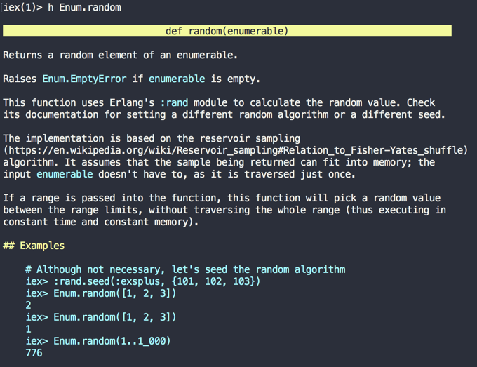
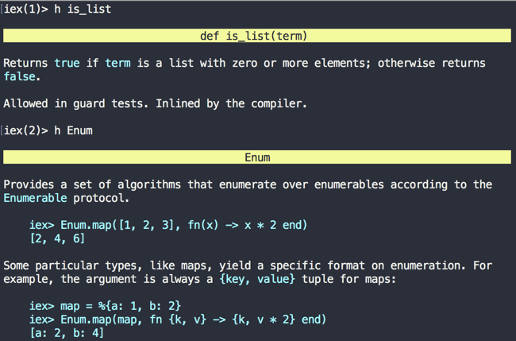

==  Modules and functions
Though modules and functions can be written directly in `iex`, it's convenient to write them in normal Elixir files and then execute them in the `iex` shell.

We will use the Phoenix project created in the first chapter to start writing modules and functions.

=== Module
A Module in Elixir is used to group a bunch of functions doing logically related tasks. A module is defined using the syntax `defmodule` followed by the module name and a `do.. end` block.

[source,elixir]
----
defmodule ModuleName do
end
----

From the Elixir docs:

> What is called a module name is an uppercase ASCII letter followed by any number of lowercase or uppercase ASCII letters, numbers, or underscores.

Module names should begin with an initial capital letter and by convention use CamelCase. By the above rule, `myModuleName`, `111Module` are invalid as they don't begin with uppercase ASCII letters. `My_Module_name` is a valid module name but we will rarely see an Elixir library using this notation as the convention is to use CamelCase. So instead of snake_case `My_Module_name`, we will use CamelCase `MyModuleName`.

Let's create a new module `Catalog` in our `learn_phoenix` app at `lib/learn_phoenix/catalog.ex` with the code below:

[source,elixir]
----
defmodule Catalog do
end
----

We have now successfully created a new module but it doesn't do anything useful yet. So let's look into writing some functions to do something useful.

=== Function

We define functions inside of a module using the syntax `def` or `defp` followed by the function_name, followed again by a `do...end` block. Functions defined using `def` are public functions whereas those defined with `defp` are private functions.

Public functions can be called from outside the module defining them whereas private functions can only be called within the module that defines them.

Let's create a public function in our `Catalog` module to list some products.

[source,elixir]
----
defmodule Catalog do
  def list_products do
    ["Tomato", "Apple", "Potato"]
  end
end
----

The function `list_products` returns a List containing three product names. Like Ruby, functions don't have an explicit return statements. The output of the last executed line of a function is its return value. In the above case, the last executed line is the List of 3 elements and the same is returned by the function.

Let's try calling our function in the `iex` shell. This time we will run `iex` with `-S mix` argument from inside our project folder.

----
iex -S mix
----

The above command runs the `iex` shell as usual but additionally compiles all the modules in our `learn_phoenix` project and makes them available in our shell.

----
iex(1)> Catalog.list_products()
["Tomato", "Apple", "Potato"]
----
The parenthesis after the function name is optional.

----
iex(1)> Catalog.list_products
["Tomato", "Apple", "Potato"]
----

Let's write another function in the `Catalog` module that returns a random product from the list.

[source,elixir]
----
defmodule Catalog do
  ...

  # Add this new function.
  def random_product(list) do
    Enum.random(list)
  end
end
----

Before I explain what is happening here, let's go back to `iex` and call this new function.

----
iex(2)> Catalog.random_product(Catalog.list_products)
** (UndefinedFunctionError) function Catalog.random_product/1 is undefined or private
    Catalog.random_product(Catalog.list_products)
----

We are greeted with `UndefinedFunctionError`. This is because when we started the `iex` shell, we didn't have this function in our module. `iex` is only aware of the modules and functions that were present when we started it. To reload a module definition, we need to explicitly tell `iex` to recompile the module file.

----
iex(3)> r(Catalog)
warning: redefining module Catalog (current version defined in memory)
  lib/learn_phoenix/catalog.ex:1

{:reloaded, Catalog, [Catalog]}
----

Now we can call our new function as the module is recompiled.

----
iex(4)> Catalog.random_product(Catalog.list_products)
"Apple"    # You may get a different random product
----

Let's go back and study our new function.

[source,elixir]
----
def random_product(list) do
  Enum.random(list)
end
----

`random_product` takes a List as argument and then it calls the `Enum.random` function passing in the List. `Enum.random` is a built-in function that picks a random value from a List. Though our code seems to be working fine, it's brittle because it makes the assumption that the input to `random_product` is always a List data type. What happens if we pass in a string?

----
iex(5)> Catalog.random_product("hello")
** (Protocol.UndefinedError) protocol Enumerable not implemented for "hello"
    (elixir) lib/enum.ex:1: Enumerable.impl_for!/1
    (elixir) lib/enum.ex:146: Enumerable.count/1
    (elixir) lib/enum.ex:1677: Enum.random/1
----

Obviously, the string "hello" is not a List and our function `random` just passed on the input to `Enum.random` without validating the input.
We can correct this now by introducing guard clauses to our function.
Back to the code editor, modify the function as below:

[source,elixir]
----
def random_product(list) when is_list(list) do
  Enum.random(list)
end
----

Guard clauses are written after the function arguments but before the `do` keyword.
In the above code, we are using a function `is_list` to check if the input is of type `List`.
If so, the function returns true otherwise it returns false.
If the guard clause returns false, then the function is ignored and not called.

Recompile the module again in `iex` and try again.

----
iex(8)> r Catalog
warning: redefining module Catalog (current version defined in memory)
  lib/mango/catalog.ex:1

{:reloaded, Catalog, [Catalog]}
iex(9)> Catalog.random("hello")
** (FunctionClauseError) no function clause matching in Catalog.random/1
    lib/mango/catalog.ex:6: Catalog.random("hello")
----

While the guard clause prevented the function from being called, it just resulted in a no function match error.
What we ideally want is to return a tuple with two elements `{:error, "Not a list"}` when we give a non-List value as the argument.
While we work at this, we also need to handle the case when `random_product` function is called without any argument. In this case it should return a tuple `{:error, "Need a List of products as argument"}`

Go back to editor add two new functions.

[source,elixir]
----
defmodule Catalog do
  ...

  def random_product(list) when is_list(list) do
    Enum.random(list)
  end

  # Add these two new functions.
  def random_product(_) do
    {:error, "Not a list"}
  end

  def random_product do
    {:error, "Need a List of products as the argument"}
  end
end
----

At first glance, this new addition looks like an error. How can we have multiple function definitions with the same name? Doesn't one overwrite the other?
In Elixir this is valid code and it doesn't overwrite anything.
We can write multiple functions with the same name as long as these functions either take different arguments or have different guard clauses.

Let's now try all possible scenarios in `iex` shell.

----
iex(10)> Catalog.random_product("hello")
{:error, "Not a list"}
iex(11)> Catalog.random_product()
{:error, "Need a list of products as argument"}
iex(12)> Catalog.random_product(Catalog.list_products)
"Tomato"
----

=== Function Arity

So far we have referred to functions by just their name. But the proper way to refer to Elixir functions is _function name followed by `/` followed by a numeral_ which refers to the number of arguments the function accepts.
The proper way to refer to our functions is

* `Catalog.list_products/0`
* `Catalog.random_product/0`
* `Catalog.random_product/1`

Notice that there is no way to differentiate the two variations of `Catalog.random_product/1` function i.e., the one with the guard clause and the one without it.
The reason is Elixir combines these two functions into a single function with a `case` statement during the compilation process.
We will see more about `case` statement in the next section along with other control structures in Elixir.

Before we wind up our intro to modules and functions, we will look into one of the exciting features of Elixir which is its built-in documentation.

In `iex` type in `h Enum.random`. Tada!
You get the full documentation for using the `Enum.random/1` function right on your screen.

Isn't it cool? Let's try looking for documentation for a couple of others like `is_list` or `Enum`.

In each case, Elixir gives us complete documentation of the function or the module.
Can we try the documentation for our module and functions?

----
iex> h Catalog
Catalog was not compiled with docs

iex> h Catalog.list_products
Catalog was not compiled with docs
----

How does the documentation for Elixir functions work?
How can we add this functionality to the code that we write?

=== Documentation

Elixir provides first class support for documentation.
We can document our module using the `@moduledoc` attribute in our module file followed by a multiline string which is enclosed by `"""` in Elixir.
A function can also be documented using the `@doc` attribute followed by a multiline string just before the function definition.

Our modified module code with documentation for both the module and its functions look like this.
[source,elixir]
----
defmodule Catalog do
  @moduledoc """
  Provides a set of functions for querying the product inventory.
  """

  @doc """
  Returns a list of available products.
  """
  def list_products do
    ["Tomato", "Apple", "Potato"]
  end

  ...
end
----

In `iex`, we can now read the documentation for our module just like we can read the documentation for any built-in Elixir functions. Reload the module in IEx and
type in `h Catalog` or `h Catalog.list_products` and you will see the documentation on your screen. Isn't that cool?
