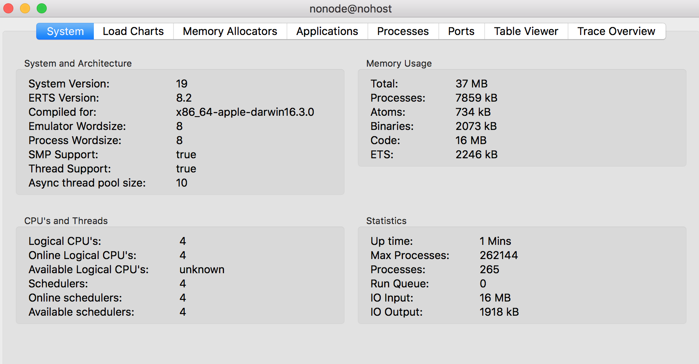
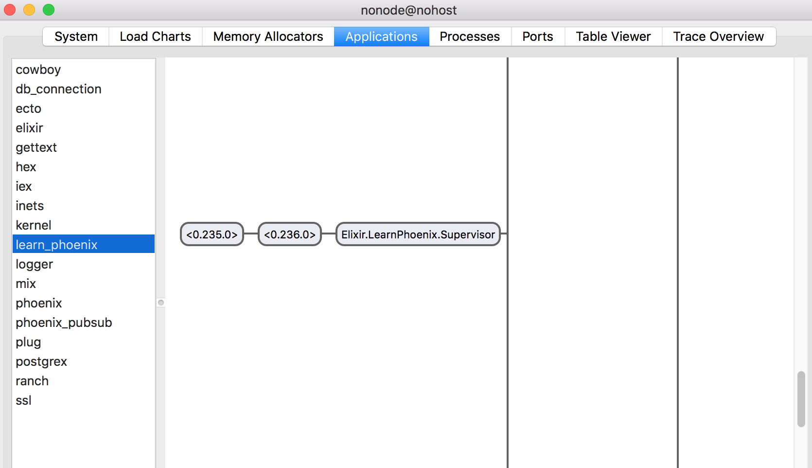
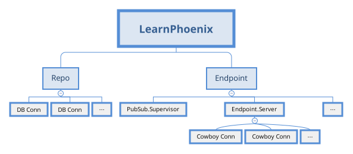

== OTP Basics

When we run our application using `mix phx.server`, it makes the app available on our localhost at http://localhost:4000. That deceptively simple command we used to start our application organized a large number of supervisors and workers to carry out various tasks that our application needs to do. To understand what we are talking about, let's run our application within an IEx shell by using the command `iex -S mix phx.server` from our project folder.

----
→ iex -S mix phx.server
Erlang/OTP 19 [erts-8.2] [source] [64-bit] [smp:4:4] [async-threads:10] [hipe] [kernel-poll:false] [dtrace]

[info] Running LearnPhoenix.Endpoint with Cowboy using http://localhost:4000
----

Now type `:observer.start` in the IEx shell to open the Erlang Observer window.




The observer window provides several useful pieces of information about our application during runtime. We will focus on the `Applications` tab alone in this section.

Moving to the `Applications` tab, you will see a list of names on the left side as below:

image::images/app_list.png[App listing,150,500]

All these applications are running in the background in order for our site to be functioning.

Selecting each one of them shows a flowchart like diagram on the right. These are the respective supervisors and workers for the application. We will get to know what that means in a moment. Have a look at all of them and then finally click on our project name `learn_phoenix.` This should display a very large chart which doesn't fit in a single screen view.



Let's look at a simplified diagram of the same below:




Our LearnPhoenix app is using two top level supervisors namely `Repo` and `Endpoint`. The `Repo` Supervisor has many workers, where each is a database connections. The Endpoint supervisor again has several child supervisors. I have shown only the `Endpoint.Server` supervisor in detail in the above diagram to keep it digestible. The `Endpoint.Server` supervisor has many workers in it which are each Cowboy web server connections.

=== What are Supervisors and Workers?
A program like a web application can have several points of failure. Elixir which is built on the Erlang Virtual Machine uses the Erlang feature called OTP to build fault tolerant applications. We do this by commissioning workers to do different tasks and putting them under different supervisors whose only job is to check if the worker processes are alive or dead. If any of the worker process is dead due to any failure, the supervisor's job is to create a new worker in its place.

Our Phoenix web application needs a database and needs to start its own embedded web server to serve the web requests. Both these activities can potentially fail due to various reasons. The database server may be busy or temporarily down and the web server may crash due to a run time error. Whatever error happens, we need to ensure that our application recovers from it gracefully on its own.

The chart that we saw in the Observer window is the hierarchy of supervisors and workers as required by our application. Our application also depends on several other applications that we have mentioned in our `mix.exs` file. These applications also have their own hierarchy of supervisors and workers to carry out their tasks. This is the reason you see different supervision tree under each of the applications listed in the left sidebar of the `observer` window.

If we visualize this all together, it might look like a cluster of several independent trees like below:

image::images/tree.png[]


How does Elixir or the Erlang Virtual Machine get the information about these tree structure? The answer to that starts with the `mix.exs` file. Back in our `mix.exs` file in the `learn_phoenix` project, we have among others, the following function.

[source,elixir]
----
def application do
  [mod: {LearnElixir.Application, []},
   extra_applications: [:logger, :runtime_tools]]
end
----

The function `application/0` is special. The information returned by this function is used by `mix` to generate a `learn_phoenix.app`. If you are brave enough, you can look at the contents of this file which is a large complex Tuple, reproduced below:

[source,elixir]
----
{application,learn_phoenix,
             [{description,"learn_phoenix"},
              {modules,['Elixir.LearnPhoenix','Elixir.LearnPhoenix.Endpoint',
                        'Elixir.LearnPhoenix.ErrorHelpers',
                        'Elixir.LearnPhoenix.ErrorView',
                        'Elixir.LearnPhoenix.Gettext',
                        'Elixir.LearnPhoenix.LayoutView',
                        'Elixir.LearnPhoenix.PageController',
                        'Elixir.LearnPhoenix.PageView',
                        'Elixir.LearnPhoenix.Repo',
                        'Elixir.LearnPhoenix.Router',
                        'Elixir.LearnPhoenix.Router.Helpers',
                        'Elixir.LearnPhoenix.UserSocket',
                        'Elixir.LearnPhoenixWeb']},
              {registered,[]},
              {vsn,"0.0.1"},
              {mod,{'Elixir.LearnPhoenix.Application',[]}},  # Focus on this line.
              {applications,[kernel,stdlib,elixir,phoenix,phoenix_pubsub,
                             phoenix_html,cowboy,logger,gettext,phoenix_ecto,
                             postgrex]}]}.
----

The file is present at this location `_build/dev/lib/learn_phoenix/ebin/learn_phoenix.app` relative to our project directory.

This large Tuple contains all the information needed to start the OTP supervision tree. To keep it simple, without going into the details of this Tuple structure, we will read the `application/0` function again.

[source,elixir]
----
def application do
  [mod: {LearnElixir.Application, []},
   extra_applications: [:logger, :runtime_tools]]
end
----

It returns a Keyword List with the key `mod:` holding the value `{LearnElixir.Application}`. This piece of information says whenever our application is started, call the `start/2` function defined in this module. It's like the `main` function in the C language which gets called first whenever you start the program.

.lib/learn_phoenix/application.ex
```elixir
defmodule LearnPhoenix.Application do
  use Application

  def start(_type, _args) do
    import Supervisor.Spec

    children = [
      supervisor(LearnPhoenix.Repo, []),          # look here
      supervisor(LearnPhoenixWeb.Endpoint, []),  # look here
    ]

    opts = [strategy: :one_for_one, name: LearnPhoenix.Supervisor]
    Supervisor.start_link(children, opts)         # look here
  end
end
```

This function starts the supervision tree for our project `learn_phoenix`. Without going into the details of how `Supervisor.start_link/2` works, we can infer that it starts two child supervisors `LearnPhoenix.Repo` and `LearnPhoenixWeb.Endpoint`.  Each child supervisor then has to define the workers and supervisors in its module. In this fashion, the supervisor tree of our project `learn_phoenix` gets generated.

Every Elixir project contains the `mix.exs` file and if it starts an OTP supervisor, it mentions the main module that is responsible for starting the tree. This is true for all the dependencies that we have listed in our project's `mix.exs` file.

[source,elixir]
----
defp deps do
  [{:phoenix, "~> 1.3.0-rc"},
   {:phoenix_pubsub, "~> 1.0"},
   {:phoenix_ecto, "~> 3.2"},
   {:postgrex, ">= 0.0.0"},
   {:phoenix_html, "~> 2.6"},
   {:phoenix_live_reload, "~> 1.0", only: :dev},
   {:gettext, "~> 0.11"},
   {:cowboy, "~> 1.0"}]
end
----

Elixir starts the supervision tree for each of the listed libraries above and this results in the cluster of trees that we saw above.
