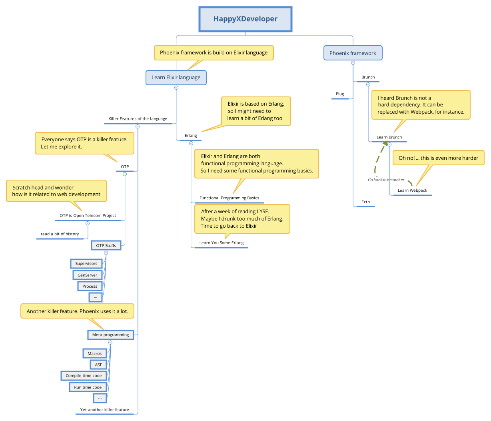

== Down the rabbit hole

From my own experience and talking with fellow developers having mixed levels of experience in web development, here is what happens when someone comes to learn Phoenix.

HappyXDeveloper reads somewhere on the internet that Phoenix is super awesome! HappyXDeveloper now wants to learn Phoenix. (Replace X with Rails, Django, Laravel or any other awesome framework.)

Here is a typical journey of such a developer. You might need to zoom in to read all those text.

I have first-hand experience progressing through this maze, though I started learning Elixir before Phoenix.
Learning through the maze can be at times daunting and unpleasant.

However, it need not be. The first step is to understand that while Elixir stands on top of the giant Erlang and has all those cool killer features like metaprogramming, you are probably not required to write metaprogramming in most cases.

OTP is yet another killer feature. You might have heard people calling it "battle tested", but again you are not going to launch a missile on the first day of your job. While these features are surely the differentiators and something that you should learn, do yourself a favor by not tackling them on the first day of your journey with Phoenix.

=== Metaprogramming
Elixir has powerful metaprogramming features. This allows you to create Domain Specific Languages (DSLs).
Frameworks like Phoenix make extensive use of meta programming in Elixir.
For example, Phoenix router has several DSLs for defining routes.

Learning meta programming is not an overnight task.
Even if you understand the concepts and syntax behind metaprogramming, it takes a lot of practice and experience to use it appropriately. However, the good news is that as a developer using Phoenix, you only need to grok a very small subset of metaprogramming and you don't have to do it on a day to day basis.

In fact as a developer using the Phoenix framework, you will reap the benefits of the built in meta programming, without having to know how it works. The only time you may want to do jump into hard core metaprogramming is when you want to create a framework like Phoenix itself.

=== OTP stuffs
Apart from the metaprogramming feature in Elixir, the bag full of tools and concepts from Erlang OTP available in Elixir is yet another challenge for newbies to understand.

The Process, Agent, Genserver, Supervisor are a whole new paradigm shift for any programmer diving into Elixir. These concepts don't exist in any of the mainstream web programming language. As a result the programmer is not just learning a new syntax, but is undergoing an entire overhaul in the way they think.

Again, you are not likely to use OTP tools for every single problem you solve in Phoenix. The Phoenix framework depends heavily on OTP, but not all your applications using Phoenix are likely to use the OTP tools heavily. In fact, you can even build a moderately complex application without knowing the abc of OTP. When you are comfortable playing with Phoenix, you can go back to OTP and learn it inside out.

=== Learning Path
Here is what I recommend as the learning path.

* Play with IEx
* Learn the basic data types and operators
* Write simple Elixir modules and functions
* Understand the basic control flow structures
* Understand the Mix tool
* Learn how Pattern Matching works
* Think in Pipe operator
* Learn the `use`, `alias` and `import` macros
* Learn the basics of OTP Supervisors and Observer

The above topics should cover you in most cases when working as a Phoenix developer. When you are comfortable writing simple projects in Phoenix, you may then venture into learning in-depth metaprogramming, OTP in Elixir and even Erlang itself.

In the following sections of this chapter, you will learn Elixir using the learning path outlined above.
