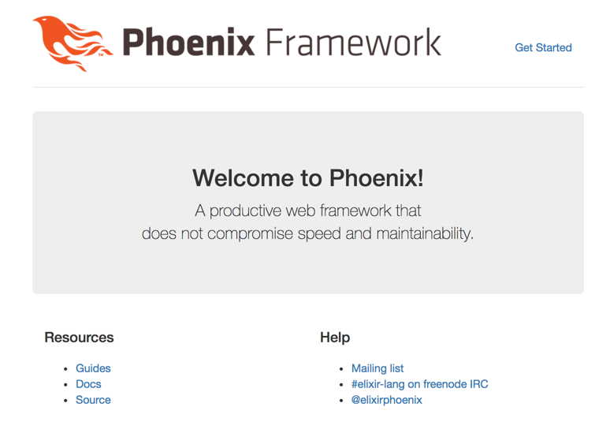
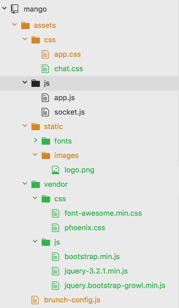
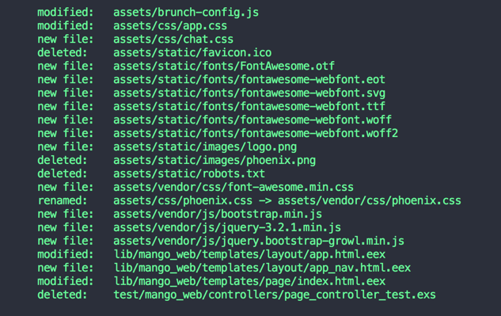
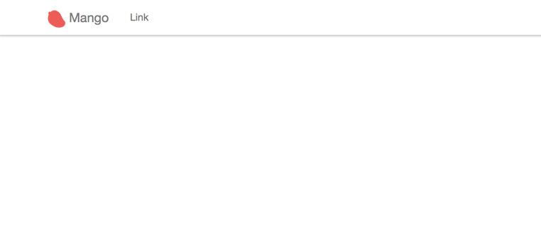

== Setting up Mango

Run `mix phx.new mango` from your terminal to generate a new Phoenix project.

[source,bash]
----
→ mix phx.new mango
...
* creating mango/assets/css/app.css
* creating mango/assets/css/phoenix.css
* creating mango/assets/js/app.js
* creating mango/assets/js/socket.js
* creating mango/assets/package.json
* creating mango/assets/static/robots.txt
* creating mango/assets/static/images/phoenix.png
* creating mango/assets/static/favicon.ico

Fetch and install dependencies? [Yn] Y
----

When prompted to install dependencies, select `Y` and continue as we did in Chapter 1 by following the on-screen instructions.

```
We are all set! Go into your application by running:

    $ cd mango

Then configure your database in config/dev.exs and run:

    $ mix ecto.create

Start your Phoenix app with:

    $ mix phx.server

You can also run your app inside IEx (Interactive Elixir) as:

    $ iex -S mix phx.server
```

Now we are ready to start working on our project powered by the latest Phoenix code.
Run `mix phx.server` on the terminal to start the server.



Nothing has changed since we saw the same page in Chapter 1.
We shall now clean up the default HTML, and add a few CSS and Javascript files so that we don't have to work on styling as we progress through the book.

*Asset Files*

Copy the `assets/brunch-config.js`, `assets/css`, `assets/static` and `assets/vendor` from the asset files bundled with this book replacing the files and folders in the `assets` directory of our project directory.

If all goes well, you will end up with a directory like this:



*Template files*

Open up `mango_web/templates/layout/app.html.eex`.
This file is the layout file for our project. That is, content from our page specific template will get rendered within this template.
This is a good place to put in common navigational elements that are seen across all pages of the site.
The contents of this page currently reads as below.

.lib/mango_web/templates/layout/app.html.eex
[source,html]
----
<body>
  <!-- Insert navigation code here --> <1>
  <div class="container">
    <!-- delete this header block --> <2>
    <header class="header">
      <nav role="navigation">
        <ul class="nav nav-pills pull-right">
          <li><a href="http://www.phoenixframework.org/docs">Get Started</a></li>
        </ul>
      </nav>
      <span class="logo"></span>
    </header>

    <p class="alert alert-info" role="alert"><%= get_flash(@conn, :info) %></p>
    <p class="alert alert-danger" role="alert"><%= get_flash(@conn, :error) %></p>

    <main role="main">
      <%= render @view_module, @view_template, assigns %>
    </main>

  </div> <!-- /container -->
  <script src="<%= static_path(@conn, "/js/app.js") %>"></script>
</body>
----
<1> Insert the code `<%= render "app_nav.html" %>`. This renders a `partial` containing the common navigation menu.
<2> Delete the entire `<header>` block.

When you are done, the body tag should now read as below:

.lib/mango_web/templates/layout/app.html.eex https://gist.github.com/shankardevy/61f88bb8b8383018fb840398fe4a1062[Link]
[source,html]
----
<body>
  <%= render "app_nav.html" %>
  <div class="container">
    <p class="alert alert-info" role="alert"><%= get_flash(@conn, :info) %></p>
    <p class="alert alert-danger" role="alert"><%= get_flash(@conn, :error) %></p>

    <main role="main">
      <%= render @view_module, @view_template, assigns %>
    </main>
  </div>
  <script src="<%= static_path(@conn, "/js/app.js") %>"></script>
</body>
----

Now let's create the partial that we referenced above.
Create a new file `mango_web/templates/layout/app_nav.html.eex` with the following content in it.
The code is standard Bootstrap `navbar` component code with embedded Elixir to insert the logo image.

.lib/mango_web/templates/layout/app_nav.html.eex https://gist.github.com/shankardevy/bfdfb23d35376261b8a513900312f299[Link]
[source,html]
----
<nav class="navbar navbar-default navbar-fixed-top">
  <div class="container">
    <div class="navbar-header">
      <button type="button" class="navbar-toggle collapsed" data-toggle="collapse" data-target="#primary-nav">
        <span class="sr-only">Toggle navigation</span>
        <span class="icon-bar"></span>
        <span class="icon-bar"></span>
        <span class="icon-bar"></span>
      </button>
      <a class="navbar-brand" href="/">
         Mango
      </a>
    </div>
    <div class="collapse navbar-collapse" id="primary-nav">
      <ul class="nav navbar-nav">
        <li><a href="">Link</a></li>
      </ul>
    </div>
  </div>
</nav>
----

As we saw in the first chapter, `mango_web/templates/page/index.html.eex` is the template that gets rendered when we visit the home page. Let's open it up and delete all the contents in it.

*Test file*

We will also delete the default controller test file present in `tests/mango_web/controllers/page_controller_test.exs` as it's not relevant.

If you have followed along, this is the summary of the changes done so far:



Back to the browser, our homepage should now display a nicely themed navbar and present a blank slate for us to play with.


