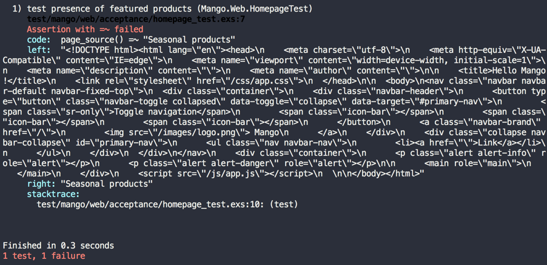
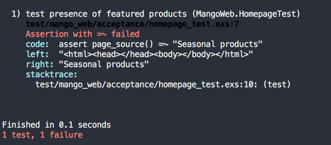
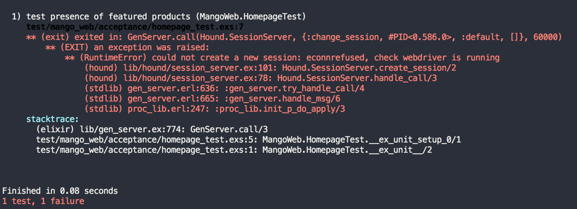
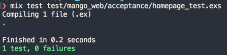

== Setting up Hound

Phoenix projects by default are configured to work with the `ExUnit` testing framework for
writing controller, context and view tests.
In this book, we will use Hound, in addition to the default setup.
Hound is an Elixir library for writing acceptance test. These tests are run using the browser and test the end-to-end workflow of each feature of our app.
If you are familiar with Rails, this is like Capybara for Phoenix.
You can use Hound to write test code which can be executed in Chrome, Firefox or Phantomjs browsers.

We will use Phantomjs in this book for running our Hound tests.

Open the `mix.exs` file and add the `hound` dependency to your `mix.exs` file:

.mix.exs
[source,elixir]
----
defp deps do
  [
    {:phoenix, "~> 1.3.0"},
    {:phoenix_pubsub, "~> 1.0"},
    {:phoenix_ecto, "~> 3.2"},
    {:postgrex, ">= 0.0.0"},
    {:phoenix_html, "~> 2.10"},
    {:phoenix_live_reload, "~> 1.0", only: :dev},
    {:gettext, "~> 0.11"},
    {:cowboy, "~> 1.0"},
    {:hound, "~> 1.0"} <1>
  ]
end
----
<1> Add the Hound dependency.

Next run `mix deps.get` to download Hound and its dependencies.

Now open up the `config/test.exs` file and look for the configuration below:

.config/test.exs
[source,elixir]
----
# We don't run a server during test. If one is required,
# you can enable the server option below.
config :mango, MangoWeb.Endpoint,
  http: [port: 4001],
  server: false
----

As the comment says, if we want the server to run during the test, we need to set the `server` value to true.
Since we will use the Hound library with Phantomjs to test our app in a browser, we set this value to true.

We also need to configure Hound to let it know which browser we will use for testing.

The modified `config/test.exs` file is shown below.

.config/test.exs https://gist.github.com/shankardevy/9a07b38394079fe688abde00231162d5[Link]
[source,elixir]
----
config :mango, MangoWeb.Endpoint,
  http: [port: 4001],
  server: true  <1>

config :hound, driver: "phantomjs" <2>

(...) <3>
----
<1> Change from false to true.
<2> Add this line.
<3> Retain all other code as is.

Our next task is to install Phantomjs if you haven't already installed it.
On macOS, you can install Phantomjs using brew.

[source,bash]
----
brew install phantomjs
----

On Ubuntu you can install Phantomjs using `apt-get`

[source,bash]
----
sudo apt-get install phantomjs
----


=== A little intro to basic Hound
Throughout this book we will be using the Hound library to interact with our HTML programmatically.
Let's spend some time understanding the basics so that when we use Hound in subsequent chapters we don't have to diverge too much from what we are doing to understand Hound's syntax.

Think of Hound as your little assistant who likes to do rote tasks.
First, you teach Hound a given task.
Then later you can ask it to repeat the task after you make modification to your code and it will repeat the task with pleasure.
The type of tasks you can automate with Hound are

. Go to a webpage
. Fill in an HTML form element with given content
. Submit a form
. Check if the page has some given content
. Find a link by its visible text
. Click on a link
. Resize the browser window
. Take a screenshot
. Read the page content
. Find the current path

This is a non comprehensive list of tasks that Hound can do. To read the comprehensive list of tasks, have a look at `Helpers` section in the https://hexdocs.pm/hound/readme.html[API Documentation].

The above list of tasks gives us an idea about Hound's abilities.
Hound can do the job of manual testers. Manual testers are typically given a list of tasks to accomplish, and do so by opening a browser and check them off one by one. Hound does this programatically.

Let quickly review some of the basic Hound commands that we will use quite often as we move through the book.

. `navigate_to`
. `find_element`
. `find_within_element`
. `visible_text`
. `click`
. `page_source`

Most of the names are self explanatory. We will quickly go over each command below to ensure our understanding:

*Visit Page*

All Hound commands are given in the context of a webpage. So the first thing that we will want to do is to visit a page.
We can instruct Hound to visit a page by using the command `navigate_to("/path_to_visit")`

*Finding Elements*

To interact with the webpage, we need to first identify the element on the page with which we want to interact.

Consider the following HTML document displaying two pieces of product information:

```html
<body>
  <div id="product1" class="product">Product 1
    <span class="price">50</span>
    <a class="buy-link" href="buy/1">Buy now</a>
  </div>
  <div id="product2" class="product">Product 2
    <span class="price">100</span>
    <a class="buy-link" href="buy/2">Buy now</a>
  </div>
</body>
```

We can use Hound to find the first product by using `find_element(:css, "#product1")`.
We can also find all products in the page by using `find_all_elements(:css, ".product")`.


[NOTE]
.From the Hound docs on `find_element/2`
====

Finds element on current page. It returns an element that can be used with other element functions.

. The first argument is the strategy.
. The second argument is the selector.

Valid selector strategies are `:css`, `:class`, `:id`, `:name`, `:tag`, `:xpath`, `:link_text` and `:partial_link_text`. `raises` if the element is not found or an error happens.
====

In the command `find_element(:css, "#product1")`, the first argument refers to the strategy by which we identify the elements.
In this case, we are using `:css` strategy to find the elements so in the second argument we reference a valid css selector.
`#product1` is the CSS selector that we normally use to style the product element in CSS by its `id` property.
We use the same selector here to find the element.

Next, to find an element which is a child of another element we use the `find_within_element/3` function. It works similarly to how the `find_element/2` function works but takes a parent element as an additional first argument. For example, to find the buy link of the first product, we can use `find_within_element/3` like this:

```elixir
# First find the parent element
parent_element = find_element(:id, "product1")

# Use the parent element found above to narrow down to price within it.
buy_link_element = find_within_element(parent_element, :css, ".buy-link")
```

*Interacting with the elements*

After we have identified an element we can interact with it. For example, we can click the element or read the elements visible text.

Extending the above example,

* to find the text in the link element, we can make use of `visible_text(buy_link_element)` to locate the text "Buy now" within the parent element.
* to click on the buy link and there by navigate to the linked page, we make use of `click(buy_link_element)`. This makes Hound navigate to `buy/1` path.

*Interacting with the page*

Sometime, we might need to interact with the page as a whole. Such as reading the page source to find out if some text is present or not.
In such cases, we make use of `page_source()` which returns the complete HTML of the visited page as a string.

=== Writing our first acceptance test
Let's write our first acceptance test.
Open a new file `test/mango_web/acceptance/homepage_test.exs` and write the following code.

.test/mango_web/acceptance/homepage_test.exs https://gist.github.com/shankardevy/953487648d9fb296b3e9dfea217f5638[Link]
[source,elixir]
----
defmodule MangoWeb.HomepageTest do
  use ExUnit.Case
  use Hound.Helpers <1>

  hound_session()   <2>

  test "presence of featured products" do <3>
    navigate_to("/")

    assert page_source() =~ "Seasonal products"
  end

end
----
<1> This enables the use of helper functions from Hound library in our test.
<2> Starts a Hound worker who will do the tasks instructed.
<3> `test` block encloses a logical unit of test coverage which may contain one or more tasks to be done.

The above code loads the `/` path of our app in the test browser and checks if the page contains the text "Seasonal products”.
We are using helper functions provided by the Hound library to navigate to a given path and to check the presence of a text in the resulting page.

.What is `=~`?
[NOTE]
====

`=~` in the code `page_source() =~ "Seasonal products"` is Elixir's way of asking:

does `page_source()` contain the text "Seasonal products" ?.
====

We need to start Phantomjs before running the test.
On a separate terminal tab, run the following command to start Phantomjs.

[source,bash]
----
→ phantomjs --wd
----

Now on another terminal, run

```
mix test test/mango_web/acceptance/homepage_test.exs
```

to execute the test we have written.

Hound makes a request to http://localhost:4001 in Phantomjs browser and checks for the text "Seasonal products".



The test fails as the text "Seasonal products" is not present in our template. Again, this test simply checks for the presence of a chunk of text. To make this test pass we just need to add the text that our test expects to our homepage template.

Two problems you might encounter. First, if your test fails with a blank HTML body content as in the screenshot below, you most likely forgot to turn on the server for the test environment as explained above.



Second, if you get an error like below, then you might not have started Phantomjs in a new terminal as indicated earlier.



Add the following text to `templates/page/index.html.eex`

.lib/mango_web/templates/page/index.html.eex
[source,html]
----
<h1>Seasonal products</h1>
----

Now run the test again and it should pass.



From now on, whenever we run our acceptance tests, we need to ensure that Phantomjs is also running.
