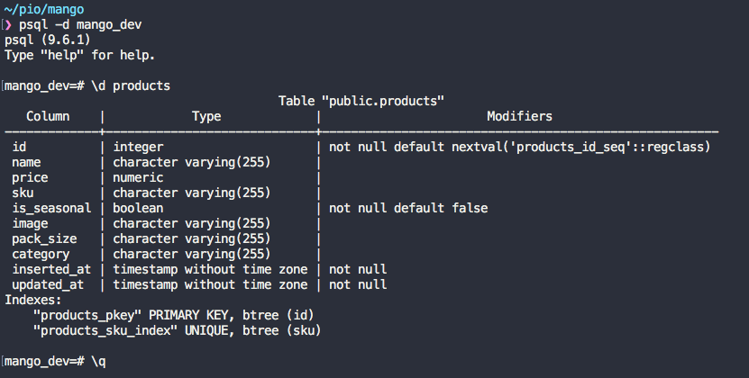
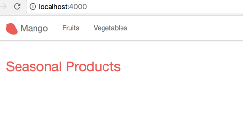
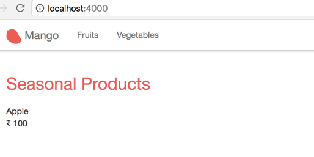
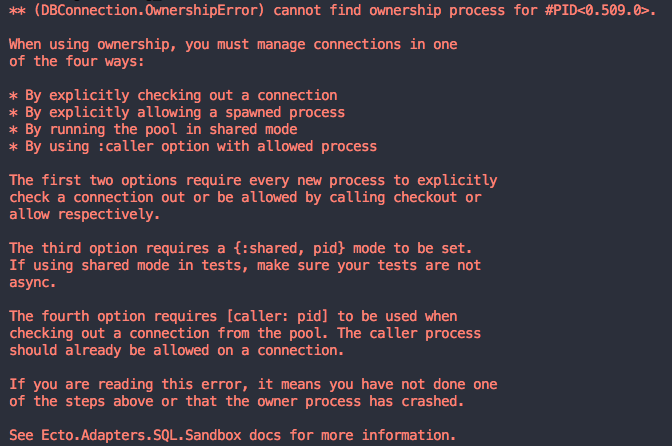
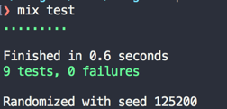

== Adding Ecto

Product information in an ecommerce store is a potential the type of data that goes into the database.
So far we have used hardcoded product structs in our code. In this section let's move away from the hardcoded product definitions and make the products load dynamically from the database. We will use the Elixir database wrapper Ecto to make this change.
Our Phoenix project already lists Ecto as a dependency and is configured to use it. So we can start using it straightaway.

Our product struct currently contains the following fields:

. name
. price
. is_seasonal
. category

As we are migrating to the database, let's also add more fields to it at the same time so that our product system looks more realistic.

In addition to the above fields, we will add the following fields to it:

. sku
. image
. pack size

**Creating database table**

The first task is to create a database table that stores our product information.
Any change in the database is done through a migration file.
It's just a simple Elixir script file named with a current timestamp prefix such as `20170530083715_create_product.exs` so that Ecto can track which migration is new and which is pending execution. Ecto provides a handy Mix command to generate this file with just the basics needed to add our database changes.

Run the command `mix ecto.gen.migration create_product` to generate this migration file.

[source,bash]
----
→mix ecto.gen.migration create_product
* creating priv/repo/migrations
* creating priv/repo/migrations/20170611060357_create_product.exs
----

The first time you run this command it creates the folder `priv/repo/migrations` to store migration files and also generates the timestamped migration files. On subsequent calls, it will generate only a migration file.

Open up the newly created migration file and it should read as below. Note, the timestamp on the migration file will be different when you run the command and it will not match the one above.

[source,elixir]
.priv/repo/migrations/20170611060357_create_product.exs
----
defmodule Mango.Repo.Migrations.CreateProduct do
  use Ecto.Migration

  def change do

  end
end
----

The migration file just contains an Elixir module with a function named `change/0`. Ecto will run this function to carry out the changes needed in the database. Currently this function doesn't do anything. Our job is to populate this function with the changes that we want in our database. To describe the changes needed, Ecto provides a convenient Domain Specific Language(DSL) that is available to use in this module. The macro call `use Ecto.Migration` performs this magic.

Let's add the instructions to create a product table with the details of the fields.

[source,elixir]
.priv/repo/migrations/20170611060357_create_product.exs https://gist.github.com/shankardevy/fc7ca2527dda0ab4790037b9f62e29b9[Link]
----
defmodule Mango.Repo.Migrations.CreateProduct do
  use Ecto.Migration

  def change do
    create table(:products) do <1>
      add :name, :string <2>
      add :price, :decimal
      add :sku, :string
      add :is_seasonal, :boolean, default: false, null: false
      add :image, :string
      add :pack_size, :string
      add :category, :string

      timestamps() <3>
    end

    create unique_index(:products, [:sku]) <4>
  end
end
----
<1> Instruction to create a table named `products`
<2> Add the required columns in the table with their data types
<3> `timestamps/0` is a handly function to add two common fields `inserted_at` and `updated_at` with the data type as datatime.
<4> Make our `sku` column unique.

When all the above changes are made to the migration file, run `mix ecto.migrate` to apply the changes to the database. We now have the product table in our database. We can verify it on Postgresql console.



Apart from the fields that we specified in the migration file, Ecto has also generated a primary key field `id` automatically. This is the default behaviour and can be overridden if necessary. We can also see the timestamp field created by using `timestamp/0` in the migration file.


**Schema**

Our next job is to create an Ecto schema for our products. It looks pretty much like our database table definition in the migration file and might look repetitive but it's not. It serves a completely different purpose which will be clear as we develop Mango.

Open up `lib/mango/catalog/product.ex` file and remove the struct definition, and replace it with the schema definition as below:

.lib/mango/catalog/product.ex https://gist.github.com/shankardevy/09967fcfee6a2740b25a5c60530bf2b1[Link]
[source,elixir]
----
defmodule Mango.Catalog.Product do
  use Ecto.Schema

  schema "products" do
    field :image, :string
    field :is_seasonal, :boolean, default: false
    field :name, :string
    field :price, :decimal
    field :sku, :string
    field :category, :string
    field :pack_size, :string

    timestamps()
  end
end
----

The schema definition as you can see contains more information about each field than what was provided by the struct definition. The `schema` is a Elixir macro that does two main tasks

. Automatically create an Elixir struct `%Mango.Catalog.Product{}` as we had earlier.
. Helps in mapping the data from database `products` table into the Elixir struct `%Mango.Catalog.Product{}`.

Now it's time to start modifying `list_products/0` in our `Mango.Catalog` module.

[source,elixir]
.lib/mango/catalog.ex https://gist.github.com/shankardevy/66fccc088b420d684f073e8ec7ea1473[Link]
----
defmodule Mango.Catalog do

  alias Mango.Catalog.Product
  alias Mango.Repo <1>

  def list_products do <2>
    Product
    |> Repo.all
  end

  (...)
end
----
<1> Add this new alias.
<2> Modify this function.

The `Mango.Repo` module is our point of contact with the database configured for our application. All actions that touch the database are done using a function available in this module. Here we are calling `Repo.all/2` function passing in `Product`. Ecto automatically identifies the struct defined by the module and retrieves all the products stored in the database.

Back to the browser, http://localhost:4000 returns a blank page because we don't have seasonal products in our database. In fact, we don't have any product at all.



We will insert the same two products that we hard coded earlier into our database.

Open `iex -S mix` and run the following commands

```elixir
iex> alias Mango.Catalog.Product
iex> alias Mango.Repo
iex> Repo.insert %Product{name: "Tomato", price: 50, is_seasonal: false, category: "vegetables"}
iex> Repo.insert %Product{name: "Apple", price: 100, is_seasonal: true, category: "fruits"}
```

Back to the browser, it now displays the seasonal products on the homepage.



However, our tests are now broken. Running `mix test` now fails for all our tests. Our test also raises a few new error messages that we haven't seen so far:



This is because until now, we were using a hard coded product list in our test and not using the database. Let's fix them.

Open up `test/mango/catalog/catalog_test.exs` file and modify as below:

[source,elixir]
.test/mango/catalog_test.exs https://gist.github.com/shankardevy/15fd2b108c01c03c2e9da81687b52019[Link]
----
defmodule Mango.CatalogTest do
  use Mango.DataCase <1>

  alias Mango.{Catalog, Repo} <2>
  alias Mango.Catalog.Product

  setup do <3>
    Repo.insert %Product{ name: "Tomato", price: 55, sku: "A123", is_seasonal: false, category: "vegetables" }
    Repo.insert %Product{ name: "Apple", price: 75, sku: "B232", is_seasonal: true, category: "fruits" }
    :ok
  end

  (...)

end
----
<1> Instead of using `ExUnit.Case`, we use `Mango.DataCase` which helps us establish db connections during tests.
This module is already present in our project, thanks to `mix phx.new` generator.
<2> Add new alias to `Mango.Repo`
<3> Add `setup` call to insert test data.

The `setup` call deserves more explanation. Our Phoenix project is configured with three different Mix environments -- _dev_, _test_, _prod_.
Each of these environments is capable of having many options including having its own database.
When we run `mix test`, our test will not find the products that we added in the `iex` shell because these got added in the *dev* environment. So in order to have some products available for us to test, we need to insert them for each test manually in the *test* environment before running the tests. This helps us to separate our test data from the actual live data.
Additionally these test data are removed automatically after each test run so that our test are always run against a clean database.

Now running `mix test`, we can see all our tests in `Mango.CatalogTest` pass while our acceptance tests fail. Our acceptance tests also need a similar fix.

Modify both our acceptance tests as below:

[source,elixir]
.test/mango_web/acceptance/category_page_test.exs https://gist.github.com/shankardevy/531ec793bc2882a42d0b26e9627c4a41[Link]
----
defmodule MangoWeb.Acceptance.CategoryPageTest do
  use Mango.DataCase <1>
  use Hound.Helpers

  hound_session()

  setup do <2>
    ## GIVEN ##
    # There are two products Apple and Tomato priced 100 and 50
    # categorized under `fruits` and `vegetables` respectively
    alias Mango.Repo
    alias Mango.Catalog.Product
    Repo.insert %Product{name: "Tomato", price: 50, is_seasonal: false, category: "vegetables"}
    Repo.insert %Product{name: "Apple", price: 100, is_seasonal: true, category: "fruits"}
    :ok
  end
  (...)
----

[source,elixir]
.test/mango_web/acceptance/homepage_test.exs https://gist.github.com/shankardevy/a02fbb71e5457b0aef0cf477aa2912eb[Link]
----
defmodule MangoWeb.Acceptance.HomepageTest do
  use Mango.DataCase <1>
  use Hound.Helpers

  hound_session()

  setup do <2>
    ## GIVEN ##
    # There are two products Apple and Tomato priced 100 and 50 respectively
    # Where Apple being the only seasonal product
    alias Mango.Repo
    alias Mango.Catalog.Product
    Repo.insert %Product{name: "Tomato", price: 50, is_seasonal: false}
    Repo.insert %Product{name: "Apple", price: 100, is_seasonal: true}
    :ok
  end
  (...)
----
<1> Instead of using `ExUnit.Case`, we use `Mango.DataCase` which helps us establish db connections during tests.
<2> Insert `setup` call as we did in `CatalogTest`.

The reason we need to repeat the test data in each test file is as stated above. Each test runs in a database transaction. So the setup data available to tests defined in one module is not available for the tests defined in another module.

At this point, we might also think of DRYing up our setup call by moving all the code to a common function. Let's resist that urge to keep our tests independent. Making our test files dependent on a common fixture creates more harm than benefit as any change in the common fixture doesn't obviously convey the tests that get affected by it.

Let's run the entire test suite to check if we introduced any new bugs with the changes we made.

```
mix test
```



With our tests backing us up, we can be confident that we didn't introduce any regressions and move to the next feature.
