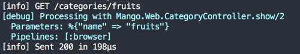
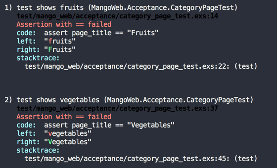
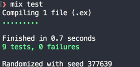
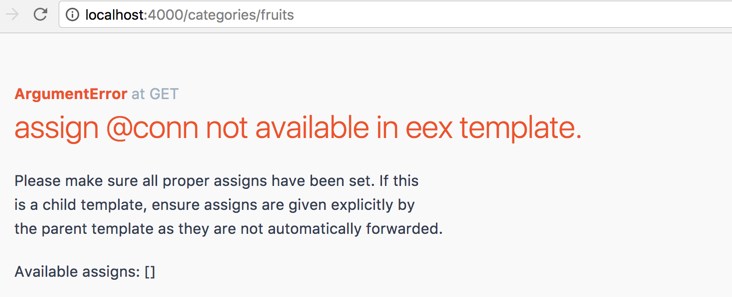

== View Categorized Products

[sidebar]
.User Story #2
--
*As a customer, I want to see categorized products.*

Specifications:

* Products are categorized either as "fruits" or as "vegetables"
* Show all vegetables in the path `category/vegetables`
* Show all fruits in the path `category/fruits`
* Each product should display its name and price.
--

As with our previous user story, we will start with a failing acceptance test that captures the above specifications.
Create a new file `test/mango_web/acceptance/category_page_test.exs`. Here is the template.

.test/mango_web/acceptance/category_page_test.exs
[source,elixir]
----
defmodule MangoWeb.Acceptance.CategoryPageTest do
  use ExUnit.Case
  use Hound.Helpers

  hound_session()

  setup do
    ## GIVEN ##
    # There are two products Apple and Tomato priced 100 and 50
    # categorized under `fruits` and `vegetables` respectively
    :ok
  end

  test "show fruits" do
    # write tests for fruits
  end

  test "show vegetables" do
    # write tests for vegetables
  end

end
----

The difference between the previous acceptance test for user story #1 and this acceptance test is that we are doing two tests that share a given setup.

We have not used the `setup` function so far in our tests.
As we now have an example of two tests sharing a single context, I have moved the comments for the _GIVEN_ context to the `setup` function.
We will dive deeper with the setup function as we start using Ecto for storing our products.
For now just know, the `setup` function should return an `:ok` atom if the setup is successful.


Here is the test for the fruits page.

[source,elixir]
----
  test "shows fruits" do
    ## WHEN ##
    # I navigate to the fruits page
    navigate_to("/categories/fruits")

    ## THEN ##
    # I expect the page title to be "Seasonal products"
    page_title = find_element(:css, ".page-title") |> visible_text()
    assert page_title == "Fruits"

    # And I expect Apple in the product displayed
    product = find_element(:css, ".product")
    product_name = find_within_element(product, :css, ".product-name") |> visible_text()
    product_price = find_within_element(product, :css, ".product-price") |> visible_text()

    assert product_name == "Apple"
    # And I expect its price to be displayed on screen
    assert product_price == "100"

    # And I expect that Tomato is not present on screen.
    refute page_source() =~ "Tomato"
  end
----


Here is the test for vegetables page.
[source,elixir]
----
  test "shows vegetables" do
    ## WHEN ##
    # I navigate to vegetables page
    navigate_to("/categories/vegetables")

    ## THEN ##
    # I expect the page title to be "Seasonal products"
    page_title = find_element(:css, ".page-title") |> visible_text()
    assert page_title == "Vegetables"

    # And I expect Tomato in the product displayed
    product = find_element(:css, ".product")
    product_name = find_within_element(product, :css, ".product-name") |> visible_text()
    product_price = find_within_element(product, :css, ".product-price") |> visible_text()

    assert product_name == "Tomato"
    # And I expect its price to be displayed on screen
    assert product_price == "50"

    # And I expect that Apple is not present on screen.
    refute page_source() =~ "Apple"
  end
----

https://gist.github.com/shankardevy/0e56a6b9f987ae79e9e62fd09bb16afb[See Gist of complete test code.]

The comments in the code above explain the test details.

Since the product list is hardcoded, both the `dev` and `test` environment use the same product list.
This will change in the next section as we introduce the Ecto database wrapper and we can have different product list for development and testing.
Since we are not yet there, we will go and modify the `product_list/0` function in `Mango.Catalog` to include the category information.

.lib/mango/catalog/catalog.ex https://gist.github.com/shankardevy/f83ef8cee9beb0cfc804c7e2bf8f62c5[Link]
[source,elixir]
----
defmodule Mango.Catalog do

  alias Mango.Catalog.Product

  def list_products do
    product1 = %Product{ name: "Tomato", price: 50, is_seasonal: false, category: "vegetables" }
    product2 = %Product{ name: "Apple", price: 100, is_seasonal: true, category: "fruits" }
    [product1, product2]
  end

  (..)
end
----

We will also modify the `%Product{}` struct to allow the new key `:category` in it.

.lib/mango/catalog/product.ex https://gist.github.com/shankardevy/86faca7846aa738e71ff30506f3380cc[Link]
[source,elixir]
----
defmodule Mango.Catalog.Product do
  defstruct [:name, :price, :is_seasonal, :category]
end
----

Since both the paths `/categories/fruits` and `/categories/vegetables` share the same base path `/categories/` and since both paths display similar information, we will create a single router configuration to handle both paths.

Open up `lib/mango_web/router.ex` and add the following configuration.

.lib/mango_web/router.ex https://gist.github.com/shankardevy/601299bb1c9cb8d165aab568aea2aa97[Link]
[source,elixir]
----
(...)
scope "/", MangoWeb do
  pipe_through :browser

  get "/", PageController, :index
  get "/categories/:name", CategoryController, :show <1>
end
(...)
----
<1> Add this new line.

In the above code, we forward all requests matching the path format `categories/*` to the `show` action of `MangoWeb.CategoryController`.

Since we already saw how to create a new controller and template in Chapter 1, we will run through this quickly.

Create a new controller at `mango_web/controllers/category_controller.ex` with the following content.

.lib/mango_web/controllers/category_controller.ex https://gist.github.com/shankardevy/45b13cce106af3c5a8677eb66975c297[Link]
[source,elixir]
----
defmodule MangoWeb.CategoryController do
  use MangoWeb, :controller
  alias Mango.Catalog

  def show(conn, _params) do
    products = Catalog.list_products
    conn
    |> assign(:products, products)
    |> assign(:name, "Title")
    |> render("show.html")
  end

end
----

Create a new view at `mango_web/views/category_view.ex` with the following content.

.lib/mango_web/views/category_view.ex https://gist.github.com/shankardevy/633e5c611f783a485e00d462d0d3aeaa[Link]
[source,elixir]
----
defmodule MangoWeb.CategoryView do
  use MangoWeb, :view
end
----

Create a new template at `mango_web/templates/category/show.html.eex` with the following content.

.lib/mango_web/templates/category/show.html.eex https://gist.github.com/shankardevy/e3f9dc3c0a3d3cde517439c5a73aff4d[Link]
[source,elixir]
----
<h1 class="page-title"><%= @name %></h1>
<div>
  <%= for product <- @products do %>
      <div class="product">
          <div class="product-name"><%= product.name %></div>
          <div>INR <span class="product-price"><%= product.price %></span></div>
      </div>
  <% end %>
</div>
----

At this point, we are close to completing out user story, except the following

. We are showing all products instead of the category products.
. The title of the page is not corresponding to the url.

To resolve the above listed issues one by one, we first need a function to filter our products by category.
This function being similar to the function `list_seasonal_products/0` goes under the `Catalog` context module.
We will name this function `get_category_products/1` accepting the category name as its argument.

Let's write a unit test for this new function.

.test/mango/catalog/catalog_test.exs https://gist.github.com/shankardevy/d658c5f49c5d1dea3b1267e92baf64b5[Link]
[source,elixir]
----
defmodule Mango.CatalogTest do

  (...)

  test "get_category_products/1 returns products of the given category" do
    [product = %Product{}] = Catalog.get_category_products("fruits")

    assert product.name == "Apple"
  end

end
----

To make the above test pass, we write a function that filters the products by category.
This is similar to the function we wrote for filtering for seasonal products.

.lib/mango/catalog/catalog.ex https://gist.github.com/shankardevy/141eedd7ec9bc61c5bc948a1c6fd043e[Link]
[source,elixir]
----
defmodule Mango.Catalog do
  (...)
  def get_category_products(name) do
    list_products()
    |> Enum.filter(fn(product) -> product.category == name end)
  end
end
----

Now we have the function ready to list the products of a given category. The last piece of this puzzle is to figure out how to get the category so that we can use our new function with the category information.
Let's modify the `CategoryController` as below and then we will go through the changes made.

.lib/mango_web/controllers/category_controller.ex https://gist.github.com/shankardevy/e720387f72a77cfceba581bc7624a724[Link]
[source,elixir]
----
defmodule MangoWeb.CategoryController do
  use MangoWeb, :controller
  alias Mango.Catalog

  def show(conn, %{"name" => name}) do <1>
    products = Catalog.get_category_products(name) <2>
    conn
    |> assign(:products, products)
    |> assign(:name, name) <3>
    |> render("show.html")
  end

end
----
<1> So far we have been ignoring the second argument. Now we are pattern matching on it and magically get the category name.
<2> We now know the category name, so we are passing it to `get_category_products/1` to get a list of products by category.
<3> We also pass the category name to our template so we can display it as the title.

**How did we get the category name by pattern matching?**

To answer this question, let's look at our router configuration again.

[source,elixir]
----
get "/categories/:name", CategoryController, :show
----

`:name` is called the placeholder in our path. When an actual page request comes in, Phoenix sends the value present in the placeholder in the `params` variable as the second argument to our actions.

This can be verified by visiting `/categories/fruits` path on our browser and
then checking the logs in the terminal that runs `mix phx.server`.



Note the line that says

```elixir
Parameters: %{"name" => "fruits"}
```

Phoenix passed the map `%{"name" => "fruits"}` as the params argument to our function. From here on, it's a simple pattern matching trick.

Open `iex` and type in the following

[source,elixir]
----
iex(1)> %{"name" => name} = %{"name" => "fruits"}
%{"name" => "fruits"}
iex(2)> name
"fruits"
----

By using pattern matching in the above code, we set the value of `name` to `fruits`. We use the same pattern matching technique above in our `show/2` function head and get the category name.

Run `mix test` check if all tests pass. We see it now fails for a trivial reason.



The page titles displayed in our category pages are in lower case, where as in the test, we have the title capitalized.
Let's take this opportunity to learn about writing helper function in our view module.

Open `mango_web/views/category_view.ex` and modify it as shown below:

.lib/mango_web/views/category_view.ex https://gist.github.com/shankardevy/a4b21184975dff8ee9155fab0b5fc81e[Link]
```elixir
defmodule MangoWeb.CategoryView do
  use MangoWeb, :view

  def title_case(name) do
    name
    |> String.downcase
    |> String.capitalize
  end
end
```

Next we will make use of the new function in our category template `show.html` file as below:

```elixir
<h1 class="page-title"><%= title_case @name %></h1>
```

Now run the entire test suite to confirm that everything passes.



**Adding links to navigation**

Finally, let's add two navigational links for these two categories. Open `lib/mango_web/templates/layout/app_nav.html.eex` and add two links

Remove this code
```html
<ul class="nav navbar-nav">
  <li><a href="">Link</a></li>
</ul>
```
and instead add the following

[source,elixir]
.lib/mango_web/templates/layout/app_nav.html.eex https://gist.github.com/shankardevy/3c42fef9b3273d690b1afd75e3211415[Link]
----
<ul class="nav navbar-nav">
  <li><%= link "Fruits", to: category_path(@conn, :show, "fruits") %></li>
  <li><%= link "Vegetables", to: category_path(@conn, :show, "vegetables") %></li>
</ul>
----
Everytime we write a new route in our router file, Phoenix automatically generates helper functions to generate a url and/or a path for this new route.

The helper function `category_path/3` is one such function generated by Phoenix when we added the route to the category page.
The function takes `conn` as the first argument, the controller action as the second argument, and values for any optional placeholders.
The function call `category_path(@conn, :show, "vegetables")` generates a string such as `/categories/vegetables` which is then passed as the argument to the `link` function.

The module `Phoenix.HTML.Link` defines the helper function `link/2`.
We make use of the `link/2` helper function to generate links to the respective category pages.

Going back to the site, we get an error.



This is because the `@conn` variable is not available in the `app_nav.html.eex`. In Phoenix, partial templates don't get the value from the parent template automatically. Variables required for partials needs to be explicitly passed on by the parent template.

Open `app.html.eex` in `mango_web/templates/layout` and modify the line below:

from
```elixir
<%= render "app_nav.html" %>
```

to

```elixir
<%= render "app_nav.html", conn: @conn %>
```
https://gist.github.com/shankardevy/98a5e58aa1e12a3fa39df275e0a5fb0e[View Gist of modified `app.html.eex`]

This passes the `@conn` variable present in the `app.html.eex` template to the `app_nav` template under the same name. We could also pass the variable under a different name to the partial by just modifying the key name.
Here it's convenient to call it `conn` in both templates so we pass the value as `conn`.
