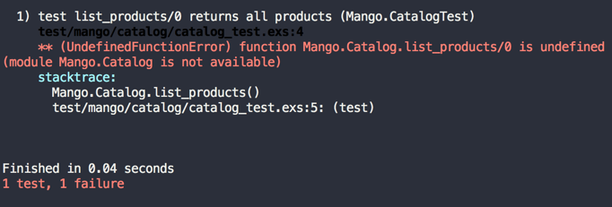
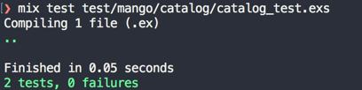
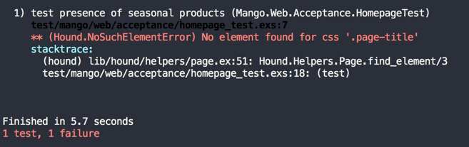
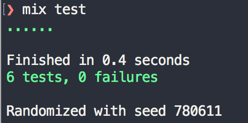
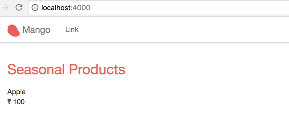

== Seasonal Products

[sidebar]
.User Story #1
--
*As a customer, I want to see seasonal products.*

Specifications:

* See the seasonal products on the homepage.
* Each product should have the following information:
** Name
** Price
--

We will start by writing an acceptance test case that captures the requirements above:

Open `test/mango_web/acceptance/homepage_test.exs` and modify it as below:


[source,elixir]
.test/mango_web/acceptance/homepage_test.exs https://gist.github.com/shankardevy/48bc48252be3f1c11d08d3e7cf321aa2[Link]
----
defmodule MangoWeb.Acceptance.HomepageTest do
  use ExUnit.Case
  use Hound.Helpers

  hound_session()

  test "presence of seasonal products" do
    ## GIVEN ##
    # There are two products Apple and Tomato priced at 100 and 50 respectively
    # With Apple being the only seasonal product

    ## WHEN ##
    # I navigate to homepage
    navigate_to("/")

    ## THEN ##
    # I expect the page title to be "Seasonal products"
    page_title = find_element(:css, ".page-title") |> visible_text()
    assert page_title == "Seasonal Products"

    # And I expect Apple to be in the product displayed
    product = find_element(:css, ".product")
    product_name = find_within_element(product, :css, ".product-name") |>  visible_text
    product_price = find_within_element(product, :css, ".product-price") |>  visible_text

    assert product_name == "Apple"
    # And I expect its price to be displayed on the screen
    assert product_price == "100"

    # And I expect that Tomato is not present on the screen.
    refute page_source() =~ "Tomato"
  end

end
----
The above test captures the specifications that we have listed for the user story in the format:

*Given* - lists the state of the system to be tested.

*When*  - lists the actions performed in the test.

*Then* - lists the expectations regarding the new state that we need to test.

All three are listed as comments in the test above.

The test will now fail because we don't have the system with the expected setup as mentioned in the **GIVEN** section, i.e., we don't have the products yet.

What we need is

* a function that lists all products
* a function that filters and return only the seasonal products.

When we have both these functions, we have the necessary setup for continuing with the acceptance test.

In Test Driven Development, we spend time thinking about how our API should work before we implement it. This thinking exercise should focus on

* keeping the function's responsibility clear.
* choosing clear and concise names for the functions that conveys their intent.
* identifying the required inputs and expected outputs for our functions.

[NOTE]
====
Interestingly this is the same exercise that we need to practice when using the Phoenix `Context` -- which is basically a fancy way of calling a well named Elixir module containing a bunch of well designed functions.
====

Let's first work out the details of our first function --  a function that lists all products.

. It should only return a list of products and do nothing else.
. We can settle on the name `list_products` which is concise and expresses its intent.
. Lastly the function needs no input and returns a list data type containing the products.

Now that we have spent time thinking about our function, we could go ahead and create it. But under which module?
Since all named functions in Elixir must belong to a module, our function needs a home.

We could place our `list_products` function thoughtlessly on any `FooBar` module placed inside any of the folders inside `lib` and it would work.
Unlike many MVC frameworks, in Elixir projects there is no special folder in which to place our code to make it discoverable.

Though any random path and module will work, we want our code to be well organized and self-explanatory. This will benefit any new person looking at our code or our future self when we return to the project code 6 months in the future.

We could settle on the module name `Product`, and with our project name prepended, it would be `Mango.Product`.
That's one valid choice. However, that also means we will have as many public modules as business entities.
In the short term there is no harm going this way, but it brings in certain challenges.
For example, if we have a `Category` entity, all functions related to the category entity will fall under the `Category` module. In this scenario, where will we place a function that spans both entities? Say, list of products in a given category?
Does this function belong to the `Category` or the `Product` module? Placing the function in either of them is a choice that is not backed up by any rationale.

In situations like this, it's best to think about our expectations of the world around us.
For example, imagine a new gadget shop opens in your area.
You walk up to the store manager to ask a few questions.

. Do you accept cash payment?
. Do you have deals on iPhone?
. Do you offer home delivery?

It's our expectation that the store manager can answer all these questions. On the other hand if he said

_Oh dear madam! Pardon me for my limited knowledge. Your first question is regarding cash payments. Please ask that question to the guy sitting at the cash register. Your second question is on iPhones, please ask that to the lady standing near the Apple products section. Our delivery man is standing by his truck out back, you can ask him about home delivery._

If that was the reply, I bet you would never enter that store again.
Why? Because it is our expectation that a store have a person who knows how the store functions, and that the manager is that person. As a store manager, it's our expectation that he is reasonably able to answer all kinds of questions related to the store -- which is the context for which he is responsible.
If we were to ask him a question related to trade enquiry, he may not have the knowledge and may direct us to the Operations Manager who deals with them and that's acceptable.

So what is the take away point that is related to our problem space?
Just like how we expect a store manager, to be the single point of contact for all kinds of questions related to the store,
we need a module that can hold functions related to our product as well as for other entities that are closely related.
This unnamed module that will hold our product functions is the *context* in which our product entity lives.
We expect other business entities to share this context space, but only if they are closely related.

Just like having to spend time thinking about our function design, it's necessary to spend time thinking about good context names and what business entities each context should hold.
Most often the context names can be derived from the business processes in the physical world. In our case, we will settle on the name `Catalog` as our context.

Now that we have spent time thinking about various aspects of our functions and the context module, let's define a simple test for our functions before we actually implement them. This test is going to be a unit test, testing the api of our functions. We will create a new context test file at `test/mango/context_name/context_name_test.exs`. Note, you need to also create the folder `test/mango` as it doesn't exists yet.

Create a new file in `test/mango/catalog/catalog_test.exs` and add the following code.

.test/mango/catalog/catalog_test.exs https://gist.github.com/shankardevy/3b83b77a6cf1b3fe05aba0e2baebddb1[Link]
[source,elixir]
----
defmodule Mango.CatalogTest do
  use ExUnit.Case <1>
  alias Mango.Catalog <2>

  test "list_products/0 returns all products" do
    [p1, p2] = Catalog.list_products
    assert p1 == "Tomato"
    assert p2 == "Apple"
  end
end
----
<1> By using `ExUnit.Case`, we have macros such as `test` and `assert` available in our test file.
<2> Add alias to Mango.Catalog to keep our code concise.

The above test checks if calling the function `Mango.Catalog.list_products/0` returns a list of two items which we verify by pattern matching.
We then verify if the two products are named "Tomato" and "Apple".

Lets run the test, which will obviously fail.

```
mix test test/mango/catalog/catalog_test.exs
```



To get this test to pass, let's create a new module and function as per the test specifications.
Create a new file at `lib/mango/catalog/catalog.ex` with the below content.

.lib/mango/catalog/catalog.ex https://gist.github.com/shankardevy/b8173ca514d1edbb081c8f329d99d5e9[Link]
[source,elixir]
----
defmodule Mango.Catalog do

  def list_products do
    ["Tomato", "Apple"]
  end
end
----

Now running the test again, we see our test pass.

image::images/_seasonal-fcee8.png[]

The information  that we return about each product is very basic.
We just returned the product name.
However, as per our user story specification we need the product name and price.

To store complex data about each product, we could make use of a map or a struct data type.
In this case since we want all products to have the same data structure, struct is the more appropriate choice.

Let’s modify our test code so that it now expects a list of two product structs.

.test/mango/catalog/catalog_test.exs https://gist.github.com/shankardevy/af2a6860143adbbce95e4ecba401e8b4[Link]
[source,elixir]
----
defmodule Mango.CatalogTest do
  use ExUnit.Case
  alias Mango.Catalog
  alias Mango.Catalog.Product

  test "list_products/0 returns all products" do
    [p1, p2] = Catalog.list_products

    assert %Product{} = p1
    assert p1.name == "Tomato"
    assert %Product{} = p2
    assert p2.name == "Apple"
  end
end
----

Now our test will fail. We need to define a `Product` struct first and then change the implementation of `list_products/0` to a list of structs.
Since the struct is related to our `Catalog` context, we will create it inside `lib/mango/catalog/`. Create a new file `product.ex` with the following contents to define a struct.

.lib/mango/catalog/product.ex https://gist.github.com/shankardevy/263fce64e5e2348eb51776434243e99f[Link]
[source,elixir]
----
defmodule Mango.Catalog.Product do
  defstruct [:name, :price]
end
----

We can now modify `list_products/0.` to use this new struct below.

.lib/mango/catalog/catalog.ex https://gist.github.com/shankardevy/fb4c12fe493ffdc41fe78614b72398ca[Link]
[source,elixir]
----
defmodule Mango.Catalog do
  alias Mango.Catalog.Product <1>

  def list_products do
    product1 = %Product{ name: "Tomato", price: 50 }
    product2 = %Product{ name: "Apple", price: 100 }
    [product1, product2]
  end
end
----
<1> We added this new alias, so we can keep our struct name short in our code.


Running our test again, we can see it passes successfully.

Open up `iex -S mix` and try executing our new function.

[source,elixir]
----
iex(1)> Mango.Catalog.list_products

[%Mango.Catalog.Product{name: "Tomato", price: 50},
 %Mango.Catalog.Product{name: "Apple", price: 100}]
----

Hurray! we just created a simple product catalog for our ecommerce store.

We can make the code inside the test function even more compact if we use some pattern matching.

Instead of these three lines
[source,elixir]
----
[p1, p2] = Catalog.list_products

assert %Product{} = p1
assert %Product{} = p2
----

we could do them in a single line as below
[source,elixir]
----
[p1 = %Product{}, p2 = %Product{}] = Catalog.list_products
----
The above code pattern matches each of the two items to a `%Product{}` struct before assigning it to variables `p1` and `p2`.

Our test file now reads like this

[source,elixir]
.test/catalog_test.exs https://gist.github.com/shankardevy/adb5b172f55b5ba8569e36382bc6f6b5[Link]
----
defmodule Mango.CatalogTest do
  use ExUnit.Case
  alias Mango.Catalog
  alias Mango.Catalog.Product

  test "list_products/0 returns all products" do
    [p1 = %Product{}, p2 = %Product{}] = Catalog.list_products

    assert p1.name == "Tomato"
    assert p2.name == "Apple"
  end
end
----

The next thing that we want to do is to create a function that filters the products and returns only the seasonal products.
To do that, we need an attribute in our `%Product{}` struct that stores if the product is seasonal or not.

Add a new key to the `%Product{}` struct to store the seasonal value.

[source,elixir]
.lib/mango/catalog/product.ex https://gist.github.com/shankardevy/8957e00cace91a303f863a4abc5a613a[Link]
----
defmodule Mango.Catalog.Product do
  defstruct [:name, :price, :is_seasonal] <1>
end
----
<1> Added the new key `:is_seasonal`.

Modify `list_products/0` to list one seasonal and another non-seasonal product. This way when we implement our new function to filter, we can set our expectations in our test code.

[source,elixir]
.lib/mango/catalog.ex https://gist.github.com/shankardevy/f70d88bf5a0376b211169156eef736b1[Link]
----
defmodule Mango.Catalog do

  alias Mango.Catalog.Product

  def list_products do
    product1 = %Product{ name: "Tomato", price: 50, is_seasonal: false }
    product2 = %Product{ name: "Apple", price: 100, is_seasonal: true }
    [product1, product2]
  end
end
----

Now let's create a function to list seasonal products.
Our previous function name was `list_products/0` so it stands to reason that the new function can be named `list_seasonal_products/0`.
Let's write a failing test for this new function.


[source,elixir]
.test/mango/catalog/catalog_test.exs https://gist.github.com/shankardevy/923ecf9525474b61ee841529bef4e0cb[Link]
----
defmodule Mango.CatalogTest do
  use ExUnit.Case

  (...)

  test "list_seasonal_products/0 return all seasonal products" do
    [product = %Product{}] = Catalog.list_seasonal_products

    assert product.name == "Apple"
  end
end
----

Running `mix test test/mango/catalog/catalog_test.exs` will fail at this point for the above test.


Let's add the `list_seasonal_products/0` function in our `Catalog` module as below:


[source,elixir]
.lib/mango/catalog.ex https://gist.github.com/shankardevy/89cf55e41fb0c13de2a171b4bbefae30[Link]
----
defmodule Mango.Catalog do

  (...)

  def list_seasonal_products do
    list_products()
    |> Enum.filter(fn(product) -> product.is_seasonal == true end)
  end
end
----

The new function basically calls our `list_products/0` function to get the list of all products and passes the return value to the `Enum.filter` function where we only select the items whose `is_seasonal` value is `true`.

[TIP]
====
If you are not super familiar with `Enum.filter` syntax, help is just `iex` away.
Open up an `iex` shell and type `h Enum.filter` to quickly refresh your memory to the use of `Enum.filter`
====

With the above change, our catalog test will now pass.

```
mix test test/mango/catalog/catalog_test.exs
```




Our next task is to make the acceptance test pass.

```
mix test test/mango_web/acceptance/homepage_test.exs
```



Our acceptance test fails because it doesn't see the HTML markup as expected.

Since we already have `PageController` serving the homepage, we can modify it to make our acceptance test pass.

We open up `PageController` module and call the `list_seasonal_products/0` function to get the product list. We then pass on this data to the template where we print the product names.


[source,elixir]
.lib/mango_web/controllers/page_controller.ex https://gist.github.com/shankardevy/bc8576c693decc30da1890669c0dd70b[Link]
----
defmodule MangoWeb.PageController do
  use MangoWeb, :controller
  alias Mango.Catalog <1>

  def index(conn, _params) do
    seasonal_products = Catalog.list_seasonal_products <2>

    render conn, "index.html", seasonal_products: seasonal_products <3>
  end
end
----
<1> Add a new alias.
<2> Call `list_seasonal_products/0` and then store the result in `seasonal_products`
<3> Pass the `seasonal_products` variable to the `index.html` template under the same name.

Let's spend sometime understanding this piece of code.
[source,elixir]
.lib/mango_web/controllers/page_controller.ex
----
render conn, "index.html", seasonal_products: seasonal_products <3>
----

This code creates a variable named seasonal_products and makes it available in our template file. Let's see the alternate ways of achieving the same thing.

When we want to send some data to the template, the only legitimate way is to add this information to the `conn` variable.
We can do so by using the function `Plug.Conn.assign/3`. The module `Plug.Conn` is already imported in all controller files so we can just use the function name `assign` without any module prefix.
The function takes the `conn` struct as the first argument, a key as the second, and a value as the third argument.
So in order to send the seasonal products list to our template in the name of `my_seasonal_products`, we need to modify the code as follows.

[source,elixir]
----
defmodule MangoWeb.PageController do
  (...)
  def index(conn, _params) do
    seasonal_products = Catalog.list_seasonal_products
    new_conn = assign(conn, :my_seasonal_products, seasonal_products) <1>
    render new_conn, "index.html" <2>
  end
end
----
<1> Note the call to `Plug.Conn.assign`.
<2> Note that we are now sending the `new_conn` with the value assigned in the previous step.

.What is a `conn`?
[NOTE]
====
All controllers receive `%Plug.Conn{}` struct named `conn`. It contains the complete request information and also acts as a storage mechanism between controllers and templates. Any variable assigned in the `conn` struct in the controller is automatically available in template files.
====

.Want to know more about `conn`?
[NOTE]
====
The second book of Phoenix Inside Out bundle -- Garuda -- treats this topic extensively.
====

The above way of using `assign/3` is fine until we face a situation of multiple variable assignments.


[source,elixir]
----
defmodule MangoWeb.SomeController do
  def some_action(conn, _params) do
    variable1 = get_variable1()
    variable2 = get_variable2()
    variable3 = get_variable3()

    new_conn1 = assign(conn, :my_var1, variable1)
    new_conn2 = assign(new_conn1, :my_var2, variable2)
    new_conn3 = assign(new_conn2, :my_var3, variable3)

    render new_conn3, "index.html"
  end
end
----

We could simplify the code by using the pipe operator and avoid the temporary variables by modifying our controller as below:
[source,elixir]
----
defmodule MangoWeb.SomeController do
  (...)
  def some_action(conn, _params) do
    variable1 = get_variable1()
    variable2 = get_variable2()
    variable3 = get_variable3()

    conn
    |> assign(:my_var1, variable1)
    |> assign(:my_var2, variable2)
    |> assign(:my_var3, variable3)
    |> render("index.html")
  end
end
----
Using the pipe operator has reduced the use of temporary variables but there are still a lot of calls to `assign/3`.

Phoenix provides a shortcut function to get the same output by passing a keyword list to the `render/3` function.

[source,elixir]
----
conn
|> assign(:my_var1, variable1)
|> assign(:my_var2, variable2)
|> assign(:my_var3, variable3)
|> render("index.html")
----

The above code is the same as writing

[source,elixir]
----
render(conn, "index.html", my_var1: variable1, my_var2: variable2, my_var3: variable3)
----

Back to our code in the `PageController`,

[source,elixir]
----
render conn, "index.html", seasonal_products: seasonal_products
----

this is the same as writing

[source,elixir]
----
conn
|> assign(:seasonal_products, seasonal_products)
|> render("index.html")
----

The final step of the journey to complete our first user story is to modify the `index.html` template.

Open `index.html.eex` and add the following code.

.lib/mango_web/templates/page/index.html.eex https://gist.github.com/shankardevy/17ba131d46da5850b408434ef6b03802[Link]
[source,elixir]
----
<h1 class="page-title">Seasonal Products</h1> <1>
<div>
  <%= for product <- @seasonal_products do %> <2>
    <div class="product">
      <div class="product-name"><%= product.name %></div>
      <div>INR <span class="product-price"><%= product.price %></span></div>
    </div>
  <% end %>
</div>
----
<1> Add class `page-title`
<2> Use Elixir List comprehension to loop through the product list.

The variables we pass from the controller are available in the templates via the `@` prefix.
Therefore we have the `@seasonal_products` variable in our `index.html` template. We use list comprehension to loop over the products and we print the product details.

Run the full test suite to check if all tests pass.



Open up http://localhost:4000 to see a seasonal product listed on the homepage.



Hurray! we have successfully completed our first user story using TDD.
