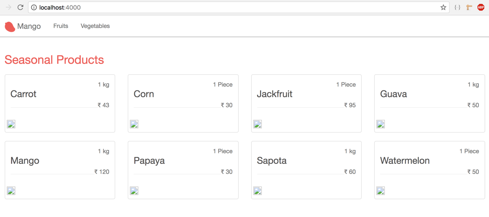
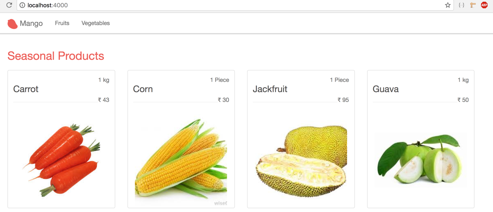

== Refactor and Tidy up

In the homepage template, we have the following code

[source,elixir]
.lib/mango_web/templates/page/index.html.eex
----
(...)

  
<%= product.name %>

  
INR <%= product.price %>

(...)
----

We also have the same code duplicated in category show template.

Let's DRY this up by refactoring the above code into a separate template that we can call from both the home and category page templates.

Create a new folder `lib/mango_web/templates/product` to hold this new template.
Since the template we are going to create is for a product, which doesn't logically belong to either `category` or `page` module, we are using a new folder.
Inside this new folder, create a new file `product_card.html.eex` with the following code extracted from the homepage template.

[source,elixir]
.lib/mango_web/templates/product/product_card.html.eex https://gist.github.com/shankardevy/2765fc7f3f4cf0a671e959212c6b122c[Link]
----

  
<%= @product.name %>
 <1>
  
INR <%= @product.price %>

----
<1> Note the addition of `@` prefix to the `product` variable. In partials, variables are passed down from the parent template and are no longer local variables inside a list comprehension.

Since all template files have to be backed up by a view module, let's create a new `ProductView` module to support this template.
Create a new file `mango_web/views/product_view.ex` with the following code.

[source,elixir]
.lib/mango_web/views/product_view.ex https://gist.github.com/shankardevy/727fdf6baf4591ccf6e27bed075e7696[Link]
----
defmodule MangoWeb.ProductView do
  use MangoWeb, :view
end
----

Now back in the homepage template, let's modify the code to use the new template. We will also add some bootstrap classes to make it look pretty.

[source,elixir]
.lib/mango_web/templates/page/index.html.eex https://gist.github.com/shankardevy/d311269223d6f2414347034fb1ab9875[Link]
----
<h1 class="page-title">Seasonal Products</h1>

 <1>
  <%= for product <- @seasonal_products do %>
    
 <2>
      <%= render MangoWeb.ProductView, "product_card.html", product: product %><3>
    

  <% end %>

----
<1> Add a new Bootstrap class.
<2> Enclose the content in a new Bootstrap column.
<3> Use the new template that we extracted.

Since the new template lives in a view that is different from the view responsible for the current template, we explicitly pass the view name in our call to the `render` function.

We do the same in the category page template.

[source,elixir]
.lib/mango_web/templates/category/show.html.eex https://gist.github.com/shankardevy/729fc973b948ff6e9fe5fa9eeda2a076[Link]
----
<h1 class="page-title"><%= title_case @name %></h1>

 <1>
  <%= for product <- @products do %>
    
 <2>
      <%= render MangoWeb.ProductView, "product_card.html", product: product %> <3>
    

  <% end %>

----
<1> Add a new Bootstrap class.
<2> Enclose the content in a new Bootstrap column.
<3> Use the new template that we extracted.

Run `mix test` to confirm all our tests pass and nothing breaks in response to this refactoring.

Our database contains more information about each product than we display now.
Let's modify our product template to show all the fields.
Again we will use some Bootstrap classes to make the display look nice.

[source,elixir]
.lib/mango_web/templates/product/product_card.html.eex https://gist.github.com/shankardevy/3cea2f302c0bdf89bd7b3496b03ccf63[Link]
----

  

    <%= @product.pack_size %>
    <h2>
      
<%= @product.name %>

      
        <small class="product-price">INR <%= @product.price %></small>
      
    </h2>
    

  

  " />

----

Back in the homepage, we see more information for each product stacked horizontally. However, we don't see the images rendered.

Copy the `product_images` folder from the files bundled with book to `priv/static` directory.
Refresh the browser again, we still don't see them.
This is because our project is not configured to serve static files from this new directory that we created.
That's easy to fix. Open up the file `lib/mango_web/endpoint.ex` add `product_images` to the list of directories allowed by `Plug.Static` which is responsible for serving static files.

[source,elixir]
.lib/mango_web/endpoint.ex https://gist.github.com/shankardevy/47a7d49713e1b4d815a26ad4187d98ed[Link]
----
plug Plug.Static,
  at: "/", from: :mango, gzip: false,
  only: ~w(css fonts images product_images js favicon.ico robots.txt)
----

Now refresh the browser and you will see all the product images load up.

