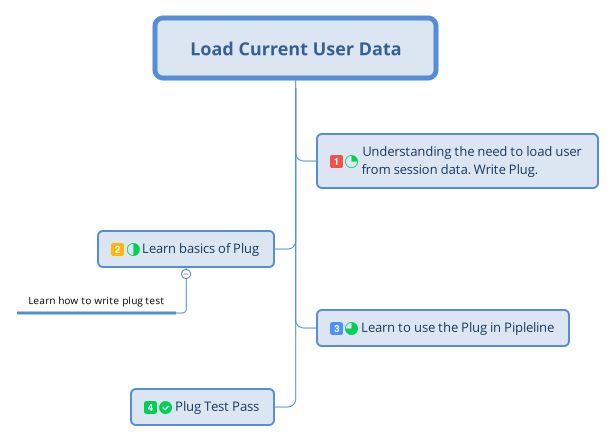
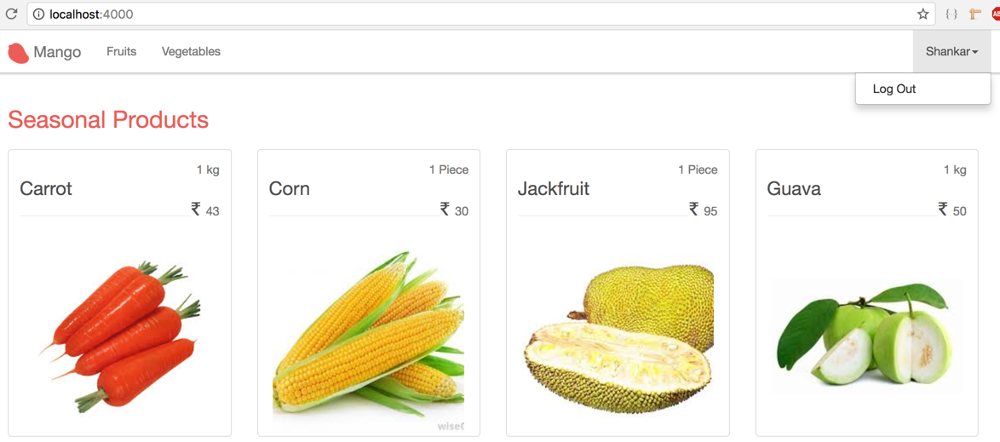

== Recognizing Current User.

=== Learning Map



In the last section, we created the login form allowing the user to successfully login with valid credentials. We also stored the customer data in the `conn` struct as `:current_user`. However, since the `conn` struct values are reset for every page request, our `current_customer` value is not available for the next page reload. That means even though we have the `id` value of the logged in customer in the session data, our templates can no longer access the `@current_user` data.

Moreover, we can only make use of the data that we store in the `conn` through the `assign` function and cannot use the session value in templates. So that brings us to the question: how can we assign the value of `current_user` in the `conn` struct for every page request?

When we want to modify the `conn` struct in this way, the defacto way of doing it is to use a `plug` module. For a `plug` module to work, it needs to be added to a plug `pipeline` present in our app. Since we are learning several new concepts now, let's take it one by one.

Let's create a `plug` module first.

=== Creating Our First Plug
Any Elixir module can be called a `plug` module if it satisfies the following conditions.

* It implements a `init/1` function and can return any value.
* It implements a `call/2` function taking a `%Plug.Conn{}` struct as the first argument, the return value from `init` as the second argument, and it returns a `%Plug.Conn{}` struct as its output.

Create a new file at `mango_web/plugs/load_customer.ex` with the following code which satisfies the above definition of a `plug` module.

.lib/mango_web/plugs/load_customer.ex https://gist.github.com/shankardevy/66f66e5c004912fc0bf7246107edc0ae[Link]
[source,elixir]
----
defmodule MangoWeb.Plugs.LoadCustomer do
  def init(_opts), do: nil <1>

  def call(%Plug.Conn{} = conn, _opts) do <2>
    conn
  end
end
----
<1> Here we have an `init/1` function but it doesn't do any thing. That's ok. We still adhere to the requirement that a `plug` module must define an `init/1` function and that `init/1` must return a value...nil in this case
<2> We also have a `call/2` function that takes a `%Plug.Conn{}` struct as its first argument. Since it takes the return value of `init/1` as its second argument and since that value is nil in this case, we use the ignore operator. Again this function doesn’t do anything useful. It just returns the received conn as it is.

=== Understanding Plug Pipeline

The `plug` that we wrote will sit idly in our app unless we put it to use.  We use a `plug` by adding it to one of the plug `pipelines` in our applications. The `pipelines` available are

* Endpoint
* Controller
* Router

We will understand what a `pipeline` is in a moment. For now, assume that it's a place where you can put your `plug` module in order to access its functionality.

If you open up `lib/mango_web/endpoint.ex` file, you will see several calls to `plug <this>`. Snippet shown below:

.lib/mango_web/endpoint.ex
```elixir
plug Plug.RequestId
plug Plug.Logger
...
plug Plug.MethodOverride
plug Plug.Head
```

We could add our `plug` module in the Endpoint list, but it's not appropriate.

Endpoint `plugs` are meant to do low level grunt work like adding a logger, parsing HTTP request body etc. Our `plug` is meant to load our customer data which is very much application specific. So it's not something that fits the Endpoint `plug` role.

Alternately, we could add our plug to any of our controller modules. But when added to a controller a `plug` only gets executed for paths that use that specific controller. Again, this is not what we need. We need the `current_customer` data to be available for all controllers.

The last option is to place the plug in the router pipeline so that any path using that pipeline will be able to call our new plug. This looks like what we need.

Open the `router.ex` file and add our plug to the code highlighted below:

.lib/mango_web/router.ex https://gist.github.com/shankardevy/49d0f8625eb9305a40e910860aa4224b[Link]
```elixir
pipeline :browser do
  plug :accepts, ["html"]
  plug :fetch_session
  plug :fetch_flash
  plug :protect_from_forgery
  plug :put_secure_browser_headers
  plug MangoWeb.Plugs.LoadCustomer <1>
end
```
<1> Add our plug module here.

A router pipeline is a list of plugs that are chained one after the other and is used by one or more paths defined in the router. In the case of our router, all routes defined with the `scope "/"` block use the above pipeline as configured by the line highlighted below:

```elixir
scope "/", MangoWeb do
  pipe_through :browser

  (...)
end
```

Because of this configuration, all requests that pass through the `scope "/"` will call all the `plugs` listed in the `:browser` pipeline. Each plug receives a `conn` struct as input. Each `plug` also has the potential to change the value of the `conn` struct and return the newly updated `conn`. The updated `conn` value will then be used by the `plug` that follows. Since our `plug` is listed as the last one in the pipeline, the `conn` value returned by it will be passed to all controllers and then to the templates.

So if we check the `customer_id` in the session, load the customer for that `id`, and then assign it to the `conn` under the `:current_customer` key, then our controller and templates will be able to access this value automatically.

We don't have a function in our CRM context to load the customer by `id` yet. Let's define it before we move on to the plug.

.lib/mango/crm/crm.ex https://gist.github.com/shankardevy/dfda7176dafa4519192780252123b869[Link]
```elixir
def get_customer(id), do: Repo.get(Customer, id)
```
The function takes `id` as an input and returns a customer record matching the id.

With all that set, let's write a test for our new plug. Create a new file at:

```
test/mango_web/plugs/load_customer_test.exs
```

with the code shown below:

[source,elixir]
.test/mango_web/plugs/load_customer_test.exs https://gist.github.com/shankardevy/36f77cbc9ff4d27fa5f1d22220ef77a2[Link]
----
defmodule MangoWeb.Plugs.LoadCustomerTest do
  use MangoWeb.ConnCase <1>
  alias Mango.CRM

  @valid_attrs %{
    "name" => "John",
    "email" => "john@example.com",
    "password" => "secret",
    "residence_area" => "Area 1",
    "phone" => "1111"
  }

  test "fetch customer from session on subsequent visit" do
    # Create a new customer
    {:ok, customer} = CRM.create_customer(@valid_attrs)

    # Build a new conn by posting login data to "/session" path
    conn = post build_conn(), "/login", %{"session" => @valid_attrs } <2>

    # We reuse the same conn now instead of building a new one
    conn = get conn, "/" <3>

    # now we expect the conn to have the `:current_customer` data loaded in conn.
    assert customer.id == conn.assigns.current_customer.id <4>
  end

end
----
<1> We are using `MangoWeb.ConnCase` instead of the `Mango.DataCase` that we have used so far because our test now interacts with the `conn` struct.
Using `MangoWeb.ConnCase` takes care of the grunt work in setting up our Plug so we just have to write our expectations for `conn`.
<2> We create a new `conn` struct using `build_conn` and we make a `POST` request to `/login` path.
<3> We reuse the same `conn` struct created in step 2 above and visit homepage `/`.
<4> We assert that in the second visit to `/` path, the `conn` struct contains the `current_customer` info whose `id` value is the same as the customer id of the logged in user.

.Module Attributes
****
`@valid_attrs` in the test code above is called a module attribute. We can use module attributes like constants. During the compilation process, Elixir replaces all instances where we refer to the module attributes with their corresponding values.
****

To make this test pass, we will modify the LoadCustomer plug as follows:

.lib/mango_web/plugs/load_customer.ex https://gist.github.com/shankardevy/69c0f2ba3a172b3cbc5eb84eb0d9ccdf[Link]
[source,elixir]
----
defmodule MangoWeb.Plugs.LoadCustomer do
  import Plug.Conn
  alias Mango.CRM

  def init(_opts), do: nil

  def call(conn, _opts) do
    customer_id = get_session(conn, :customer_id) <1>
    customer = customer_id && CRM.get_customer(customer_id) <2>
    assign(conn, :current_customer, customer) <3>
  end
end
----
<1> Get the customer_id from the session.
<2> Load the customer for the given `id`
<3> Assign the loaded customer to `:current_customer`. If `customer_id` is not present or a valid customer is not available for the given `id`, then a `nil` value gets stored.


Run the test for the new plug and it should now pass indicating that our customer information is now available in `conn.assigns`.

```
→ mix test test/mango_web/plugs/load_customer_test.exs
```

=== Display Menu for Logged in User

With all this heavy lifting by our `LoadCustomerPlug`, we can now work on displaying a menu specifically for the logged in user.

If the user is logged in, we display their name and show a `Log out` link, if not, we show links to the registration and sign in pages.

Open the layout file `mango_web/templates/layout/app.html.eex` and pass in the `@current_customer` value to our navigation partial.

.lib/mango_web/templates/layout/app.html.eex https://gist.github.com/shankardevy/f23d60e13660f02a459d21f66b093a7c#file-app-html-eex-L16[Link]
```elixir
<%= render "app_nav.html", conn: @conn, customer: @current_customer %>
```

In the navigation partial, we will display different HTML content based on the value of `@customer`. Modify the `app_nav` partial with the HTML shown below.

.lib/mango_web/templates/layout/app_nav.html.eex https://gist.github.com/shankardevy/58f7f937b25d0e859705170ab048ead7#file-app_nav-html-eex-L20-L34[Link]
```elixir
<ul class="nav navbar-nav navbar-right">
<%= if @customer do %>
  <li class="dropdown">
    <a href="#" class="dropdown-toggle" data-toggle="dropdown"><%= @customer.name %><span class="caret"></span></a>
    <ul class="dropdown-menu">
      <li><%= link "Log Out", to: "/logout" %></li>
    </ul>
  </li>
<% else %>
  <li><%= link "Register", to: registration_path(@conn, :new), class: "nav-link" %></li>
  <li><%= link "Sign in", to: session_path(@conn, :new), class: "nav-link" %></li>
<% end %>
</ul>
```

Now visit the site as a logged in user and you will be able to see the logged in user information in the nav bar.


