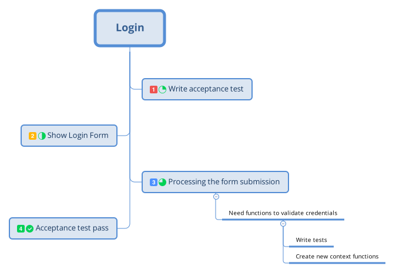
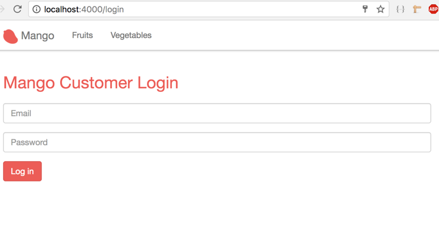
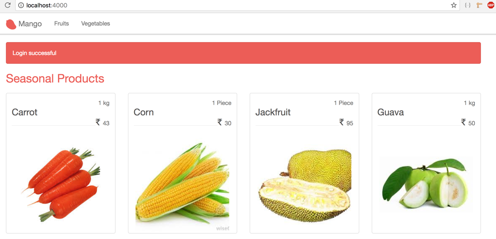

== Login

[sidebar]
.User Story #4
--
*As a customer, I want to login.*

Specifications:

* Customer should be able to login with the email and password combination used during registration.
* On successful login, redirect the user to the homepage with message "Login successful."
* On failed attempt, show the login form again with the message "Incorrect email/password."
--

=== Learning Map




=== Acceptance Test

We will start with an acceptance test for capturing the details above.

.test/mango_web/acceptance/session_test.exs https://gist.github.com/shankardevy/1186e4da8632dd1fa93a5149cc767188[Link]
```elixir
defmodule MangoWeb.Acceptance.SessionTest do
  use Mango.DataCase
  use Hound.Helpers

  hound_session()

  setup do
    ## GIVEN ##
    # There is a valid registered user
    alias Mango.CRM
    valid_attrs = %{
      "name" => "John",
      "email" => "john@example.com",
      "password" => "secret",
      "residence_area" => "Area 1",
      "phone" => "1111"
    }
    {:ok, _} = CRM.create_customer(valid_attrs)
    :ok
  end
  ## Test should be added here.
end
```
In the setup, we create a new customer with valid details so that the following tests can be made in the context of this customer trying to login.


Add the following test to check login validity

```elixir
  test "successful login for valid credential" do
    ## When ##
    navigate_to("/login")

    form = find_element(:id, "session-form")
    find_within_element(form, :name, "session[email]")
    |> fill_field("john@example.com")

    find_within_element(form, :name, "session[password]")
    |> fill_field("secret")

    find_within_element(form, :tag, "button")
    |> click

    ## THEN ##
    assert current_path() == "/"
    message = find_element(:class, "alert-info")
              |> visible_text()

    assert message == "Login successful"
  end
```

Add the following test for invalid login.

```elixir
test "shows error message for invalid credentials" do
  ## WHEN ##
  navigate_to("/login")

  form = find_element(:id, "session-form")

  find_within_element(form, :tag, "button")
  |> click

  ## THEN ##
  assert current_path() == "/login"
  message = find_element(:class, "alert-danger") |> visible_text()
  assert message == "Invalid username/password combination"
end
```

=== Show the Login Form

As with registration, we need two routes: one for displaying the login form and another for processing the submitted data.

Open `router.ex` and add these two routes.

.lib/mango_web/router.ex https://gist.github.com/shankardevy/27128f1222a9a06e9ba8ef91559d1379[Link]
```elixir
get "/login", SessionController, :new  <1>
post "/login", SessionController, :create <2>
```
<1> Used for displaying the login form
<2> Used for processing the login form


Create the session controller with the following content:

.lib/mango_web/controllers/session_controller.ex https://gist.github.com/shankardevy/0b815ea84111cb51f4f9fb9d0636ddd7[Link]
```elixir
defmodule MangoWeb.SessionController do
  use MangoWeb, :controller

  def new(conn, _params) do
    render(conn, "new.html")
  end
end
```

Create a new view at `mango_web/views/session_view.ex` with the following content.

.lib/mango_web/views/session_view.ex https://gist.github.com/shankardevy/01380128b8123d41ba4d4410668f7253[Link]
```elixir
defmodule MangoWeb.SessionView do
  use MangoWeb, :view
end
```

Finally, create a new template `mango_web/templates/session/new.html.eex` with the following code.

.lib/mango_web/templates/session/new.html.eex https://gist.github.com/shankardevy/0bd4810bd95732563c6593873d667cbc[Link]
```elixir
<div class="row">
  <div class="col-md-4 col-md-offset-4">
    <h1>Mango Customer Login</h1>
    <%= form_for @conn, session_path(@conn, :create), [as: :session, id: "session-form"], fn f -> %>
      <div class="form-group">
        <%= text_input f, :email, placeholder: "Email", class: "form-control" %>
      </div>
      <div class="form-group">
        <%= password_input f, :password, placeholder: "Password", class: "form-control" %>
      </div>
      <%= submit "Log in", class: "btn btn-primary" %>
    <% end %>
  </div>
</div>
```
In the previous section when we created a form for registration, the form fields directly mapped to the customer struct. But now, what we need is a simple form for login with two fields which doesn't map to any struct. For this purposes, we need to use `@conn` struct for creating the form.

At this stage, we now have a login form displayed. Try visiting http://localhost:4000/login to see the login form.




=== API Functions Required for Login


The form submission still doesn't work because we haven't added the `create` action yet. Let's do that now.

Open `session_controller.ex` file and add the following content.

```elixir
def create(conn, %{"session" => session_params}) do
  # check and load the customer matching the given credentials
  # if customer found, put the customer id on session data
  # if not found return to login page with error
end
```

We have already pattern matched the form data on the function header in the previous section on Registrations. We are reapplying the same concept here for getting the session data as well.
Now what we need is a way to validate the password and sign the customer in.

Since the form submission contains the email of the customer, we need a way to get a customer record from the database using their email as our query.

Next, we need to validate if the password given in the form data matches with the hashed password of the customer. If it matches we return the customer; if not we return an error.

Let's write the unit tests for the function `get_customer_by_email` which fetches a customer from the database using the given email. Open `test/mango/crm/crm_test.exs` file and add the following test.

.test/mango/crm/crm_test.exs
```elixir
test "get_customer_by_email" do
  valid_attrs = %{
    "name" => "John",
    "email" => "john@example.com",
    "password" => "secret",
    "residence_area" => "Area 1",
    "phone" => "1111"
  }
  {:ok, customer1} = CRM.create_customer(valid_attrs)
  customer2 = CRM.get_customer_by_email("john@example.com")
  assert customer1.id == customer2.id
end
```
The above test creates a customer and then uses the new function (that we will write subsequently) to load the customer by email. Finally we check if the customer returned by our new function is the same as the customer created in our test.

We will write a similar test for the function `get_customer_by_credentials` which will load the customer after verifying the given password. If the password matches the encrypted password, then the function returns the customer. Our test setup is similar, and we check if our new function will return the customer using the email and password used to create the customer.

```elixir
test "get_customer_by_credentials" do
  valid_attrs = %{
    "name" => "John",
    "email" => "john@example.com",
    "password" => "secret",
    "residence_area" => "Area 1",
    "phone" => "1111"
  }
  {:ok, customer1} = CRM.create_customer(valid_attrs)
  customer2 = CRM.get_customer_by_credentials(valid_attrs)
  assert customer1.id == customer2.id
end
```
https://gist.github.com/shankardevy/f21325fdffd534bdfa783ca4f511475d[See Gist of updated `crm_test.exs`]

Let's open the context file `lib/mango/crm/crm.ex` and add the following implementation code to pass the above tests.

.lib/mango/crm/crm.ex https://gist.github.com/shankardevy/ffdbd8e0802d65d22db22c291c3bd760[Link]
```elixir
def get_customer_by_email(email), do: Repo.get_by(Customer, email: email) <1>

def get_customer_by_credentials(%{"email" => email, "password" => pass} ) do
  customer = get_customer_by_email(email)

  cond do
    customer && Comeonin.Bcrypt.checkpw(pass, customer.password_hash) -> <2>
      customer
    true ->
      :error
  end
end
```
<1> We make use of the Ecto function `Repo.get_by` which allows any valid column on the database table to be queried.
<2> We make use of the `Comeonin.Bcrypt.checkpw` function from `Comeonin` library to check if the given password matches the hashed value of the stored password. If it matches, then we return a tuple with the customer information. If the customer is not found or if the password doesn't match, we return an `{:error}` tuple.


=== Adding Session Data

Now we have all the API functions needed for performing a login. So let's open up the `session_controller.ex` file and modify it as below. We will run through it line by line.

.lib/mango_web/controllers/session_controller.ex https://gist.github.com/shankardevy/cf79b1bafbdacc220525d598d1cfee6a[Link]
```elixir
alias Mango.CRM
def create(conn, %{"session" => session_params}) do
  case CRM.get_customer_by_credentials(session_params) do
    :error ->
      conn
      |> put_flash(:error, "Invalid username/password combination")
      |> render("new.html")
    customer ->
      conn
      |> assign(:current_customer, customer)
      |> put_session(:customer_id, customer.id)
      |> configure_session(renew: true)
      |> put_flash(:info, "Login successful")
      |> redirect(to: page_path(conn, :index))
  end
end
```
The `session_params` contains the `email` and `password` data entered by the user as an Elixir map. We pass this value to the function `get_customer_by_credentials` which will take care of validating the customer and password details given. Since we know the structure of the return value from this function, we now use a `case` statement to match the value and perform the appropriate action for either a successful or unsuccessful login.

For the unsuccessful attempt, we just put in a flash message and show the login form again. This is done by rendering the `new.html`.

For the successful login, we do a bit more:

. We store the customer data in the `conn` as `:current_customer` so that we can make use of the `@current_customer` variable in the templates.
. We store the customer information in the session data so that when the customer visit the site next time or makes a new page request, we know the customer is logged in.
.. To add data to the session, the Plug library provides the function `put_session` which takes in a key and a value. We use the key `:customer_id` and the value is the `id` field of the customer data.
.. We then use the function `configure_session` to regenerate a new session id and redirect the user to the homepage with the message "Login successful".

If we now try to login with a valid credential, we will be logged in as shown in the screenshot below:


