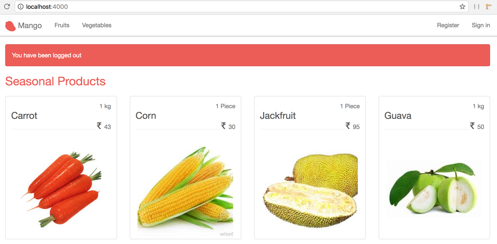

== Logout


[sidebar]
.User Story #5
--
*As a customer, I want to logout.*
--

This is going to be the simplest user story we implement in this entire book. We already have a navigation menu item to logout.

But the path doesn't exist yet. Let's create it.

Open `router.ex` and add this route.

.lib/mango_web/router.ex https://gist.github.com/shankardevy/b0b0e61368873c072bac0b8c8f6d7de6#file-router-ex-L29[Link]
```elixir
get "/logout", SessionController, :delete
```

We could make use of the `delete` verb instead of `get` for this route. However, this would mean our logout link would then be rendered as an HTML form.
Getting Bootstrap to display an HTML form in the dropdown menu is not supported by default and would require some CSS hacking. So we will just use an old school `get` url for our logout.

Open the `session_controller.ex` and add the `delete` action to it.

.lib/mango_web/controllers/session_controller.ex https://gist.github.com/shankardevy/15126fee0cdc0c2e451735334c708035#file-session_controller-ex-L26-L30[Link]
```elixir
def delete(conn, _) do
 clear_session(conn)
 |> put_flash(:info, "You have been logged out")
 |> redirect(to: page_path(conn, :index))
end
```

Since the session data holds the information about the logged in user, it's just a matter of clearing the session data to logout the user. So the next time the user visits the site, our `LoadCustomerPlug` will not be able to find the `customer_id` it needed to load the customer data and hence our app will treat the user as not loged in.

Click on the logout link and you will see the logout message on the homepage.


