== Registration

[sidebar]
.User Story #3
--
*As a customer, I want to register for an account.*

Specifications:

* The following details of the customer must be captured using the registration form:
** Name
** Email
** Phone number
** Residence Area
** Password
* All fields in the registration form are mandatory.
* Password should be a minimum of 6 characters.
* Email is the primary identifier of a customer during login.
* Since _Mango_ operates only in the Auroville community, only the list of residence area from Auroville should be shown in the registration form.
+
The list of residence areas is available from a public API and we need a library to query the data and present it in our desired format.
--

We are postponing our acceptance test in this chapter. We will go through a long tour of various concepts before we actually arrive at creating the registration form. By that time we risk forgetting what we did in the test. So instead we will start by learning the preliminaries required for user registration. Once we have the requisite foundation set, we will return to our acceptance test and then develop the functionality for this chapter.

=== Learning Map

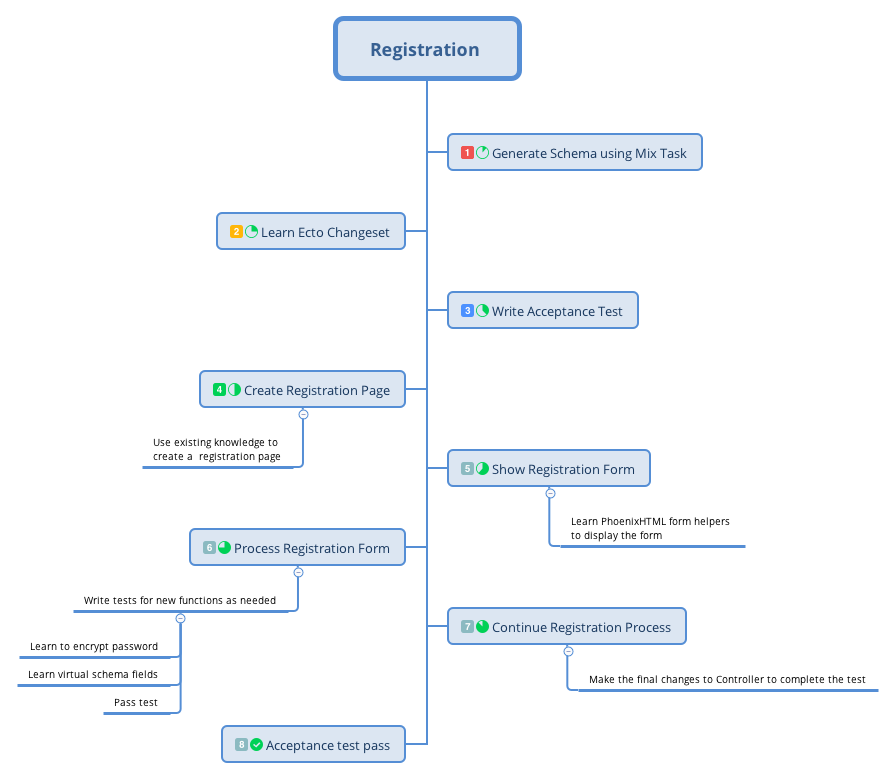


=== Generating Schema Using Mix Task

Let's get started with our storage needs. We need to decide where to store the registration data and how we should represent this data in our application.
As we saw earlier, we can store the data in a `customers` table and we can represent this data in our application using a `%Customer{}` struct.

The next thing we need to consider is the context module that will hold our API functions which will be used to interact with this struct. The context for this customer struct can be `CRM` (Customer Relationship Management).
We chose this name for the context as we have already seen a full list of user stories for _Mango_ which contains features such as the ability for the customer to create support tickets.
Because we have these functionalities planned, the name `CRM` suits us well. `CRM` is a good context because it fits our current needs and can be extended to hold other customer related API functions such as our support tickets.

[NOTE]
====
.Context names are contextual
Just because we used CRM as our context for storing the customers data, it doesn't mean every application where customer data is present should fall under a CRM `Context`.
The context module name is something very specific to the business operations of the application you are building.
====

In the last chapter when we migrated our Product data to Ecto, we manually created both the migration file and the schema file in two different steps.
We can do better by using the mix task `mix phx.gen.schema` to do it in a single command.

In the terminal, run the command `mix phx.gen.schema` followed by `ContextName.SchemaName`, `table_name_in_plural`, and a `list of fields` which are required in the table along with their their data type as shown in the command below.

```bash
→ mix phx.gen.schema CRM.Customer customers name:string email:string:unique phone residence_area password_hash
* creating lib/mango/crm/customer.ex
* creating priv/repo/migrations/20170613061922_create_customers.exs

Remember to update your repository by running migrations:

    $ mix ecto.migrate
```

The above command includes a lot of information and creates both the schema file and the migration file. Let's understand what is going on.

* `CRM.Customer` denotes that the context module is named `CRM` and the schema module is named `Customer`.
* `customers` denotes the plural form of the schema module which is used as the table name.
* Fields required in the schema are given after the table name in the format `field_name:type`.
* `name:string` denotes a `name` field of type string is required in the schema.
* `email:string:unique` denotes that an `email` field of type string is required in the schema and it needs to be unique i.e., implement `UNIQUE INDEX` in PostgreSQL table.
* other fields such as `phone` doesn't mention the data type. When given without a type the field defaults to type string.
+
In fact, we could also remove `:string` from the `name` column in our command.
It's just added there to show the different types of usage.


Open the newly created migration file and confirm everything is configured as required.

.priv/repo/migrations/**_create_customers.exs https://gist.github.com/shankardevy/0b8e242dca7a78e7f7ebccf3afbbd135[Link]
```elixir
defmodule Mango.Repo.Migrations.CreateCustomers do
  use Ecto.Migration

  def change do
    create table(:customers) do
      add :name, :string
      add :email, :string
      add :phone, :string
      add :residence_area, :string
      add :password_hash, :string

      timestamps()
    end

    create unique_index(:customers, [:email])
  end
end
```

All looks fine, except for the `email` field as our specification says

> Email is the primary identifier of a customer during login.

If we were to create a table as it is now, our system would consider data such as  "JOHN@example.com" and "john@example.com" to be two different emails and would allow two different registrations with the same username.

Obviously we don't want this to happen.
So we need to modify the column definition of the `email` field from `:string` to `:citext` which is a column type supported by the PostgreSQL database for storing case insensitive strings.
Additionally we need to enable the `citext` PostgreSQL extension as it's not available without enabling it explicitly.

Modify the `email` field definition in the migration file as given below.

.priv/repo/migrations/**_create_customers.exs https://gist.github.com/shankardevy/ca87eab8d94eb1dea9612073d2694b96[Link]
```elixir
defmodule Mango.Repo.Migrations.CreateCustomers do
  use Ecto.Migration

  def change do
    execute "CREATE EXTENSION IF NOT EXISTS citext" <1>
    create table(:customers) do
      add :name, :string
      add :email, :citext <2>
      add :phone, :string
      add :residence_area, :string
      add :password_hash, :string

      timestamps()
    end

    create unique_index(:customers, [:email])
  end
end
```
<1> Enable extension `citext`.
<2> Change column type.

Let's run `mix ecto.migrate` to execute the migration file.

=== Understanding Ecto.Changeset
Open `customer.ex` file created by our mix command to see the schema definition created.

.lib/mango/crm/customer.ex https://gist.github.com/shankardevy/ac3e0e5523afe23ad297c5051a451741[Link]
```elixir
defmodule Mango.CRM.Customer do
  use Ecto.Schema
  import Ecto.Changeset
  alias Mango.CRM.Customer


  schema "customers" do
    field :email, :string
    field :name, :string
    field :password_hash, :string
    field :phone, :string
    field :residence_area, :string

    timestamps()
  end

  @doc false
  def changeset(%Customer{} = customer, attrs) do
    customer
    |> cast(attrs, [:name, :email, :phone, :residence_area, :password_hash])
    |> validate_required([:name, :email, :phone, :residence_area, :password_hash])
    |> unique_constraint(:email)
  end
end
```

It looks similar to what we have seen in the `Product` schema module except this one imports `Ecto.Changeset` and has a `changeset/2` function defined in it.
To understand this changeset, let's open `iex -S mix` and start playing with it.


```bash
iex(1)> alias Mango.CRM.Customer
Mango.CRM.Customer

iex(2)> alias Mango.Repo
Mango.Repo

iex(3)> %Customer{name: "Shankar"} |> Repo.insert
[debug] QUERY OK db=42.9ms
INSERT INTO "customers" ("name","inserted_at","updated_at") VALUES ($1,$2,$3) RETURNING "id" ["Shankar", {{2017, 6, 13}, {7, 13, 35, 349497}}, {{2017, 6, 13}, {7, 13, 35, 356712}}]
{:ok,
 %Mango.CRM.Customer{__meta__: #Ecto.Schema.Metadata<:loaded, "customers">,
  email: nil, id: 1, inserted_at: ~N[2017-06-13 07:13:35.349497],
  name: "Shankar", password_hash: nil, phone: nil, residence_area: nil,
  updated_at: ~N[2017-06-13 07:13:35.356712]}}
```

[TIP]
====
Through out this book, we will be using `iex -S mix` shell to play with a lot of code like this. It's tiresome to type `alias` each time we start the `iex` shell.
We can avoid this by creating a `.iex.exs` file in the project root folder and add all the aliases you want to use each time you run `iex -S mix`.

```elixir
# .iex.exs file

alias Mango.{CRM, Repo}
alias Mango.CRM.Customer
```
With this above code written in an `.iex.exs` file, you don't have to type them each time you restart the `iex -S mix` shell.
====

We were able to create a new customer with just the name value using `Repo.insert`. We need to restrict the struct from being inserted into the database if it's missing required values?
The solution is to use Ecto.Changeset.

If you are familiar with Rails, Changeset is similar to ActiveRecord validations.
However, there is a lot of flexibility allowed with the Ecto.Changeset that is not provided by ActiveRecord.
For instance, it's very easy to provide different types of validations for a single schema without resorting to complex `if else` conditional trees.

Coming back to our `Customer` struct, let's say we don't want it to be stored without `name` and `email` field.
To do that, we need to use `Ecto.Changeset` when inserting the data.
Before we do that, let's understand what `Ecto.Changeset` is.

```elixir
iex> %Ecto.Changeset{}
Ecto.Changeset<action: nil, changes: %{}, errors: [], data: nil, valid?: false>

iex> Map.from_struct(%Ecto.Changeset{})
%{action: nil, changes: %{}, constraints: [], data: nil, empty_values: [""],
  errors: [], filters: %{}, params: nil, prepare: [], repo: nil, required: [],
  types: nil, valid?: false, validations: []}
```

As you can see from above, `%Ecto.Changeset{}` is a normal Elixir struct just like our `%Product{}` struct that we have created in the previous chapter.

The `%Ecto.Changeset{}` struct has several keys which can be seen in our second call to `Map.from_struct`.
Without going into details regarding what these keys are meant to store, understand that we need to use this struct to insert data into our database when we want to perform any kind of validation on our data.

So, for inserting validated data; instead of using `%Product{} |> Repo.insert` or `%Customer{} |> Repo.insert`,
we will have to use `%Ecto.Changeset{} |> Repo.insert`.

Because we use a common struct to insert all kinds of data in our database, there needs to be a mechanism to store our `product` data or `customer` data into this `%Ecto.Changeset{}` struct.
Ecto provides several functions to create and manipulate `%Ecto.Changeset` structs. These functions are defined in the module `Ecto.Changeset`.

.As a quick refresher on Elixir struct
****
Structs are defined within a module using `defstruct`. The struct takes the name of the module that defines it.
The module however is free to have any number of functions just like any other Elixir module.
```elixir
defmodule MyModule do
  defstruct [:field1, :field2]

  def func1() do
  end
  def func2() do
  end
end
```
The above code defines a module `MyModule`, it defines a struct named `%MyModule{}`, and it also defines two functions `func1` and `func2`.
****

To insert our customer data into `%Ecto.Changeset{}` struct, we need to use the function `cast` defined in `Ecto.Changeset`.

Back to `iex -S mix`, let's start using this cast function to create `%Ecto.Changeset` and insert customer data in it.

```elixir
iex> Ecto.Changeset.cast(%Customer{}, %{name: "shankar"}, [:name])
#Ecto.Changeset<action: nil, changes: %{name: "shankar"}, errors: [],
 data: #Mango.CRM.Customer<>, valid?: true>
```

The cast function takes 3 arguments and they work as described below.

. The first argument is the struct for which we are creating the changeset.
. The second argument contains the values we want to set in our struct.
. The last argument contains the list of fields in our struct that are allowed to change.

You can think of the cast function as a funnel that takes an input map, filters only the allowed values and stores the struct and filtered values in the `%Ecto.Changeset` struct.

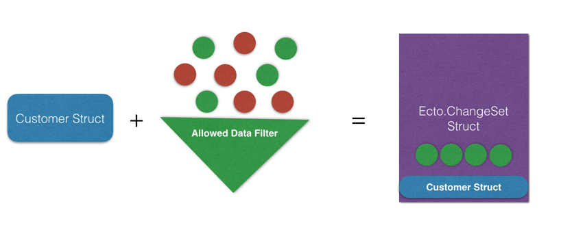

The above diagram explains the function of `cast`. On the left side of the `=`, we have `%Customer{}` struct, a set of values represented by green and red dots, and a filter that is in green.
On the right side of the `=` we have the output of the `cast` function which is an `%Ecto.Changeset` struct.
The struct returned embeds the entire `%Customer{}` struct as passed to the `cast` function and it contains only the green values as allowed by the filter.

Back to `iex -S mix`, we can try out different filters

```elixir
iex> Ecto.Changeset.cast(%Customer{}, %{name: "John", email: "john@example.com"}, [:name])
Ecto.Changeset<action: nil, changes: %{name: "John"}, errors: [],
 data: Mango.CRM.Customer<>, valid?: true>

iex> Ecto.Changeset.cast(%Customer{}, %{name: "John", email: "john@example.com"}, [:name, :email])
Ecto.Changeset<action: nil,
 changes: %{email: "john@example.com", name: "John"}, errors: [],
 data: Mango.CRM.Customer<>, valid?: true>
```
In the first example, we passed a `%Customer{}` struct, a map containing `name` and `email`, and a list containing only `:name` which acts as the filter.
The result is an `%Ecto.Changeset{}` struct. However, if we look at the `changes` key, we see only the `name` value appears.
```elixir
Ecto.Changeset<action: nil, changes: %{name: "John"}, errors: [],
 data: Mango.CRM.Customer<>, valid?: true>
```
This is because our filter given as the 3rd argument allows only the `:name` field to be changed.

In the second example, we did the same, but this time, we allowed both `:name` and `:email` by placing both values in our list of allowed filters.
This gives us an `%Ecto.Changeset{}` struct whose `:changes` key includes both the `:name` and `:email` values.

The `:changes` key in `%Ecto.Changeset{}` struct contains the values that are allowed in the filter,
whose value is different from the value present in the struct passed as first argument to `cast`.

Consider the following example

```elixir
iex> Ecto.Changeset.cast(%Customer{name: "John"},
...> %{name: "John", email: "john@example.com"},
...> [:name, :email])

Ecto.Changeset<action: nil, changes: %{email: "john@example.com"}, errors: [],
 data: Mango.CRM.Customer<>, valid?: true>
```
Even though we allow both `:name` and `:email` in our filter, the resulting changeset only contains `:email` value  in the `:changes` key. This is because, the customer struct that is passed in already has the same name.
So there is nothing changed from the original value.

It's important to note that `%Ecto.Changeset` is just a pure data structure.
It knows nothing about the database. The function `cast` also knows nothing about the database.
It consumes a struct and returns a struct.
That means unless we call `Repo.insert` or some other function in the `Repo` module with the changeset struct, the database is not touched. That is to say, Ecto does not make changes to the database.

Let's try inserting some data using a changeset.

```elixir
iex> changeset = Ecto.Changeset.cast(%Customer{},
...> %{name: "John", email: "john@example.com"},
...> [:name, :email])

iex> Repo.insert(changeset)
[debug] QUERY OK db=35.9ms queue=0.1ms
INSERT INTO "customers" ("email","name","inserted_at","updated_at") VALUES ($1,$2,$3,$4) RETURNING "id" ["john@example.com", "John", {{2017, 6, 13}, {10, 44, 15, 885167}}, {{2017, 6, 13}, {10, 44, 15, 895225}}]
{:ok,
 %Mango.CRM.Customer{__meta__: Ecto.Schema.Metadata<:loaded, "customers">,
  email: "john@example.com", id: 2, inserted_at: ~N[2017-06-13 10:44:15.885167],
  name: "John", password_hash: nil, phone: nil, residence_area: nil,
  updated_at: ~N[2017-06-13 10:44:15.895225]}}
```

Now, let's add more validation to our changeset. We want to insert our data only if the `:email` value is present.

```elixir
<1>
iex> changeset = Ecto.Changeset.cast(%Customer{},
...> %{name: "John"},
...> [:name, :email])

<2>
iex> changeset2 = Ecto.Changeset.validate_required(changeset, :email)

<3>
iex> changeset2.valid?
false

<4>
iex> Repo.insert(changeset2)
{:error,
 #Ecto.Changeset<action: :insert, changes: %{},
  errors: [email: {"can't be blank", [validation: :required]}],
  data: #Mango.CRM.Customer<>, valid?: false>}
```
<1> We create a new changeset as above, but we only set the `name` value.
<2> We use the returned changeset from step 1 and pass it to a new function where we check if `:email` is present.
<3> We could check if the changeset struct is valid without inserting it into the database. Just call the `valid?` key on the changeset struct.
<4> We try inserting the changeset returned from step 2 into the database which returns an error now.

We can chain these three steps using the pipe operator, which allows us to accomplish this without using temporary variables.

```elixir
%Customer{}
|> Ecto.Changeset.cast(%{name: "John"}, [:name, :email])
|> Ecto.Changeset.validate_required(:email)
|> Repo.insert
```

If we import the `Ecto.Changeset` module, the above code can be even more compacted
```elixir
%Customer{}
|> cast(%{name: "John"}, [:name, :email])
|> validate_required(:email)
|> Repo.insert
```

There are several validation functions present in the `Ecto.Changeset` like the `validate_required` function that we just saw.
All of them take a changeset as input, validate the data present in the changeset and return a changeset marking it as valid or invalid.
We will see more of these validation function as we work through the registration process.

Let's go back to our work...Where were we? Oh yeah! Customer schema.

With our recently gained knowledge of the Ecto.Changeset module, let's try to understand the Customer schema module generated earlier.

```elixir
defmodule Mango.CRM.Customer do
  use Ecto.Schema
  import Ecto.Changeset
  alias Mango.CRM.Customer


  schema "customers" do
    field :email, :string
    field :name, :string
    field :password_hash, :string
    field :phone, :string
    field :residence_area, :string

    timestamps()
  end

  @doc false
  def changeset(%Customer{} = customer, attrs) do <1>
    customer
    |> cast(attrs, [:name, :email, :phone, :residence_area, :password_hash]) <2>
    |> validate_required([:name, :email, :phone, :residence_area, :password_hash]) <3>
    |> unique_constraint(:email) <4>
  end
end
```
<1> A function that takes a customer struct and a Map containing a new set of values for the customer struct. Basically the function wraps all that we did in the last exercise.
<2> Create a changeset allowing only the listed fields. Currently it lists all fields.
<3> Make all listed fields mandatory.
<4> Ensure the value for `email` field is unique.

Let's use it in the IEx shell.

```elixir
iex> %Customer{} |> Customer.changeset(%{})

Ecto.Changeset<action: nil, changes: %{},
 errors: [name: {"can't be blank", [validation: :required]},
  email: {"can't be blank", [validation: :required]},
  phone: {"can't be blank", [validation: :required]},
  residence_area: {"can't be blank", [validation: :required]},
  password_hash: {"can't be blank", [validation: :required]}],
 data: Mango.CRM.Customer<>, valid?: false>
```
As expected, we get a changeset struct with all the errors listed in the errors key.


And when we pass all the required values, we get a changeset whose `valid?` value is `true`.
```elixir
Ecto.Changeset<action: nil,
 changes: %{email: "john@example.com", name: "John", password_hash: "pass",
   phone: "11111", residence_area: "Area1"}, errors: [],
 data: Mango.CRM.Customer<>, valid?: true>

iex> changeset.valid?
true
```


=== Acceptance Test for Registration form
As promised we have spent a good deal of time understanding the Ecto.Changeset schema and function.
Now let's get into the task of creating the registration form.

We will start with an acceptance test.

Create a new file at `test/mango_web/acceptance/registration_test.exs`

.test/mango_web/acceptance/registration_test.exs https://gist.github.com/shankardevy/22b02a5792690d982cd7febcc1bb12a0[Link]
```elixir
defmodule MangoWeb.Acceptance.RegistrationTest do
  use Mango.DataCase
  use Hound.Helpers

  hound_session()

  # Add test functions here
end
```

Add the following test function that checks for a successful registration.

```elixir
test "registers an account with valid data" do
  navigate_to("/register")

  form = find_element(:id, "registration-form")
  find_within_element(form, :name, "registration[name]")
  |> fill_field("John")

  find_within_element(form, :name, "registration[email]")
  |> fill_field("john@example.com")

  find_within_element(form, :name, "registration[phone]")
  |> fill_field("1111")

  find_within_element(form, :name, "registration[residence_area]")
  |> fill_field("Area 1")

  find_within_element(form, :name, "registration[password]")
  |> fill_field("password")

  find_within_element(form, :tag, "button")
  |> click

  assert current_path == "/"
  message = find_element(:class, "alert")
            |> visible_text()

  assert message == "Registration successful"
end
```

The test navigates to the `/register` path and fills in all the fields with valid data. We are using the `:name` strategy to find the elements and the `fill_field` function to enter the value.

Finally we submit the form and expect the "Registration successful" message on the homepage.

Now add this test for checking invalid registration.

```elixir
test "shows error messages on invalid data" do
  navigate_to("/register")

  form = find_element(:id, "registration-form")
  find_within_element(form, :tag, "button") |> click

  assert current_path() == "/register"
  message = find_element(:id, "form-error") |> visible_text()
  assert message == "Oops, something went wrong! Please check the errors below."
end
```

https://gist.github.com/shankardevy/22b02a5792690d982cd7febcc1bb12a0[View Gist of complete test file]

We start again by navigating to "/register" and we submit the form without filling in any values.
Then we expect to return back to the same path and find an error message. Of course, we could do better by testing if the error message for each of the field is as expected. However, that would be overkill for what we are trying to learn now. You can of course try to do that as an exercise.


=== Creating Registration Page

To start with, let's create two new routes for handling registration.


.lib/mango_web/router.ex https://gist.github.com/shankardevy/bbbb1cd7efa30856d2b85024bd2649c3#file-router-ex-L21-L22[Link]
```elixir
scope "/", MangoWeb do
  (...)

  get "/register", RegistrationController, :new <1>
  post "/register", RegistrationController, :create <2>
end
```
<1> Add this route for showing the registration form.
<2> Add this route for processing the form submission.

We will now add a new controller file `registration_controller.ex` inside `lib/mango_web/controllers` with the following content:

.lib/mango_web/controllers/registration_controller.ex https://gist.github.com/shankardevy/994d90c40e3dacd3d98c48a9fab87e99[Link]
```elixir
defmodule MangoWeb.RegistrationController do
  use MangoWeb, :controller

  def new(conn, _) do
    render(conn, "new.html")
  end

end
```

Create a new view file at `lib/mango_web/views/registration_view.ex` with the following content.

.lib/mango_web/views/registration_view.ex https://gist.github.com/shankardevy/9839fbd02c603d195b32270dd5db144f[Link]
```elixir
defmodule MangoWeb.RegistrationView do
  use MangoWeb, :view
end
```

Finally add a new template file at `lib/mango_web/templates/registration/new.html.eex` with the following content.

.lib/mango_web/templates/registration/new.html.eex
```html
<h1>Register account</h1>
```

Now visit http://localhost:4000/register` to see the message in our template.

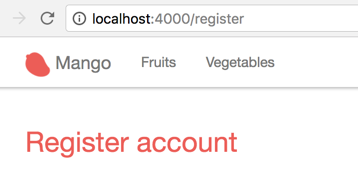

Our registration form is going to create a new customer when submittted with valid data.
When a form directly maps to a schema struct, we need an `Ecto.Changeset`.
In our case, we need an `Ecto.Changeset` for our customer struct to create this registration form.

We don't have our context module `CRM` created yet. We need two functions in this context for our current requirements. We will call them

* `build_customer`
* `create_customer`

The following are the requirements for the `build_customer` function:

* We should be able to call the `build_customer` function without any arguments and it should return a changeset struct. We will use this changeset for displaying the registration form.

* We should also be able to call the `build_customer` function with an optional map containing the customer field values. In this case, it should create a new changeset with those values applied. We will use this return value to try inserting the struct into the database.

Let's start writing the unit test for these two functions with the above design in mind. Create a new file `test/mango/crm/crm_test.exs` file with the below content:

.test/mango/crm/crm_test.exs https://gist.github.com/shankardevy/691b7f4dede5a8418673ddfa98c6aa73[Link]
```elixir
defmodule Mango.CRMTest do
  use Mango.DataCase
  alias Mango.CRM
  alias Mango.CRM.Customer

  test "build_customer/0 returns a customer changeset" do
    assert %Ecto.Changeset{data: %Customer{}} = CRM.build_customer
  end

  test "build_customer/1 returns a customer changeset with values applied" do
    attrs = %{"name" => "John"}
    changeset = CRM.build_customer(attrs)
    assert changeset.params == attrs
  end
end
```

The first test is straight forward. `Ecto.Changeset` has several keys which we haven't seen in detail. The `:data` key in the changeset stores the struct for which it is created. Here we are testing if the changeset returned is for the `%Customer{}` struct by pattern matching on the `:data` key.

The second test checks if the attrs passed in to `build_customer` are indeed applied to the changeset. We test this by checking if the `:params` of the changeset is the same as the map we passed into the `build_customer` function.

To pass both the tests, let's create `lib/mango/crm/crm.ex` with the following code.

.lib/mango/crm/crm.ex https://gist.github.com/shankardevy/1a61a30328bdb8eaba5a0b1bf6d4d55b[Link]
```elixir
defmodule Mango.CRM do
  alias Mango.CRM.Customer

  def build_customer(attrs \\ %{}) do
    %Customer{}
    |> Customer.changeset(attrs)
  end
end
```

The `\\` in the function definition sets the default value of `attrs` to an empty map `%{}`. This default value is used when we don't pass in any value to `build_customer`. The rest of the code is what we have already seen. We are building a changeset for the `%Customer{}` struct passing in the `attrs` value.

Run `mix test test/mango/crm/crm_test.exs` to confirm everything passes.

Let's modify the `registration_controller.ex` file to use this new function and then pass the changeset returned in to the template.

.lib/mango_web/controllers/registration_controller.ex https://gist.github.com/shankardevy/995c8831ba908f74f1fae037e214ffeb[Link]
```elixir
defmodule MangoWeb.RegistrationController do
  use MangoWeb, :controller
  alias Mango.CRM <1>

  def new(conn, _) do
    changeset = CRM.build_customer() <2>
    render(conn, "new.html", changeset: changeset) <3>
  end
end
```
<1> Add alias to context module.
<2> Create a changeset.
<3> Pass changeset to template.


=== Understanding Form Helpers

We will now modify this template to display a registration form.
It basically needs an html form like below

```html
<form method="post" action="/register">
  <input type="text" name="name" value="" />
  <input type="text" name="email" value="" />
  <input type="text" name="phone" value="" />
  <input type="text" name="residence_area" value="" />

  <input type="submit" name="Register" />
</form>
```

However, instead of using the plain HTML form like above, we will make use of `form_for` html helper to generate the HTML form.
Using `form_for` automatically adds hidden fields to the generated form with CSRF tokens that Phoenix uses to validate the incoming data.
By default Phoenix enables CSRF protection so any form submission without valid CSRF tokens are rejected by Phoenix thus securing the application from CSRF attacks.

Modify the template to present a partial registration form.

.lib/mango_web/templates/registration/new.html.eex https://gist.github.com/shankardevy/4aace9771b5d339133b39b48e39fcfef[Link]
```elixir
<h1>Register account</h1>
<%= form_for @changeset, registration_path(@conn, :create), [as: :registration, id: "registration-form"], fn f -> %>
  <div class="form-group">
    <%= label f, :name, class: "control-label" %>
    <%= text_input f, :name, class: "form-control" %>
    <%= error_tag f, :name %>
  </div>

  <%= submit "Register", class: "btn btn-primary" %>
<% end %>
```

Now visit the page to see the form rendered.

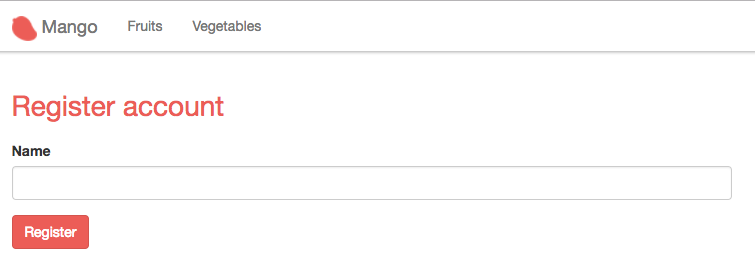

The form needs more elements but before we add them, let's focus on understanding the code so far.

The above code using `form_for` block generates the following HTML

```html
<form accept-charset="UTF-8" action="/register" id="registration-form" method="post">
  <input name="_csrf_token" type="hidden" value="PzcECh5dAAFwYX1zPwJsFi85GRUrNgAAKd7r+nZoETL5RlTNZLjAnw==">  <1>
  <input name="_utf8" type="hidden" value="✓">
  <div class="form-group">
    <label class="control-label" for="registration_name">Name</label>
    <input class="form-control" id="registration_name" name="registration[name]" type="text">
  </div>
  <button class="btn btn-primary" type="submit">Register</button>
</form>
```
<1> CSRF token generated automatically.


```elixir
<%= form_for @changeset, registration_path(@conn, :create), [as: :registration, id: "registration-form"], fn f -> %>
```

The `form_for` function takes

* `@changeset` struct as the first argument.
* the path to submit the form data as the second argument.
* a keyword list of options as the third argument. Specifically, the `as` option defines the name prefix for the elements in the form.
+
If you look at the `name` attribute of the generated HTML, you can see that our form field name gets nested under `registration[]`.
This is due to the `as` option we used in the `form_for` function. The form also gets an HTML id attribute value as passed in the options.
* finally it takes an anonymous function as the fourth argument which renders the form fields.

Within the anonymous function, we render

* a text field for getting the customer name. We will add more fields shortly.
* a button to submit the form.

Let's look at the helper to generate a single field.

.Phoenix input field helper
```elixir
<%= text_input f, :name, class: "form-control" %>
```

.HTML Output
```HTML
<input class="form-control" id="registration_name" name="registration[name]" type="text">
```

All input helper functions take a form struct represented by `f` as the first argument and the input name as the second argument.
Any attributes that need to be set on the HTML element are given as the third argument in a keyword list.

With this understanding, let's add all the remaining fields. Our template will now look like this:

.lib/mango_web/templates/registration/new.html.eex https://gist.github.com/shankardevy/0c66dc500cddcc69ff7483c1569d1c67[Link]
```elixir
<h1>Register account</h1>
<%= form_for @changeset, registration_path(@conn, :create), [as: :registration, id: "registration-form"], fn f -> %>
  <div class="form-group">
    <%= label f, :name, class: "control-label" %>
    <%= text_input f, :name, class: "form-control" %>
    <%= error_tag f, :name %>
  </div>

  <div class="form-group">
    <%= label f, :email, class: "control-label" %>
    <%= text_input f, :email, class: "form-control" %>
    <%= error_tag f, :email %>
  </div>

  <div class="form-group">
    <%= label f, :phone, class: "control-label" %>
    <%= text_input f, :phone, class: "form-control" %>
    <%= error_tag f, :phone %>
  </div>

  <div class="form-group">
    <%= label f, :residence_area, "Area of Residence", class: "control-label" %>
    <%= text_input f, :residence_area, class: "form-control" %>
    <%= error_tag f, :residence_area %>
  </div>

  <div class="form-group"> <1>
    <%= label f, :password, class: "control-label" %>
    <%= password_input f, :password, placeholder: "Password", class: "form-control" %>
    <%= error_tag f, :password %>
  </div>

  <%= submit "Register", class: "btn btn-primary" %>
<% end %>
```
<1> The customer struct contains a `password_hash` field, but here we create a form field for `password`.
Phoenix form helpers allow us to create arbitrary form fields even if they are not present in the changeset.
The reason we use `password` instead of the existing field `password_hash` is because we don't want to store the plain text password from the user directly in the database.
Instead, we are getting the plain text password in the field `password`. We will later do some processing to generate the hash and finally store the hash in the database.

Back in the browser, our registration form is now complete.

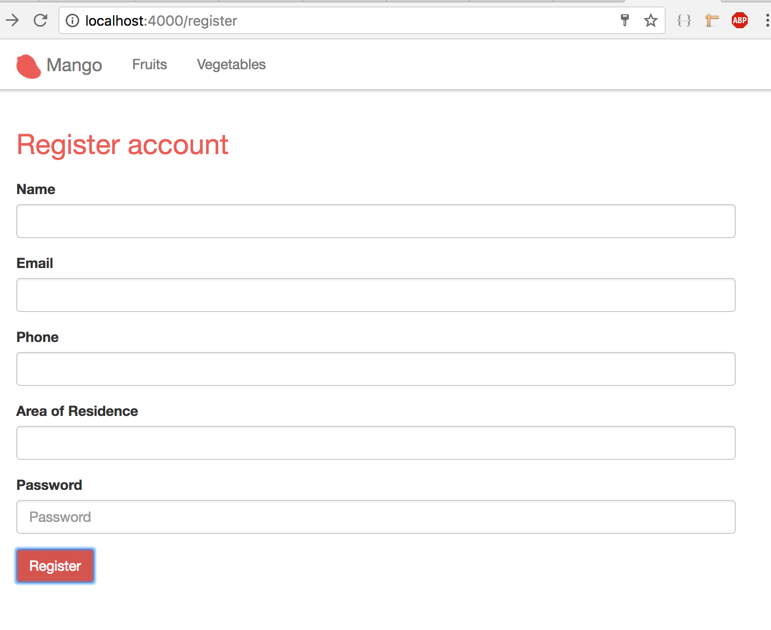

Try submitting it, we will get this error.

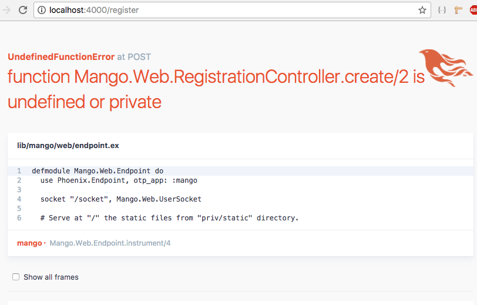

That's because we haven't added the `create` action in our `registration_controller.ex` to handle the form submission.

=== Processing Registration Form

Open the controller and add the `create` action as below:

```elixir
def create(conn, params) do
  # we will add code here soon.
end
```

_How to retrieve the submitted form details from the params?_

When a form is submitted, the controller actions receive the form contents as part of `params` in the second argument.
Unless we know the structure of the form data present in `params`, it's not possible to pattern match and isolate the submitted data from the form.
All form submissions in Phoenix are received in the map format as `%{ "form_name" => form_submission_data }`, where

* `form_name` is the value passed to the `as` key in the `form_for` helper function. In our case, this value is `registration`.
* `form_submission_data` is again a map whose keys are the names given to each field. Their corresponding values are the users submitted form data.

So to get the submitted data from our registration form we just need to pattern match on the key "registration". The result will be a map of our submitted data.

```elixir
%{"registration" => registration_data} = params
```
We can do this match on the function head as below:

```elixir
def create(conn, %{"registration" => registration_params}) do
end
```

=== Encrypting Passwords

We have the submitted data available within our controller as `registration_params` and what we now need is a function to create a customer with this value.

The function name can be `create_customer` accepting a map of our customer field values.

The requirements for this function are:

. It should return a tuple containing `{:ok, inserted_customer_struct}` when the data given is valid.

. It should return `{:error, changeset}` when the data is invalid.

. It should check for all the validations given in our user story.

. Additionally, when we create a customer, we enter a plain text password. However, it should not store the plain text password, but rather store the encrypted version.

To satisfy the last condition, we need to make a couple of changes to our schema.

. We need to disallow the `password_hash` field from being set by the incoming values to the changeset function.

. We need a virtual field `password` to accept the plain text password from the user. Virtual fields are not stored to the database but created for storing temporary values from the user. We use this virtual field for validation if the password is correctly set by the user and to display any errors related to the password if not.

. Finally we will use a library called `Comeonin` to encrypt the given plain text password and then manually add it to the `password_hash` field in the changeset before inserting the new customer into the database.

Add the following test to `test/mango/crm/crm_test.exs` file.

.test/mango/crm/crm_test.exs https://gist.github.com/shankardevy/f0127229cb2ba2624ab51b62cf7caca5[Link]
```elixir
test "create_customer/1 returns a customer for valid data" do
  valid_attrs = %{
    "name" => "John",
    "email" => "john@example.com",
    "password" => "secret",
    "residence_area" => "Area 1",
    "phone" => "1111"
  }
  assert {:ok, customer} = CRM.create_customer(valid_attrs)
  assert Comeonin.Bcrypt.checkpw(valid_attrs["password"], customer.password_hash) <1>
end

test "create_customer/1 returns a changeset for invalid data" do
  invalid_attrs = %{}
  assert {:error, %Ecto.Changeset{}} = CRM.create_customer(invalid_attrs)
end
```
<1> Assuming the plain text password "secret" is encrypted and stored in the customer record,
we check if the stored password_hash is indeed valid for the given pass. `checkpw` returns `true` for valid pass and hash combination and returns `false` otherwise.


Open `mix.exs` file and add `comeonin` as dependency to the `deps` function and run `mix deps.get` to download it.

```elixir
{:comeonin, "~> 3.0"}
```

.Comeonin Version 4
****
If you want to try the latest version of Comeonin library which is V4 at the time of this writing, you need to add both `comeonin` and `bcrypt_elixir` as below:

```elixir
{:comeonin, "~> 4.0"},
{:bcrypt_elixir, "~> 0.12.0"},
```
****

=== Creating Virtual Schema Field

Open `lib/mango/crm/customer.ex` to make the modifications to the customer schema as discussed above.

.lib/mango/crm/customer.ex
```elixir
(...)
schema "customers" do
  field :email, :string
  field :name, :string
  field :password, :string, virtual: true <1>
  field :password_hash, :string
  field :phone, :string
  field :residence_area, :string

  timestamps()
end
(...)
```
<1> Add this line. The option `virtual: true` makes it non-persistent i.e., it doesn't get saved to the database.

We also need to change our `changeset` function in the same file to accept the value for the virtual field `:password` and to set validations for the other fields.

.lib/mango/crm/customer.ex
```elixir
def changeset(%Customer{} = customer, attrs) do
  customer
  |> cast(attrs, [:name, :email, :residence_area, :password, :phone]) <1>
  |> validate_required([:name, :email, :residence_area, :password]) <2>
  |> validate_format(:email, ~r/@/, message: "is invalid")
  |> validate_length(:password, min: 6, max: 100)
  |> unique_constraint(:email)
end
```
<1> Change `:password_hash` to `:password` in the call to `cast`.
<2> Change `:password_hash` to `:password` in the call to `validate_required`


Now that we have removed the `password_hash` field from the casting, we need to set it manually with the hashed content of plain text password.

To generate the hash, we will use the `comeonin` Elixir library that we installed which uses a secure algorithm to hash the password.

.lib/mango/crm/customer.ex https://gist.github.com/shankardevy/e9febbe754b0b54ff1b0e08e22aa9330[Link]
```elixir
defmodule Mango.CRM.Customer do
  (...)
  import Comeonin.Bcrypt, only: [hashpwsalt: 1]

  def changeset(%Customer{} = customer, attrs) do
    customer
    |> cast(attrs, [:name, :email, :residence_area, :password, :phone])
    |> validate_required([:name, :email, :residence_area, :password])
    |> validate_format(:email, ~r/@/, message: "is invalid")
    |> validate_length(:password, min: 6, max: 100)
    |> unique_constraint(:email)
    |> put_hashed_password() <1>
  end

  defp put_hashed_password(changeset) do <2>
    case changeset.valid? do
      true ->
        changes = changeset.changes
        put_change(changeset, :password_hash, hashpwsalt(changes.password))
      _ ->
        changeset
    end
  end
end
```
<1> Add a new function to the pipeline.
<2> Checks if the changeset is valid. If so get the password from the changeset, hash it using `Comeonin.Bcrypt.hashpwsalt` and return a new changeset with the `password_hash` field value set.
If the changeset is invalid, i.e., some other validation already failed, we don't spend time encrypting the password and return the changeset as it is.

With all those changes done in the Customer module, let's create a new function in `CRM` context module to create a customer.

.lib/mango/crm/crm.ex https://gist.github.com/shankardevy/9197ff3567dd4685e14cfe5d885bb131[Link]
```elixir
defmodule Mango.CRM do
  (...)

  def create_customer(attrs) do
    attrs
    |> build_customer
    |> Repo.insert
  end
end
```

With this change, let's check if our new unit tests for CRM pass.

```
mix test test/mango/crm/crm_test.exs
```

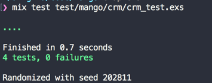

=== Continuing the Registration Process

All tests pass and now we could make use of our new functions in the `create` action of our registration controller.

.lib/mango_web/controllers/registration_controller.ex https://gist.github.com/shankardevy/98ba3dd5a8a5c15118a0b8ca5d73cf7a[Link]
```elixir
def create(conn, %{"registration" => registration_params}) do
  case CRM.create_customer(registration_params) do
    {:ok, customer} ->
      conn
      |> put_flash(:info, "Registration successful")
      |> redirect(to: page_path(conn, :index))
    {:error, changeset} ->
      conn
      |> render(:new, changeset: changeset)
  end
end
```

We make a call to `CRM.create_customer(registration_params)` and we pattern match on the return value.
If it matches `{:ok, customer}`, then we use `put_flash` to set the success message and finally redirect to the homepage.
If the return value matches the pattern `{:error, changeset}` we render the `new.html` template passing the error changeset to template.
The Phoenix form helpers automatically show the error in each field in the rendered template.

Now open up http://localhost:4000/register and submit the form without entering any values.

It will display the registration form again with error messages against each field.

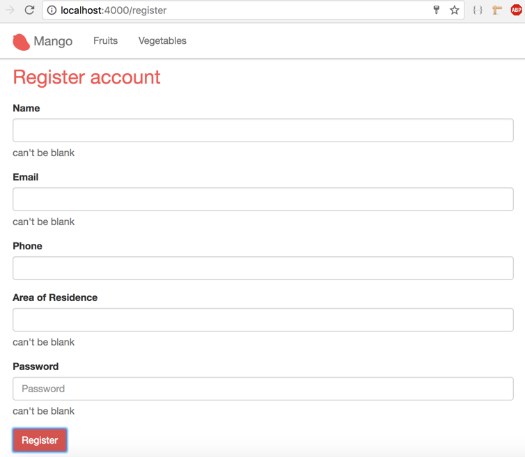

Now run the test `mix test test/mango_web/acceptance/registration_test.exs` and we should have the test for valid form submission pass while the other fail.

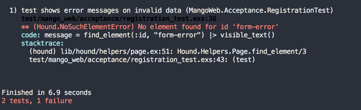

=== Acceptance Test Passing

Our invalid form submission test expects a message to be shown on the form if there are errors present. In order to get our `Acceptance Test Passing` we need to add this message. Open the registration template and add this code inside the `form_for` block.

.lib/mango_web/templates/registration/new.html.eex https://gist.github.com/shankardevy/8a35acbd349bd3623bf10f8af9645adc[Link]
```elixir
<h1>Register account</h1>
<%= form_for @changeset, registration_path(@conn, :create), [as: :registration, id: "registration-form"], fn f -> %>

# Add code below:
<%= if @changeset.action do %>
  <div id="form-error" class="alert alert-danger">
    <p>Oops, something went wrong! Please check the errors below.</p>
  </div>
<% end %>
(...)
```
The above code checks if the `action` value is present in `@changeset`. If present, it shows the message. The `action` value is set in the changeset when `Repo.insert` fails to inserting the changeset.

Now running the test again, both the tests should pass.

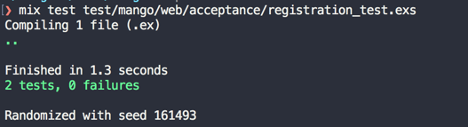

We will run our complete test suite to check ensure we did not introduce any regressions.

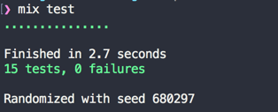

No errors. We are good to go so lets modify the registration form to satisfy the last requirement of our user story:

""
Since for now, _Mango_ operates only in Auroville community only the list of residential area from Auroville should be shown in the registration form.
""

We can modify the residence_area field in the registration form as shown below to convert it into a select box:

```elixir
<%= select f, :residence_area, ["Area 1", "Area 2", "Area 3"], prompt: "Choose your residence area", class: "form-control" %>
```

The `select` function creates an HTML select box with the options passed to it as a list. In the above code, we are creating a select box in the registration form showing three options with the prompt "Choose your residence area" as shown below:

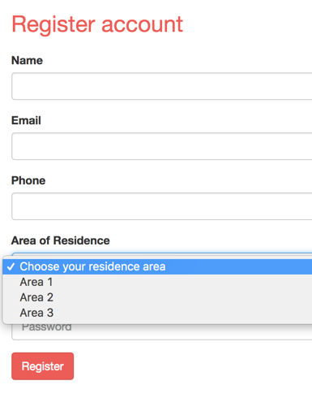

In a real world application, we would probably get this list from an external service that provides a JSON list of residence areas.

Third party integration code that are not specific to our application can be added as top level directories under the `lib` folder. Create a new file `lib/auroville/residence_service.ex` with the code shown below:

```elixir
defmodule Auroville.ResidenceService do
  def list_areas do
    ["Area 1", "Area 2", "Area 3"]
  end
end
```

The folder `lib/auroville` serves as the context for our external integration code. In the above example, we have a hard coded list of areas. However, in a real world application, this list will be replaced with an HTTP request for an external API that provides the real-time list of residence areas. Elixir has several HTTP client libraries such as HTTPoison and HTTPotion. You may use them to get the list of areas from an external service. For example:

```elixir
# Pseudocode
defmodule Auroville.ResidenceService do
  def list_areas do
    response = HTTPoison.get "http://api.auroville.org.in/residence"
    # The assumption here is that the above API will provide a list of residence areas as JSON data.
    Poison.decode!(response.body)
    # Poison library is already available in our Phoenix project.
    # We call the `decode!/1` function to convert the response body into an Elixir List.
  end
end
```

Now, let's change the registration controller as shown below:

.lib/mango_web/controllers/registration_controller.ex  https://gist.github.com/shankardevy/e0379f63de933cd4ee8bbe8dab80ec38[Link]
```elixir
(...)
def new(conn, _) do
  changeset = CRM.build_customer()
  residence_areas = Auroville.ResidenceService.list_areas <1>
  render(conn, "new.html", changeset: changeset, residence_areas: residence_areas) <2>
end

def create(conn, %{"registration" => registration_params}) do
  case CRM.create_customer(registration_params) do
    {:ok, _customer} ->
      conn
      |> put_flash(:info, "Registration successful")
      |> redirect(to: page_path(conn, :index))
    {:error, changeset} ->
      residence_areas = Auroville.ResidenceService.list_areas <3>
      conn
      |> render(:new, changeset: changeset, residence_areas: residence_areas) <4>
  end
end
(...)
```

(1 - 4) -- We are getting the list of residence areas from the external service module that we just created and we pass on this value to the template in both the `new` and `create` actions.

Let's modify the template to use this value. Open `templates/registration/new.html.eex` and modify the `residence_area` field as shown below:

```elixir
<%= select f, :residence_area, @residence_areas, prompt: "Choose your residence area", class: "form-control" %>
```

If we run our test now, the acceptance test for the registration form will be broken.

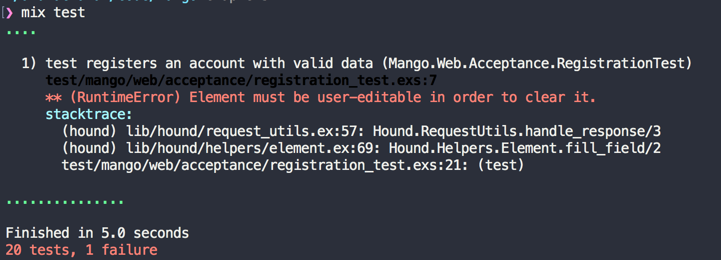

This is because our existing acceptance test treats the residence area field as a text box. We have now changed it to a select box in the registration form. So we need to modify the test file as well. Open `test/mango_web/acceptance/registration_test.exs` and modify the `residence_area` field as shown below:

Replace this line
```elixir
find_within_element(form, :name, "registration[residence_area]")
|> fill_field("Area 1")
```

With this line:
```elixir
find_element(:css, "#registration_residence_area option[value='Area 1']")
|> click
```
https://gist.github.com/shankardevy/66a6f2499369c8a304a87c076dfffed9#file-registration_test-exs-L20[View Gist] of the modified change in the test file.

Now run `mix test` and all tests should pass as earlier.
