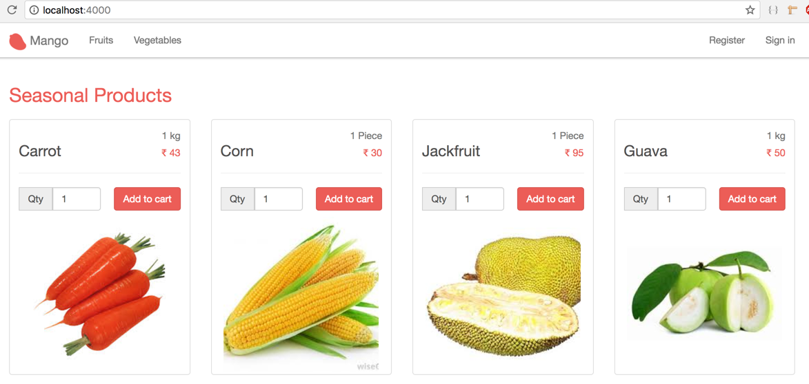

== Add to cart

With the `Order` schema available to back up our cart functionality, let's get started with implementing the _Add to cart_ user story.

[sidebar]
.User Story #6
--
*As a customer, I want to add products to my cart.*

Specifications:

* show an "add to cart" form for every product displayed on the homepage
* the cart form should contain a quantity field defaulting to one
* when the form is submitted, the selected quantity of the product is added to the cart.
--

=== Acceptance test
Let's start with an acceptance test. Create a new file `test/mango_web/acceptance/cart_test.exs` and add the following test code.

[source,elixir]
.test/mango_web/acceptance/cart_test.exs https://gist.github.com/shankardevy/4ec1b0fc863727b9a16fc5668b47a5f5[Link]
----
defmodule MangoWeb.Acceptance.CartTest do
  use Mango.DataCase
  use Hound.Helpers

  hound_session()

  setup do
    alias Mango.Repo
    alias Mango.Catalog.Product

    Repo.insert %Product{ name: "Carrot", pack_size: "1 kg", price: 55, sku: "A123", is_seasonal: true }
    Repo.insert %Product{ name: "Apple", pack_size: "1 kg", price: 75, sku: "B232", is_seasonal: true }
    :ok
  end

  test "presence of cart form for each product" do
    navigate_to("/")

    products = find_all_elements(:css, ".product") <1>

    assert Enum.count(products) != 0  <2>
    products
    |> Enum.each(fn(product) ->  <3>
      button = find_within_element(product, :tag, "button")
      assert visible_text(button) == "Add to cart"
    end)
  end
end
----
<1> We find all products on the homepage using the css class `.product`
<2> We confirm that the products are indeed found by asserting the count is not equal to zero
<3> We loop through each of the product and check if there is a child element of type "button" with the caption as "Add to cart"

NOTE:: We make use of helper functions from Hound library to interact with the webpage. You can find complete documentation of all the functions available from Hound for use in acceptance test in https://hexdocs.pm/hound/readme.html#helpers[Hound Documentation]

We can now run just the cart acceptance test by executing `mix test` with the file name.

```bash
→ mix test test/mango_web/acceptance/cart_test.exs
```

It should fail now as there are no button elements in our product template yet.

=== Modifying product template
Open product template at `mango_web/templates/product/product_card.html.eex` to add the cart form.

[source,elixir]
.lib/mango_web/templates/product/product_card.html.eex https://gist.github.com/shankardevy/46ea4f921bd23077ad026916619db3df[Link]
----
<div class="product thumbnail">
    (...)
    <hr/>
    <!-- add to cart code begins -->
    <%= form_for @conn, "/cart", [as: :cart], fn f -> %>
      <%= hidden_input f, :product_id, value: @product.id %>
      <%= number_input f, :quantity, value: 1  %>
      <%= submit "Add to cart" %>
    <% end %>
    <!-- add to cart code ends -->
    (...)
</div>
----

Also make sure to pass on the `@conn` variable to the `product_card.html.eex` template so that our cart form can access it.

Open `page/index.html.eex` and `category/show.html.eex` and modify the line shown below in both files by passing `@conn`.

```elixir
<%= render MangoWeb.ProductView, "product_card.html", conn: @conn, product: product %>
```

=== Adding more specs to test
Since we now have the expected "Add to cart" button on our product template, running our acceptance test again will now pass.


Let's modify the acceptance test to actually test the functionality of adding the product to cart.


[source,elixir]
.test/mango_web/acceptance/cart_test.exs https://gist.github.com/shankardevy/c32aa7aea3d6209bc64047285a4acf5d[Link]
----
defmodule MangoWeb.Acceptance.CartTest do

  (...)

  test "add to cart" do
    navigate_to("/")

    [product | _rest] = find_all_elements(:css, ".product-thumbnail")

    product_name = find_within_element(product, :name, "cart[product_name]")
                   |> attribute_value("value")
    pack_size = find_within_element(product, :name, "cart[pack_size]")
                |> attribute_value("value")

    find_within_element(product, :name, "cart[quantity]")
    |> fill_field(2)

    find_within_element(product, :tag, "button")
    |> click

    message = find_element(:css, ".alert")
              |> visible_text()
    assert message == "Product added to cart - #{product_name}(#{pack_size}) x 2 qty"
  end

end
----

The modified test now finds the quantity field and changes the value to `2` and then clicks on the cart button.
It then checks if there is a success message such as "Product added to cart - Apple(1 kg) x 2 qty".

To generate the message to verify after successfully adding a product to cart, it uses the two new fields expected in the cart form namely the _product name_ and _pack size_ field.
We can use hidden fields to present this information in the form.

=== Modifying the product template
Since our product template is now growing in size, it's good to refactor it by extracting the cart form to a separate template.

Modify the product template to include the partial.

.lib/mango_web/templates/product/product_card.html.eex https://gist.github.com/shankardevy/75bb8d192e811aed34f9c680885b615a[Link]
```elixir
<div class="product thumbnail">
  <div class="caption">
    <span class="text-muted pull-right"><%= @product.pack_size %></span>
    <h2>
      <div class="product-name"><%= @product.name %></div>
      <span class="pull-right">INR
        <small class="product-price"><%= @product.price %></small>
      </span>
    </h2>
    <hr/>
    <%= render "cart_form.html", product: @product, conn: @conn  %> <1>
  </div>
  " />
</div>
```
<1> Replace the cart form code with this line.


Create a new partial `cart_form.html.eex` inside the `product` template folder with the content below.

.lib/mango_web/templates/product/cart_form.html.eex https://gist.github.com/shankardevy/e4fb375c78a0c9879260ca43af745aa8[Link]
```elixir
<%= form_for @conn, "/cart", [class: "cart-form form-inline", as: :cart], fn f -> %>
  <div class="form-group">
    <div class="input-group">
      <%= hidden_input f, :product_name, value: @product.name %>   <1>
      <%= hidden_input f, :pack_size, value: @product.pack_size %> <2>
      <%= hidden_input f, :product_id, value: @product.id %>
      <div class="input-group-addon">Qty</div>
      <%= number_input f, :quantity, value: 1, class: "form-control", style: "width: 70px"  %>
    </div>
    <%= error_tag f, :quantity %>
  </div>

  <%= submit "Add to cart", class: "btn btn-primary pull-right" %>
<% end %>
```
<1> Adds a new hidden field containing the product name.
<2> Adds a new hidden field containing the pack size.


Now if we visit the homepage, we should be able to see the Cart form displayed for each product with all the necessary fields:



=== Adding route
Our add to cart form now submits the content to the `/cart` path. By default `form_for` submits using `POST` method. We don't have this route yet. Let's add it.

[source,elixir]
.lib/mango_web/router.ex
----
scope "/", MangoWeb do
  (...)

  post "/cart", CartController, :add
end
----

=== Create cart controller

Create a new cart controller file at `lib/mango_web/controllers/cart_controller.ex` and add the following code. Some observations of the code are appended below the code.

.lib/mango_web/controllers/cart_controller.ex https://gist.github.com/shankardevy/6eece9e436b6026177e5d20915a53125[Link]
```elixir
defmodule MangoWeb.CartController do
  use MangoWeb, :controller
  alias Mango.Sales <1>

  def add(conn, %{"cart" => cart_params}) do
    cart = "?" <2>
    case Sales.add_to_cart(cart, cart_params) do <3>
      {:ok, _} ->
        # do something on success <4>
      {:error, _} ->
        # handle the failure      <5>
    end
  end

end
```
<1> Alias the `Mango.Sales` context module as our cart belong to this context. We need functions from this module to add products to our cart.
<2> Since we don't currently have a function to get the cart in our controller we use "?" as a place holder.
<3> Assuming we have the cart, we need a function in our Sales context that can handle adding product to it.
<4> If all goes well, we need to handle the success case.
<5> If any error happens, we need to handle the error case.

There are quite a few missing pieces of code here. But we can start filling in blanks wherever we have insight about what is needed. Lets start!

_Handling the success case_

The function `Sales.add_to_cart/2` doesn't exist yet. Assuming it exists and returns a success tuple, we can put a flash message on screen as expected by our acceptance test.

```elixir
%{"product_name" => name, "pack_size" => size, "quantity" => qty } = cart_params
message = "Product added to cart - #{name}(#{size}) x #{qty} qty"

conn
|> put_flash(:info, message)
|> redirect(to: page_path(conn, :index))
```
Here again we resort to pattern matching to unpack the submitted data in distinct variable names.
We then use the variables to construct the message using interpolation.
Finally we redirect the user to the homepage and display the flash message.

_Handling the failure case_

In case the `add_to_cart` function returns a failure response we again redirect to the homepage, but this time we display a flash message explaining what went wrong.

```elixir
conn
|> put_flash(:info, "Error adding product to cart")
|> redirect(to: page_path(conn, :index))
```

Assembling all these pieces in our cart controller, we end up with this code:

.lib/mango_web/controllers/cart_controller.ex https://gist.github.com/shankardevy/fe73a83d4ebd6efdc6c4684062f9439d[Link]
```elixir
defmodule MangoWeb.CartController do
  use MangoWeb, :controller
  alias Mango.Sales

  def add(conn, %{"cart" => cart_params}) do
    cart = "?" <1>
    case Sales.add_to_cart(cart, cart_params) do <2>
      {:ok, _} ->
        %{"product_name" => name, "pack_size" => size, "quantity" => qty } = cart_params
        message = "Product added to cart - #{name}(#{size}) x #{qty} qty"

        conn
        |> put_flash(:info, message)
        |> redirect(to: page_path(conn, :index))
      {:error, _} ->
        conn
        |> put_flash(:info, "Error adding product to cart")
        |> redirect(to: page_path(conn, :index))
    end
  end
end
```
<1> We still haven't figured out how to find the current cart.
<2> We also have not yet created the add_to_cart/2 function in our Sales context.


=== Finding the current cart

HINT: It needs to exists before you find it.

As discussed earlier, the cart is nothing but an order in the "Cart" state. We will first create two functions

* A function to create an empty order in the "Cart" state
* A function to retrieve an order in the "Cart" status given an order ID.

Once we have both these functions we will go about finding the current cart for a given user.

Let's create our test code thereby setting our expectations for these two functions.
Create a new test file `test/mango/sales/sales_test.exs` with the content below:

[source,elixir]
.test/mango/sales/sales_test.exs https://gist.github.com/shankardevy/febb6c9c6dc20fa7ee3dca9cf35942fc[Link]
----
defmodule Mango.SalesTest do
  use Mango.DataCase

  alias Mango.{Sales, Repo}
  alias Mango.Sales.Order

  test "create_cart" do
    assert %Order{status: "In Cart"} = Sales.create_cart <1>
  end

  test "get_cart/1" do
    cart1 = Sales.create_cart
    cart2 = Sales.get_cart(cart1.id)
    assert cart1.id == cart2.id <2>
  end
end
----
<1> `Sales.create_cart/0` needs to create a new order in the cart status.
<2> `Sales.get_cart/1` should return a cart when given a valid cart id.

To pass the above tests, create a new file `lib/mango/sales/sales.ex` with the code below.

[source,elixir]
.lib/mango/sales/sales.ex https://gist.github.com/shankardevy/4d1cc70365b38566135daa0e6fc632fe[Link]
----
defmodule Mango.Sales do
  alias Mango.Repo
  alias Mango.Sales.Order

  def get_cart(id) do
    Order
    |> Repo.get_by(id: id, status: "In Cart")
  end

  def create_cart do
    %Order{status: "In Cart"}  |> Repo.insert!()
  end
end
----

Run `mix test test/mango/sales_test.exs` to confirm the test passes.

With those two functions ready, we now get into the meat of our work. That is,finding the current cart.

*What is current cart?*

* When a user visits the site for the first time, we create a new cart and store it in the `conn` struct.
* When the user visits the site subsequently, we find the cart present in the session data, fetch it and store it again in the `conn` struct.

In both cases, the cart present in the `conn` struct is our current cart for the user adding the product. The current cart is available in `conn` using the accessor `conn.assigns.cart`.

Since we are working with manipulating data in the `conn`, we can again achieve this by writing a module that adheres to the `Plug` specifications.

We start by defining our expectations in a test file at `test/mango_web/plugs/fetch_cart_test.exs`

[source,elixir]
.test/mango_web/plugs/fetch_cart_test.exs https://gist.github.com/shankardevy/d0358afb4e5bb9dd73edb936c84386eb[Link]
----
defmodule MangoWeb.Plugs.FetchCartTest do
  use MangoWeb.ConnCase  <1>
  alias Mango.Sales.Order

  test "create and set cart on first visit" do <2>
    conn = get build_conn(), "/"

    cart_id = get_session(conn, :cart_id)
    assert %Order{status: "In Cart"} = conn.assigns.cart
    assert cart_id == conn.assigns.cart.id
  end

  test "fetch cart from session on subsequent visit" do <3>
    conn = get build_conn(), "/"          # first visit

    cart_id = get_session(conn, :cart_id) # cart id from first visit
    conn = get conn, "/"                  # second visit
    assert cart_id == conn.assigns.cart.id
  end

end
----
<1> Again, we are using `MangoWeb.ConnCase` instead of `Mango.DataCase` because our test is interacting with the `conn` struct.
Using `MangoWeb.ConnCase` ensures that several low level tasks in setting up our Plug are taken care of and we just have to write our expectations with `conn`.
<2> During the first visit, we expect `conn.assigns.cart` to contain a new Order in our cart status and we expect the session data to contain the `ID` of this order in the key `cart_id`.
<3> During subsequent visits, which are marked by the line `get conn, /`, we expect the cart id stored in the session to be the same as the ID of the cart in `conn`. That is, do not create a new cart for subsequent requests.


We will add our plug to the :browser pipeline as we did with the `LoadCustomerPlug`. Open `router.ex` and add our plug as indicated below:

.lib/mango_web/router.ex https://gist.github.com/shankardevy/d8624b6005c8ea08e75f46963d0d817c#file-router-ex-L12[Link]
```elixir
pipeline :browser do
  plug :accepts, ["html"]
  plug :fetch_session
  plug :fetch_flash
  plug :protect_from_forgery
  plug :put_secure_browser_headers
  plug MangoWeb.Plugs.LoadCustomer
  plug MangoWeb.Plugs.FetchCart <1>
end
```
<1> Add our plug here.


=== Creating Fetch Cart Plug
We will create a new plug that will work exactly as the LoadCustomerPlug works.
// It will look into the session data for a `cart_id` value. If it's present, then it will use the function that we created to load the cart order and store it in `conn` struct. If the cart id is not present or a cart doesn't exist for that id, then we create a new cart and store it in the `conn` and place the `id` value of cart in the session.

The completed plug module code below will suffice to make our failing test pass. A line by line explanation is given below the code.
[source,elixir]
.lib/mango_web/plugs/fetch_cart.ex https://gist.github.com/shankardevy/e4469a87002ad986a8b4bdd2cc74c539[Link]
----
defmodule MangoWeb.Plugs.FetchCart do
  import Plug.Conn <1>
  alias Mango.Sales
  alias Mango.Sales.Order

  def init(_opts), do: nil

  def call(conn, _) do
    with cart_id <- get_session(conn, :cart_id),
          true <- is_integer(cart_id),
          %Order{} = cart <- Sales.get_cart(cart_id)
       do   <3>
            conn |> assign(:cart, cart)
       else <2>
         _ -> cart = Sales.create_cart()
              conn
              |> put_session(:cart_id, cart.id)
              |> assign(:cart, cart)
       end
  end
end
----
<1> Import `Plug.Conn` so that we can use functions such as `get_session/2`, `put_session/3` etc.
<2> Control flow for first visit
<3> Control flow for subsequent visit

In the above code, we make use of the two functions `Sales.create_cart` and `Sales.get_cart!/1` that we created earlier. We start with the assumption that the request is a repeat visitor. A returning visitor should satisfy the following conditions:

. It should have session data with the key `:cart_id`.
. The value present in `:cart_id` should be an integer.
. `Sales.get_cart/1` should return cart data for this value.

If all these pass, we assign the cart data to the incoming `conn` struct and return the new `conn` struct.
If any of these conditions fail, we treat the user as visiting for the first time. In this case,

. We create a new cart using `Sales.create_cart`
. Set the `:cart_id` of the session to the ID of the newly created cart
. Finally we store the entire cart struct in the `conn`

With this new plug in place, we are now able to access the current cart anywhere in our application using the `conn.assigns.cart` accessor.

_Where were we?_
Oh yes! We forked out to create this plug as part of solving the problems we faced in the `CartController`.

.lib/mango_web/controllers/cart_controller.ex https://gist.github.com/shankardevy/f943b7ce7e66bfb45f642a401573d7bc[Link]
```elixir
defmodule MangoWeb.CartController do
  use MangoWeb, :controller
  alias Mango.Sales

  def add(conn, %{"cart" => cart_params}) do
    cart = conn.assigns.cart <1>
    case Sales.add_to_cart(cart, cart_params) do <2>
      {:ok, _} ->
        %{"product_name" => name, "pack_size" => size, "quantity" => qty} = cart_params
        message = "Product added to cart - #{name}(#{size}) x #{qty} qty"

        conn
        |> put_flash(:info, message)
        |> redirect(to: page_path(conn, :index))
      {:error, _} ->
        conn
        |> put_flash(:info, "Error adding product to cart")
        |> redirect(to: page_path(conn, :index))
    end
  end

end
```
<1> Now we are able to replaced our place holder value "?" with the current cart value which is stored in the conn.assigns.
<2> We have yet to create this function in our Sales context.

The last piece of this puzzle is to create the `add_to_cart/2`.
Let's set out to write the expectations for this function. Open up `test/mango/sales/sales_test.exs` and add the code below.

.test/mango/sales/sales_test.exs https://gist.github.com/shankardevy/76fd5890f861e19ff54ac5525f679053[Link]
```elixir
alias Mango.Catalog.Product

test "add_to_cart/2" do
  product = %Product{
    name: "Tomato",
    pack_size: "1 kg",
    price: 55,
    sku: "A123",
    is_seasonal: false, category: "vegetables" } |> Repo.insert!
  cart = Sales.create_cart <1>
  {:ok, cart} = Sales.add_to_cart(cart, %{"product_id" => product.id, "quantity" => "2"})
  assert [line_item] = cart.line_items
  assert line_item.product_id == product.id
  assert line_item.product_name == "Tomato"
  assert line_item.pack_size == "1 kg"
  assert line_item.quantity == 2
  assert line_item.unit_price == Decimal.new(product.price)
  assert line_item.total == Decimal.mult(Decimal.new(product.price), Decimal.new(2))
end
```

The above test translates to:

Given we have a product and a cart,
when we call `Sales.add_to_cart/2` with cart and a map containing the product id and quantity,
we expect the returned cart to contain a list of `1` line item corresponding to the product added.
The line item should also include all its properties: `product_id`, `product_name`, `pack_size`, `quantity`, `unit_price` and `total`.


The approach we are going to take is to alter the changeset function for our `Order` schema to accept values for `line_items` which is managed by the `LineItem` schema.
If you are familiar with Rails, this is similar to `accept_nested_attributes_for` in ActiveRecord models.
We can also specify a function that needs to be called to validate the `LineItem` data managed through `Order` schema.
If all this sounds unclear, thats okay. It will all become clear as we work through the code in an incremental way.

Add the following functions to the `Sales` module.

./lib/mango/sales/sales.ex https://gist.github.com/shankardevy/b1b81c45023777a7a94af4f7dab93fe2[Link]
```elixir
def add_to_cart(%Order{line_items: []} = cart, cart_params) do
  attrs = %{line_items: [cart_params]}
  update_cart(cart, attrs)
end

def add_to_cart(%Order{line_items: existing_line_items} = cart, cart_params) do
  new_item = %{
    product_id: String.to_integer(cart_params["product_id"]),
    quantity: String.to_integer(cart_params["quantity"])
  }
  existing_line_items = existing_line_items |> Enum.map(&Map.from_struct/1)

  attrs = %{line_items: [new_item | existing_line_items]}
  update_cart(cart, attrs)
end


def update_cart(cart, attrs) do
  cart
  |> Order.changeset(attrs)
  |> Repo.update
end
```

.Item Consolidation
****
The above code doesn't consolidate the line items i.e., if we add “1 Qty of Apple” 3 times, it will get added as 3 separate line items rather than updating the quantity for the matching existing line item. If you want you can improve on the above code so that it consolidates the line items before calling the `update_cart/2`.
****

Since we are not adding the line_items directly but managing them through the parent schema `Order`, we need both the order struct and a map containing the changes to the order struct to be passed to the changeset function.

The structure of our cart, as per our Order schema is

```elixir
%Order{
  status: "In Cart",
  total: nil,
  line_items: []
}
```

We need a map with the keys in the order struct to update our cart data. For now, we only want to update the line_items data.
So we create a map with just `:line_items` as the key and wrap the incoming cart_params in a list.

```elixir
attrs = %{line_items: [cart_params]}
```

We can now pass this map to the Order.changeset/2 function, and expect it to set the values of line_items with the values from our map.

Since the line_items are managed by the LineItem struct and are only embedded in the Order struct, we need to use `cast_embed` in our order changeset.

Open up `order.ex` file and modify the `changeset` function as below:

.lib/mango/sales/order.ex https://gist.github.com/shankardevy/de6abd4cbc529b310709ca7679c140f0[Link]
```elixir
def changeset(%Order{} = order, attrs) do
  order
  |> cast(attrs, [:status, :total])  <1>
  |> cast_embed(:line_items, required: true, with: &LineItem.changeset/2) <2>
  |> set_order_total <3>
  |> validate_required([:status, :total]) <4>
end

defp set_order_total(changeset) do
  items = get_field(changeset, :line_items)
  total = Enum.reduce(items, Decimal.new(0), fn(item, acc) ->
    Decimal.add(acc, item.total)
  end)
  changeset
  |> put_change(:total, total)
end
```
<1> Remove `:line_items` from the list of fields to be cast because it's an embedded schema.
<2> Add this line so that any incoming data for order struct with `:line_items` key will be forwarded to the `LineItem.changeset/2` function.
<3> We add a function to calculate the order total from the line_items and set the order total value in the changeset.
<4> We also remove the `:line_items` key from `validate_required` list because it's an embedded schema and we set the required status in the `cast_embed` call above.

.get_field/2 and put_change/3
****
Both these functions are defined in `Ecto.Changeset` module.

`get_field/2` takes in a changeset and a key. It then retrieves the value of the key from the changeset.
If the key is not present in changeset, it retrieves the key value from the underlying struct in the changeset

`put_change/3` takes in a changeset, a key and a value. It then updates the value of the key in the changeset with the given value.
****


In the `LineItem` module, we need the following changeset function to be added. It sets the product details on the line_item struct and calculates the line_item total.

.lib/mango/sales/line_item.ex https://gist.github.com/shankardevy/1ec16af7881263d2fccc831b7db4b2cc[Link]
```elixir
  import Ecto.Changeset
  alias Mango.Catalog
  alias Mango.Sales.LineItem

  @doc false
  def changeset(%LineItem{} = line_item, attrs) do
    line_item
    |> cast(attrs, [:product_id, :product_name, :pack_size, :quantity, :unit_price, :total])
    |> set_product_details
    |> set_total
    |> validate_required([:product_id, :product_name, :pack_size, :quantity, :unit_price])
  end

  defp set_product_details(changeset) do
    case get_change(changeset, :product_id) do
      nil -> changeset
      product_id ->
        product = Catalog.get_product!(product_id)
        changeset
        |> put_change(:product_name, product.name)
        |> put_change(:unit_price, product.price)
        |> put_change(:pack_size, product.pack_size)
    end
  end

  defp set_total(changeset) do
    quantity = get_field(changeset, :quantity) |> Decimal.new
    unit_price = get_field(changeset, :unit_price)
    changeset
    |> put_change(:total, Decimal.mult(unit_price, quantity))
  end
```

.get_change/2
****
This function is again defined in the `Ecto.Changeset` module and takes in a changeset and a key. It works similar to the `get_field/2` function that we saw earlier and gets the value of the given key from the changeset. However, it only looks in the current changes in the changeset and if the current changes doesn't have any value for the given key, it returns `nil`.
****

Open `lib/mango/catalog/catalog.ex` and add a function to query for products by their `id`.

.lib/mango/catalog/catalog.ex https://gist.github.com/shankardevy/b9412937106ac7526898eff99718c87b[Link]
```elixir
def get_product!(id), do: Product |> Repo.get!(id)
```

Run `mix test` to run all our tests. They they should all pass now.
