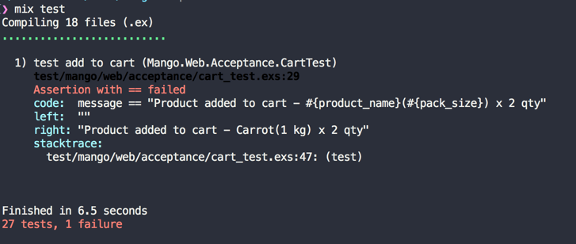

== AJAX cart

[sidebar]
.User Story #9
--
*As a customer, I want to add products to my cart quickly without page a reload.*

--

In the last section we saw how to use add to cart functionality for our products.
It works but a quick ajax update would be nice instead of a full page refresh on each addition of a product to the cart.

Surprisingly this is very easy to achieve. The list of things that we need to do are

. Ensure jQuery is loaded before any other javascript library.
. Prevent the form from performing the standard submission and post the form data via ajax.
. Modify the cart controller to respond via json on a successful update.
. Display the json data back to the user.


=== Javascript Changes
When a new Phoenix project is generated through `mix phx.new`, it doesn't include jQuery or Bootstrap javascript files in it by default.
Since we used the `mix phx.new` command to get started this applies to our project as well.
However, as part of the asset files that we copied when setting up Mango, we have both jQuery and https://github.com/ifightcrime/bootstrap-growl[bootstrapGrowl] library in our assets folder.
Without any configuration, Brunch doesn't know the order in which these files needs to be concatenated. The default concatenation order which is alphabetical is not what we need.

Open `assets/brunch-config.js` and ensure the entire value of `javascripts` key reads as follows:

.assets/brunch-config.js https://gist.github.com/shankardevy/29af3da7587d1bdcaf2020618f8f1ed1[Link]
```js
  javascripts: {
    joinTo: "js/app.js", <1>
    order: {
      before: [
        "vendor/js/jquery-3.2.1.min.js",
        "vendor/js/bootstrap.min.js"
      ]
    }
  },
```
<1> Make sure, you add a `,` at the end of this line.

The above configuration ensures that `jquery-3.2.1.min.js` is loaded first, followed by `bootstrap.min.js`, and then any other js files present in the assets folder are added in the default order. If you followed the instruction in Chapter 3 to setup assets for Mango project, you don't have to make any changes to `brunch-config.js` as it already has the necessary changes.

Add a new javascript file `assets/js/ajax_cart.js` with the below content.
[source,javascript]
.assets/js/ajax_cart.js https://gist.github.com/shankardevy/79200f4f71529fa28ee1c9c28e2e1982[Link]
----
function ajaxHandler(e) {
  e.preventDefault()
  var post_url = $(this).attr("action"); //get form action url
  var form_data = $(this).serialize(); //Encode form elements for submission

  $.post( post_url, form_data, function( response ) {
    $.bootstrapGrowl(response.message, {
      offset: {from: 'top', amount: 60},
      type: 'success'
    });
    $(".cart-count").text(response.cart_count)
  });
}

var ajaxCart = {
  init: function() {
    $(function(){
      $(".cart-form").on('submit', ajaxHandler)
    })
  }
}


export default ajaxCart
----

It prevents the cart from submitting and sends the form data through ajax.
On response from the server, it uses bootstrapGrowl jQuery plugin to display the message and updates the cart count.

Finally we need to import our javascript module on `assets/js/app.js` and call the init method to have our js executed.

[source,javascript]
.assets/js/app.js
----
import ajaxCart from "./ajax_cart"
ajaxCart.init()
----

=== CartController changes
We should change the `add` function on our `cart_controller.ex` so that it now returns a json template instead of redirecting the users. We can either create an `add.json` file inside our `templates/cart` folder or create a function inside the `CartView`. We are going to create a function inside the `CartView` module.

[source,elixir]
.web/controllers/cart_controller.ex https://gist.github.com/shankardevy/8fac13f3443e6384d259151ec872adf2#file-cart_controller-ex-L8-L9[Link]
----
def add(conn, %{"cart" => cart_params}) do
    cart = conn.assigns.cart
    case Sales.add_to_cart(cart, cart_params) do
      {:ok, cart} -> <1>
        render(conn, "add.json", cart: cart, cart_params: cart_params) <2>
      {:error, %Ecto.Changeset{} = changeset} ->
        conn
        |> put_flash(:info, "Error adding product to cart")
        |> redirect(to: page_path(conn, :index))
    end
end
----
<1> Capture the update cart information in `cart` variable, instead of ignoring it as previously.
<2> Replace the existing code with this line to render a json response.


=== CartView changes

Add the following code

.lib/mango_web/views/cart_view.ex https://gist.github.com/shankardevy/5e6a2170e199ca30254f9d632f09717d[Link]
```elixir
defmodule MangoWeb.CartView do
  use MangoWeb, :view
  alias Mango.Sales.Order

  def render("add.json", %{cart: cart, cart_params: cart_params}) do
    %{"product_name" => name, "pack_size" => size, "quantity" => qty } = cart_params

    %{
      message: "Product added to cart - #{name}(#{size}) x #{qty} qty",
      cart_count: cart_count(cart)
     }
  end

  (...)
end
```

Let's run `mix test` to see if we broke any test:



The cart acceptance test is broken. This is because our test checks for the message inside the `alert` class. Since bootstrapGrowl creates a new element with an `alert` class, there exists multiple `alert` classes in the page now and Hound checks only the first found element which doesn't contain the text we are asserting. We can modify the test to check the text inside the `alert-success` class, which is created by `bootstrapGrowl` notification. Modify `cart_test.exs` as shown below:

.test/mango_web/acceptance/cart_test.exs https://gist.github.com/shankardevy/40d397d75517bbffeac2ecf83920f265#file-cart_test-exs-L45-L47[Link]
```elixir
defmodule MangoWeb.Acceptance.CartTest do
  (...)

  test "add to cart" do
    (...)
    message = find_element(:css, ".alert-success")
              |> visible_text()
    assert message =~ "Product added to cart - #{product_name}(#{pack_size}) x 2 qty"
  end
end
```

Now run `mix test` and all tests should once again pass.
