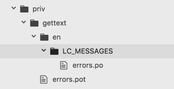
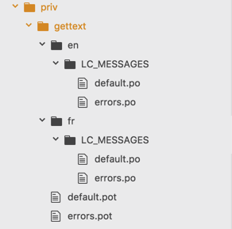
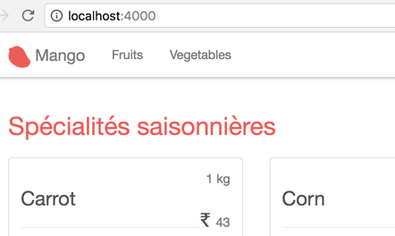
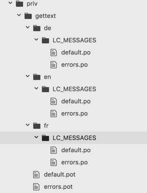
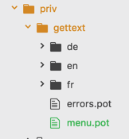
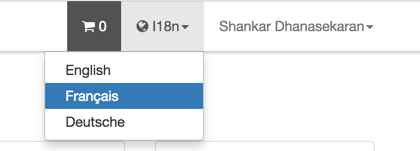

== Internationalization and Localization

[sidebar]
.User Story #14
--
As a customer, I want to browse the site in multiple languages.

*Specifications*

. Customer should be able to choose English, French or German from a dropdown menu.
. The interface text needs to be translated to the selected language.
--

Phoenix projects are by default configured to easily translate into multiple languages. Here we are concerned only about the interface language translation such as the text that is hard-coded in the templates, rather than translating the content stored in database. Phoenix uses `Gettext` Elixir library for translation. The `Gettext` Elixir library is modeled on GNU Gettext, a translation standard used by many open source projects.

On the homepage of _Mango_ we have the title "Seasonal Products". In this section, we will see how to translate this text into multiple languages. But before we go into that, we will briefly look into how `Gettext` is configured for our project.

All translated contents are stored in the `priv/gettext` folder. Currently it looks like this:




There is an `errors.pot` file and it contains text such as

```
## From Ecto.Changeset.cast/4
msgid "can't be blank"
msgstr ""

(...)
```

and then there is `en/LC_MESSAGES/errors.po` and it again contains similar content such as

```
## From Ecto.Changeset.cast/4
msgid "can't be blank"
msgstr ""
```

While it look similar, these two files serve different purpose. The `errors.pot` file serves as a template containing all translatable content in our project for the domain of `errors` strings. `en/LC_MESSAGES/errors.po` contains the translations for these strings in the English language.

Since our app is already in English, it's not immediately clear how this is useful. Run the Mix command `mix gettext.merge priv/gettext --locale fr`.

```
→ mix gettext.merge priv/gettext --locale fr

Created directory priv/gettext/fr/LC_MESSAGES
Wrote priv/gettext/fr/LC_MESSAGES/errors.po
```

The above command creates a new folder `fr` inside `priv/gettext` which contains the translation files for the French language. The file `priv/gettext/fr/LC_MESSAGES/errors.po` will hold the translations for the French language. Open up the file and you will see it contains the same text as in `en/LC_MESSAGES/errors.po`


```
msgid "can't be blank"
msgstr ""

(...)
```

The file is populated with the contents available in the template file `priv/gettext/errors.pot`. A `.po` file essentially contains two types of information: `msgid` and `msgstr`.

`msgid` is the string found in our source code.
`msgstr` is the translated string for the `msgid` for the given language.

Currently `fr/LC_MESSAGES/errors.po` contains all the error messages from Ecto library that can be translated in to the French language. Let's learn how to add more strings that can be translated for our application.

Open `templates/page/index.html.eex` and change the following line

```elixir
<h1 class="page-title">Seasonal Products</h1>
```

to

```elixir
<h1 class="page-title"><%= gettext "Seasonal Products" %></h1>
```

Basically, instead of printing the text in HTML, we pass it through an Elixir function `gettext` inside EEx tag.

Back in the browser, open up http://localhost:4000/ and there is no difference.

Now run the Mix task `mix gettext.extract --merge` from the project folder.

```
→ mix gettext.extract --merge

Extracted priv/gettext/default.pot
Extracted priv/gettext/errors.pot
Wrote priv/gettext/en/LC_MESSAGES/default.po
Wrote priv/gettext/en/LC_MESSAGES/errors.po
Wrote priv/gettext/fr/LC_MESSAGES/default.po
Wrote priv/gettext/fr/LC_MESSAGES/errors.po
```

The above command generated 3 new files:

. POT file `priv/gettext/default.pot`
. PO file `priv/gettext/en/LC_MESSAGES/default.po` for English translation.
. PO file `priv/gettext/fr/LC_MESSAGES/default.po` for French translation.




Open up the French translation file and change it as follows

```
#: lib/mango_web/templates/page/index.html.eex:1
msgid "Seasonal Products"
msgstr "Spécialités saisonnières" <1>
```
<1> Add this translation. Disclaimer: This is a text from Google translation ;-)

We have added a French translation but how do we see it on the webpage in action? Going to http://localhost:4000 still displays the text in English. For Gettext to display the translated text in the French language, we need to switch `locale`. One way to do that is to change it in `config.exs` file.


Add the following code to `config/config.exs`

```elixir
config :mango, MangoWeb.Gettext,
  default_locale: "fr"
```

The above code sets the default language as French. Restart any running server and visit http://localhost:4000 to see the French version of "Seasonal Products" displayed on the homepage:



To change `locale` value on the fly, we need a plug module that can get and set the locale information from the `conn` struct. Create a new plug module as shown below:

.lib/mango_web/plugs/locale.ex https://gist.github.com/shankardevy/5019aa5a0a6ddc9458bcfca40485e67f[Link]
```elixir
defmodule MangoWeb.Plugs.Locale do
  import Plug.Conn

  def init(opts), do: nil

  def call(conn, _opts) do
    case conn.params["locale"] || get_session(conn, :locale) do
      nil     -> conn
      locale  ->
        Gettext.put_locale(MangoWeb.Gettext, locale)
        conn |> put_session(:locale, locale)
    end
  end
end
```

and add this new plug module in `router.ex` as shown below:

.lib/mango_web/router.ex https://gist.github.com/shankardevy/fd037662cfce8036419d778cdeac1951[Link]
```elixir
defmodule MangoWeb.Router do
  (...)

  pipeline :frontend  do
    plug MangoWeb.Plugs.LoadCustomer
    plug MangoWeb.Plugs.FetchCart
    plug MangoWeb.Plugs.Locale <1>
  end

  (...)
end
```
<1> Add the new Locale plug in `frontend` pipeline.

Now visit http://localhost:4000?locale=en to see the homepage title in English and visit  http://localhost:4000?locale=fr to see the homepage title in French.

To add new languages to translate, we need to just run the Mix task `mix gettext.merge priv/gettext --locale LANGUAGE_CODE_TO_ADD`


```
mix gettext.merge priv/gettext --locale de

Created directory priv/gettext/de/LC_MESSAGES
Wrote priv/gettext/de/LC_MESSAGES/default.po
Wrote priv/gettext/de/LC_MESSAGES/errors.po
```



The above command adds a translation for the German language. It uses the existing POT files to generate the list of translatable strings.

If we add new strings in our project using `gettext("new string to translate")`, then we need to update our POT file using the mix command

```
mix gettext.extract
```

and then update all the individual translation files using the command:

```
mix gettext.merge priv/gettext
```

Since it is a very common operation to run both these tasks, there is an alternate command to run both the tasks in a single command:

```
mix gettext.extract --merge
```

=== Default Translation

We just generated the German locale `de`. We haven't added any German specific translation yet. If we visit http://localhost:4000?locale=de, we see the homepage title in English. Gettext automatically uses the `msgid` text if there is no translation found.

This brings in an interesting feature. We can go ahead and add `gettext` for all strings in our app without worrying about adding translations as we build our app. When the translations are ready, our app will automatically use them. Until then, it will display the `msgid` string which is already meaningful.

=== Translation Domain

The translation that we added to our project got added in `default.pot` file, while the Ecto translations were in `errors.pot` file. Gettext organizes the translatable strings into different domains which helps in maintainability in projects with large numbers of translatable strings. The translation that we added ended up in the domain `default` (the file name without `.pot` extension denotes the domain name). If we want it to be added to a different domain name, we need to specify the domain name using the `dgettext` function instead of the `gettext` as shown below:

Instead of the following code in the template file:

```elixir
gettext("Seasonal Products")
```

Write:

```elixir
dgettext("menu","Seasonal Products")
```

If we now run the Mix task `mix gettext.extract`, it will extract the text in "menu" domain by generating a file `menu.pot` inside `priv/gettext` as shown below:




=== Plural form of translations

When we use `gettext` for translating strings such as

```elixir
gettext("Seasonal Products")
```

we get the following contents in our `.po` file.

```
#: lib/mango_web/templates/page/index.html.eex:1
msgid "Seasonal Products"
msgstr ""
```

If we need to add translations for strings that have variations for singular and plural form, then we need to use `ngettext` (for default domain) and `dngettext` (for specific domain).

For example, let's assume the case where we want the title of the page to be in singular if total count of seasonal products is one. In this case, we will use `ngettext` to switch between singular and plural versions of the title dynamically as shown below:


```elixir
<%= ngettext "Seasonal Product", "Seasonal Products", Enum.count(@seasonal_products) %>
```

If we extract and merge the translation strings, then we get the following code in the `.po` files.

```
msgid "Seasonal Product"
msgid_plural "Seasonal Products"
msgstr[0] ""
msgstr[1] ""
```

The above code returns the singular version if the third argument to `ngettext` is `1`. If the third argument is greater than `1`, the plural version will be returned. `msgstr[0]` stores the singular version and `msgstr[1]` stores the plural version. Since both are empty, Gettext will automatically return `msgid` for singular and `msgid_plural` for plural version of translations.

=== Navigation for Changing Language

We can use the following code in our navigation to allow a change of language by selecting a language from a dropdown menu.

Add the following code to `lib/mango_web/templates/layout/app_nav.html.eex` to generate a drop down:

.lib/mango_web/templates/layout/app_nav.html.eex https://gist.github.com/shankardevy/2dbb4719dde3d2a7c0b6a21ee18e8c97[Link]
```html
<li class="dropdown">
  <a href="#" class="dropdown-toggle" data-toggle="dropdown"><i class="fa fa-globe"></i> I18n<span class="caret"></span></a>
  <ul class="dropdown-menu">
    <li class="<%= get_active_locale_class("en") %>">
      <a href="?locale=en">English</a>
    </li>
    <li class="<%= get_active_locale_class("fr") %>">
      <a href="?locale=fr">Français</a>
    </li>
    <li class="<%= get_active_locale_class("de") %>">
      <a href="?locale=de">Deutsche</a>
    </li>
  </ul>
</li>
```

Add the following helper function to `LayoutView` to print HTML class `active` on the currently active locale menu item.

.lib/mango_web/views/layout_view.ex https://gist.github.com/shankardevy/cf37318b2c20af906333dbd708c63757[Link]
```elixir
def get_active_locale_class(locale) do
  if Gettext.get_locale(MangoWeb.Gettext) == locale, do: "active" <1>
end
```
<1> We get the currently active locale using `get_locale/1` and check if its value is the same as the one passed to the function. If yes, we return the string "active" which becomes the class name of the `li` HTML element.

If we now visit the webpage, we get a nice dropdown menu for switching `locale` and it also highlights the currently active locale as shown below:


