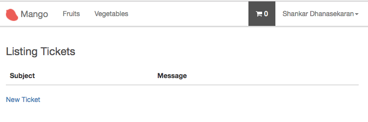
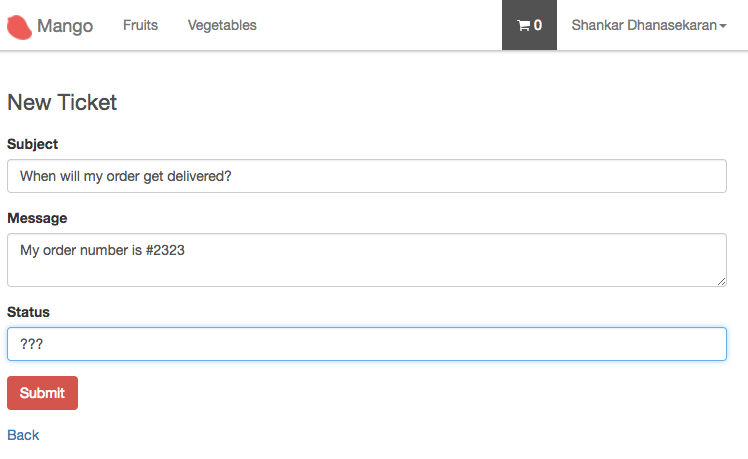
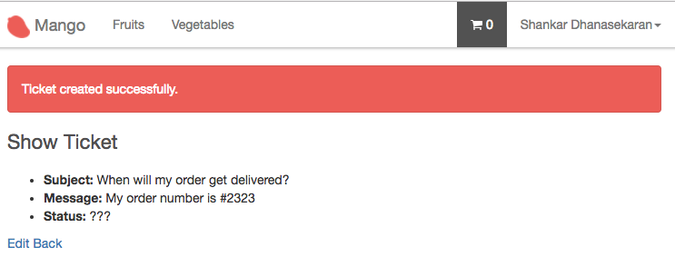
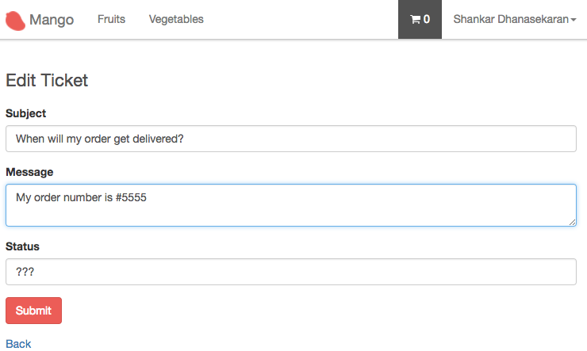
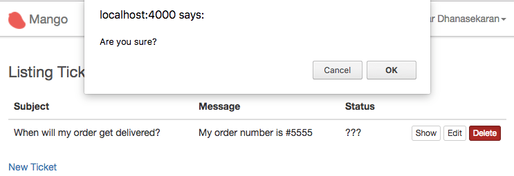
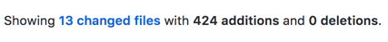
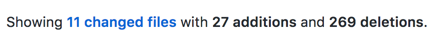

<<<
== Manage Tickets
-- a case against use of CRUD generators

[sidebar]
.User Story #13
--
As a customer, I want to see and manage my support tickets.

*Specifications*

. The customer should be able to create support tickets.
. The customer should be able to view all support tickets created by them.
. The customer should be able to view individual support ticket.
. A support ticket contains the following fields:
.. subject
.. message
.. status
--

So far we have worked on the user stories one by one without using a full scaffold helper.
For the sake of completeness, let's go through using the full scaffold generator for a complete CRUD operation of a resource.

====
NOTE: But first consider git:

In Rails we have the command `rails g scaffold` to scaffold the entire resource as shown below in the `phx.gen.html` . Rails also provides `rails d scaffold` to undo the changes if we made a mistake in the generator command. However, in Phoenix there is no undo command for `phx.gen.html`.


So before running the mix command above, it's good to commit all changes in a Git repo. This ensures that we can always go back to the previous state by `git checkout . && git clean -fd` if we made a mistake in running our mix task. Otherwise we will be forced to undo the changes manually which is time consuming, error prone, and frustrating.
====

Now run the following command
```bash
→ mix phx.gen.html CRM Ticket tickets subject message:text status customer_id:references:customers
```

In the above command

* `CRM` denotes the context module name
* `Ticket` denotes the schema module name
* `tickets` denotes the plural form of the schema which is used for creating the database table
* Finally, we provide a list of fields in the schema and their type.

The field definition `customer_id:references:customers` created a field `customer_id` in the `tickets` table with foreign key constraint to `customers` table.

The above will generate a lot of files for you and print instructions to follow.

```
* creating lib/mango_web/controllers/ticket_controller.ex
* creating lib/mango_web/templates/ticket/edit.html.eex
* creating lib/mango_web/templates/ticket/form.html.eex
* creating lib/mango_web/templates/ticket/index.html.eex
* creating lib/mango_web/templates/ticket/new.html.eex
* creating lib/mango_web/templates/ticket/show.html.eex
* creating lib/mango_web/views/ticket_view.ex
* creating test/mango_web/controllers/ticket_controller_test.exs
* creating lib/mango/crm/ticket.ex
* creating priv/repo/migrations/20170614070732_create_tickets.exs
* injecting lib/mango/crm/crm.ex
* creating test/mango/crm/crm_test.exs
* injecting test/mango/crm/crm_test.exs

Add the resource to your browser scope in lib/mango_web/router.ex:

    resources "/tickets", TicketController


Remember to update your repository by running migrations:

    $ mix ecto.migrate
```

Open up the `router.ex` file and add the following line inside the authenticated scope.

```
resources "/tickets", TicketController
```

This is the first time we are using the `resources` macro. It generates several paths for managing a resource which in this case is a `ticket`. The above line generates the following paths and maps them to TicketController actions as shown below:


```
ticket_path  GET     /tickets           TicketController :index
ticket_path  GET     /tickets/:id/edit  TicketController :edit
ticket_path  GET     /tickets/new       TicketController :new
ticket_path  GET     /tickets/:id       TicketController :show
ticket_path  POST    /tickets           TicketController :create
ticket_path  PATCH   /tickets/:id       TicketController :update
             PUT     /tickets/:id       TicketController :update
ticket_path  DELETE  /tickets/:id       TicketController :delete
```

Now run `mix ecto.migrate` to run the migration file.

Now we can go to http://localhost:4000/tickets and start playing with the newly created CRUD interface without requiring us to write a single line of code on our own.

.View all tickets http://localhost:4000/tickets


.Create a new ticket at http://localhost:4000/tickets/new


.View a ticket at http://localhost:4000/tickets/1


.Edit existing ticket at http://localhost:4000/tickets/1/edit


.Delete ticket at http://localhost:4000/tickets/


This looks fantastic. Why didn't we use it earlier and save a lot of time?

The answer is, while it looks impressive to have all this functionality created in a single command, the code generated is very generic.
It doesn't follow  the business rules of a support ticket system and moreover we cannot expect a generic code generator to do more.

For example,

. http://localhost:4000/tickets lists all tickets created by any user.
. Creation of a new ticket doesn't associate the current user with the ticket created.
. A customer can view, edit or delete any tickets in the system.

Obviously we can fix all these problems by modifying the generated code.
However, the above listed shortcomings span multiple user stories each having its own list of tasks to be done.

For eg., The third problem stated above

> 3. A customer can view, edit or delete any tickets in the system.

translates to the user story

* As a customer, I want to view my tickets
+
Acceptance test should cover cases such as

** viewing own ticket should give no error
** trying to view anyone else ticket should give 404 error

* As a customer, I want to edit my tickets
+
Acceptance test should cover cases such as

** editing own ticket should give no error
** trying to edit anyone else ticket should give 404 error
** preventing the user from editing the ticket if it's in closed status.

* Deleting the ticket may not exist as a feature for the ticketing system as the business may want to keep a full history and not allow deletion.

As you can see above, each of these user stories consists of a lot of work. The generated code contains missing business rules and/or sometimes has undesirable functionality -- e.g. deleting tickets.

So far we have created acceptance test before working on each story and by the time we get the acceptance test passing, we have code for a completely deployable piece of functionality.
There is no hanging code with undesired behaviour or dead code doing nothing. This gives a nice sense of confidence for everything we ship.

Contrast that with the current case, if we start writing acceptance tests for the generated code then a `All test pass` message is not a sure sign of deployable code.
While we write a single acceptance test to create a ticket and make it pass, there are several pieces of code that are untested.

Additionally, we will see now what it takes to modify the generated code to suit our business needs. It will also be clear that it's NOT the right approach when we are trying to learn how things work. We will be modifying a lot of code which defeats the entire purpose of using `mix phx.gen.html`.

First, let's delete all the code that we don't want.


*Removing the unwanted code:*

*  _Mango_ doesn't want the ticket to be edited or deleted once it's created.

1. Edit router.ex and modify the route as below:
+
```elixir
resources "/tickets", TicketController, except: [:edit, :update, :delete]
```
2. Open the `ticket_controller.ex` and delete the `edit`, `update` and `delete` actions. The controller should now look as shown below:
+
```elixir
  defmodule MangoWeb.TicketController do
    use MangoWeb, :controller

    alias Mango.CRM

    def index(conn, _params) do
      tickets = CRM.list_tickets()
      render(conn, "index.html", tickets: tickets)
    end

    def new(conn, _params) do
      changeset = CRM.change_ticket(%Mango.CRM.Ticket{})
      render(conn, "new.html", changeset: changeset)
    end

    def create(conn, %{"ticket" => ticket_params}) do
      case CRM.create_ticket(ticket_params) do
        {:ok, ticket} ->
          conn
          |> put_flash(:info, "Ticket created successfully.")
          |> redirect(to: ticket_path(conn, :show, ticket))
        {:error, %Ecto.Changeset{} = changeset} ->
          render(conn, "new.html", changeset: changeset)
      end
    end

    def show(conn, %{"id" => id}) do
      ticket = CRM.get_ticket!(id)
      render(conn, "show.html", ticket: ticket)
    end

  end
```
3. Remove unwanted templates code.

  . Delete the file `lib/mango_web/templates/tickets/edit.html.eex`
  . Remove the following code from `index.html.eex` which renders the Edit and the Delete links.
+
```html
<span><%= link "Edit", to: ticket_path(@conn, :edit, ticket), class: "btn btn-default btn-xs" %></span>
<span><%= link "Delete", to: ticket_path(@conn, :delete, ticket), method: :delete, data: [confirm: "Are you sure?"], class: "btn btn-danger btn-xs" %></span>
```
  . Remove the following code from `show.html.eex` which renders the Edit link
+
```html
  <span><%= link "Edit", to: ticket_path(@conn, :edit, @ticket) %></span>
```
4. Open `lib/mango/crm/crm.ex` and delete the following functions and their documentation:
** `update_ticket/2`
** `delete_ticket/2`
5. Delete all the test functions added to `test/mango/crm/crm.exs` related to tickets as all of them need to be changed based on our business rules.
6. Delete the generated controller test file `test/mango_web/controllers/ticket_controller_test.exs` as the test generated is not valid and is not worth retaining.

Now go back to http://localhost:4000/tickets. It should have only the desired features and should work without any errors at this point.

That's a lot of clean up already. But that's just the beginning. We have a lot more to do as we add the business rules.


=== Creating a ticket
We can now create a ticket by going to http://localhost:4000/tickets/new. However, it needs the following changes:

1. The status field should not be shown to the user creating the ticket. It should be set to "New" by default.
2. The ticket should be associated with the currently logged in customer.

Let's first remove the status field from the template for creating tickets.

Open `lib/mango_web/templates/ticket/form.html.eex` and remove the following code.

```elixir
<div class="form-group">
  <%= label f, :status, class: "control-label" %>
  <%= text_input f, :status, class: "form-control" %>
  <%= error_tag f, :status %>
</div>
```

Now to associate the ticket with the currently logged in user, we need more than a simple code change.
Currently the generated code demonstrates no knowledge of the relationships that exists between different entities. We must first teach the code that a `ticket` and a `customer` are related.

Open Ticket schema `ticket.ex` and replace the line

```
field :customer_id, :id
```

with

```
belongs_to :customer, Customer
```

Add an alias to `Mango.CRM.Customer` at the top.

The completed schema file now reads like this.

.lib/mango/crm/ticket.ex https://gist.github.com/shankardevy/e72afcd45863e2d301697623db2e5c02[Link]
```elixir
defmodule Mango.CRM.Ticket do
  use Ecto.Schema
  import Ecto.Changeset
  alias Mango.CRM.{Ticket, Customer} <1>


  schema "tickets" do
    field :message, :string
    field :status, :string
    field :subject, :string
    belongs_to :customer, Customer <2>

    timestamps()
  end

  @doc false
  def changeset(%Ticket{} = ticket, attrs) do
    ticket
    |> cast(attrs, [:subject, :message, :status])
    |> validate_required([:subject, :message, :status])
  end
end
```
<1> Add alias to `Customer`.
<2> Modify the line as shown.

We also need to set the other side of the relationship on the customer schema.
Open `customer.ex` and modify it as shown below:

.lib/mango/crm/customer.ex https://gist.github.com/shankardevy/32d7195b654a23bdc7ee2ae7cc3866bd[Link]
```elixir
defmodule Mango.CRM.Customer do
  use Ecto.Schema
  import Ecto.Changeset
  alias Mango.CRM.{Customer, Ticket} <1>


  schema "customers" do
    field :email, :string
    field :name, :string
    field :password, :string, virtual: true
    field :password_hash, :string
    field :phone, :string
    field :residence_area, :string
    has_many :tickets, Ticket  <2>

    timestamps()
  end
  (...)
end
```
<1> Add alias to `Ticket`
<2> Add the relationship `has_many`

Apart from the missing relationships in the schema files, the generated functions in the `CRM` context module also convey no relationships in their name or in their workings.

Consider the following sets of statements.

1. Create a ticket.
2. Create a customer ticket.

---

1. List tickets.
2. List customer tickets.

---

1. Get a ticket.
2. Get a customer ticket.

In each of the above sets, reading the first sentence gives no clue that a customer is required for the action.
While the second one conveys the meaning that tickets are closely associated with customers.

The functions that got generated in the `CRM` context module read and work as the first sentences in each of the pairs above. For example, the generated code has `get_ticket` when it would be more expressive if named `get_customer_ticket`, because we don't want to get a ticket by just its ID, but rather we want a ticket with the given ID for the given customer. Consider the example of displaying a ticket to the customer. If the function just accepts a ticket id, it has no means to check if the ticket can be viewed by the customer or not. However, if the function gets both customer and ticket id as input, it can check if the ticket is created by the user and return the appropriate response based on permissions.

Basically, we want the ticket to be managed through the customer entity, rather than treating it as a separate entity.

Back to in the `ticket_controller.ex`, we have the following code for `new` action.

```elixir
def new(conn, _params) do
  changeset = CRM.change_ticket(%Mango.CRM.Ticket{})
  render(conn, "new.html", changeset: changeset)
end
```

Replace it with

```elixir
def new(conn, _params) do
  customer = conn.assigns.current_customer
  changeset = CRM.build_customer_ticket(customer)
  render(conn, "new.html", changeset: changeset)
end
```

We are changing the function call from `change_ticket/1` to `build_customer_ticket/1`.
Instead of passing an new Ticket struct, we are passing in a customer entity for which the ticket needs to be created.

Let's modify the function `change_ticket` to `build_customer_ticket` in the `CRM` context module.

Replace this code

```elixir
def change_ticket(%Ticket{} = ticket) do
  Ticket.changeset(ticket, %{})
end
```

with
```elixir
def build_customer_ticket(%Customer{} = customer, attrs \\ %{}) do
  Ecto.build_assoc(customer, :tickets, %{status: "New"}) <1>
  |> Ticket.changeset(attrs)
end
```
<1> We are using `Ecto.build_assoc` to generate a ticket struct which sets the values for customer_id and status fields.

.Ecto.build_assoc/3
****
`build_assoc/3` has the following function signature.

```elixir
build_assoc(struct, assoc, attributes \\ %{})
```

It takes in a schema struct as the first argument and the association name as the second argument. It then builds a struct for the association with reference to the schema struct provided. Optionally a third argument containing either a map or a keyword list can be passed to set the value of the newly created struct.

In the case above, the line `build_assoc(customer, :tickets, %{status: "New"})` generates a new `%Ticket{}` struct. The generated `%Ticket{}` struct is populated with a `customer_id` field with the `id` value of the `customer` struct passed as the first argument. Additionally the `%Ticket{}` struct is populated with the `status` field value as given in the third argument to `build_assoc/3`.

****

The controller `create` action reads as below:

```elixir
  def create(conn, %{"ticket" => ticket_params}) do
    case CRM.create_ticket(ticket_params) do
      (...)
    end
  end
```

Let's modify it as below to associate the customer and the ticket created.

```elixir
def create(conn, %{"ticket" => ticket_params}) do
  customer = conn.assigns.current_customer
  case CRM.create_customer_ticket(customer, ticket_params) do
    (...)
  end
end
```

We also need to replace the function defintion of `create_ticket` with `create_customer_ticket`.

In `lib/mango/crm/crm.ex` file,

Replace

```elixir
def create_ticket(attrs \\ %{}) do
  %Ticket{}
  |> Ticket.changeset(attrs)
  |> Repo.insert()
end
```

with

```elixir
def create_customer_ticket(%Customer{} = customer, attrs \\ %{}) do
  build_customer_ticket(customer, attrs) <1>
  |> Repo.insert()
end
```
<1> We are reusing the `build_customer_ticket` function created earlier and pass the resulting value to `Repo.insert` to insert the record into the database.

With all those changes done, we now have a fully functional "create ticket" user story ready.

The other two actions: listing all tickets; and viewing a single ticket still don't filter by the currently logged in customer.

Back to the ticket controller, instead of

```elixir
def index(conn, _params) do
  tickets = CRM.list_tickets()
  render(conn, "index.html", tickets: tickets)
end

def show(conn, %{"id" => id}) do
  ticket = CRM.get_ticket!(id)
  render(conn, "show.html", ticket: ticket)
end
```

we need

```elixir
def index(conn, _params) do
  customer = conn.assigns.current_customer
  tickets = CRM.list_customer_tickets(customer) <1>
  render(conn, "index.html", tickets: tickets)
end

def show(conn, %{"id" => id}) do
  customer = conn.assigns.current_customer
  ticket = CRM.get_customer_ticket!(customer, id) <2>
  render(conn, "show.html", ticket: ticket)
end
```
<1> We want to list tickets created by the customer.
<2> We want to show the ticket if it's created by the given customer.

Now replace the following functions defined in `crm.ex`

```elixir
def list_tickets() do
  Ticket
  |> Repo.all
end

def get_ticket!(id), do: Repo.get!(Ticket, id)
```

with

```elixir
def list_customer_tickets(customer) do
  customer
  |> Ecto.assoc(:tickets)
  |> Repo.all
end

def get_customer_ticket!(customer, id) do
  customer
  |> Ecto.assoc(:tickets)
  |> Repo.get!(id)
end
```

https://gist.github.com/shankardevy/726bcac62a0d40127470d1b4c9e3cc09[View Gist of `ticket_controller.ex` with all modifications]

https://gist.github.com/shankardevy/65665e4d6de966f87b04c68a1acacae7[View Gist of `crm.ex` with all modifications]

.Ecto.assoc/2
****
`Ecto.assoc/2` returns an Ecto.Query for the given association. It takes in a schema struct as the first argument and the association name as the second argument.

In the case above, the line `customer |> Ecto.assoc(:tickets)` returns the following Ecto.Query (assuming the ID of the customer is `1`).

```elixir
Ecto.Query<from t in Mango.CRM.Ticket, where: t.customer_id == ^1>
```
****

With all that butchering of generated code done, we now have our ticketing feature complete.

How many lines of code did we change from what was generated? 

Here are the stats of the code changed when we generated the CRUD interface with `mix phx.gen.html`



Here are the stats of the code changes after we made changes on the generated code:



We have deleted more than half of the generated code and added 27 lines.
Our new code doesn't have any tests. If we have added tests, the number would be much higher.

Is it worth using full scaffold generators? In this case, No. There are a few cases where it might be useful i.e., when we want a simple CRUD interface with little or no modification to the generated code.
We run into such a cases when we work on our admin dashboard in the next chapter.
For all the user stories that we have covered so far, full scaffold generators are not worth the trouble as it would have resulted in similarly large scale modifications of the generated code.
