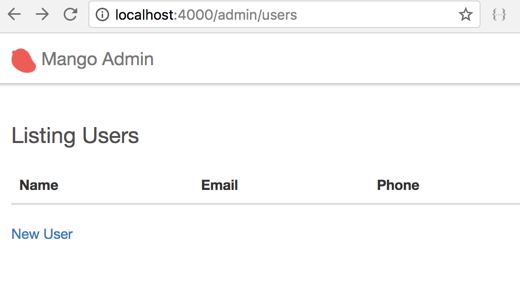

== Admin layout

[sidebar]
.User Story #16
--
*As an admin, when I visit pages under `/admin`, I want to see the site using a distinct admin layout.*
--

By default as we know, Phoenix uses the layout file `app.html` present in the `mango_web/templates/layout/app.html.eex`.
Let's duplicate it under the name `admin_app.html.eex`.  We will do some minor modifications to the new file so that we can identify when the new template is rendered.


.lib/mango_web/templates/layout/admin_app.html.eex https://gist.github.com/shankardevy/c8068de5e16c977aeb91c08c2c22a7e9[Link]
```html
<!DOCTYPE html>
<html lang="en">
  <head>
    <meta charset="utf-8">
    <meta http-equiv="X-UA-Compatible" content="IE=edge">
    <meta name="viewport" content="width=device-width, initial-scale=1">
    <meta name="description" content="">
    <meta name="author" content="">

    <title>Hello Mango!</title>
    <link rel="stylesheet" href="<%= static_path(@conn, "/css/app.css") %>">
  </head>

  <body>
    <%= render "admin_app_nav.html", conn: @conn %> <1>
    <div class="container">
      <p class="alert alert-info" role="alert"><%= get_flash(@conn, :info) %></p>
      <p class="alert alert-danger" role="alert"><%= get_flash(@conn, :error) %></p>

      <main role="main">
        <%= render @view_module, @view_template, assigns %>
      </main>
    </div>
    <script src="<%= static_path(@conn, "/js/app.js") %>"></script>
  </body>
</html>
```
<1> Remove the reference to the variable `@customer` and change the navigation partial name to `admin_app_nav.html`. The file doesn't exist yet so let's create it under the `layouts` folder with the following content.

.lib/mango_web/templates/layout/admin_app_nav.html.eex https://gist.github.com/shankardevy/d699097b15ed0b1cccfc89fde80468b1[Link]
```html
<nav class="navbar navbar-default navbar-fixed-top">
  <div class="container">
    <div class="navbar-header">
      <button type="button" class="navbar-toggle collapsed" data-toggle="collapse" data-target="#admin-nav">
        <span class="sr-only">Toggle navigation</span>
        <span class="icon-bar"></span>
        <span class="icon-bar"></span>
        <span class="icon-bar"></span>
      </button>
      <a class="navbar-brand" href="#">"/> Mango Admin</a> <1>
    </div>
    <div class="collapse navbar-collapse" id="admin-nav">
      <ul class="nav navbar-nav">
      </ul>
    </div>
  </div>
</nav>
```
<1> Modify the site name to include the text "Admin", so we can easily identify when the new layout is rendered.

Now that our admin template files are ready we need to configure our app to use it when we visit `/admin/users`.

Open the controller file `mango_web/controllers/admin/user_controller.ex` and modify it as shown below:

.web/controllers/admin/user_controller.ex
```elixir
def index(conn, _params) do
  users = Administration.list_users()
  conn
  |> put_layout("admin_app.html")
  |> render("index.html", users: users)
end
```

Now go back to the `/admin/users` page to see the new layout in action.



You can identify it by the navbar text that says "Mango Admin", instead of just "Mango" which is used in the older layout.

We have successfully changed the layout for a single path. Try visiting `admin/users/new` and you will see the old layout.
We shouldn't be doing this for every single path using the admin layout. That would be difficult and error prone. Luckily there is a better way to set this layout. But before we do that let's understand the small piece of code shown above.

```elixir
conn
|> put_layout("admin_app.html")
|> render("index.html", users: users)
```

`put_layout/2` is a function defined in the `Phoenix.Controller` module.
It is automatically imported in all controller modules through the code `use MangoWeb, :controller`.
This automatic import means we can just call the function name without the module name prefix.
The function takes in a `conn` struct and a layout file name and it return a new `conn` struct with the layout name changed.
This highlights another interesting fact about the `conn` struct -- information such as which layout to render is also stored within the `conn` struct.
We then pass this new `conn` struct returned by the `put_layout` function to the `render` function call. In the View layer, Phoenix now uses the new layout instead of the default one by getting the layout name from the `conn` struct.

With the above information, we now know that it's just enough to set the layout value in `conn` struct to change the layout of the site. We already know how to write a Plug module to change the values in the `conn` struct. We have seen it in action when we previously loaded the current cart information and the current customer information in the `conn` struct.

Let's create a plug module in the file `lib/mango_web/plugs/admin_layout.ex`

.lib/mango_web/plugs/admin_layout.ex https://gist.github.com/shankardevy/7248726f39f2ecfd3ad4eecdb10f96dd[Link]
```elixir
defmodule MangoWeb.Plugs.AdminLayout do
  import Phoenix.Controller, only: [put_layout: 2]

  def init(_opts), do: nil

  def call(conn, _) do
    conn
    |> put_layout({MangoWeb.LayoutView, "admin_app.html"})
  end
end
```


.put_layout/2
****
Previously when we used `put_layout/2` inside a controller action, we only had to pass in the layout name as a string i.e., `conn |> put_layout("admin_app.html")`. This works because inside the controller, the `conn` struct is already aware of the View module for the layout. So it's enough to just set the template name `"admin_app.html"`. The View module name `MangoWeb.LayoutView` is already present in the `conn` struct.

However, when we use `put_layout/2` inside a Plug module used in the router, this information about the layout module is not yet set in the `conn` struct. So if we just pass in the layout template name here, Phoenix wouldn't know which View module to use and would throw an error. For this reason, we have to provide both the View module name and the layout template name to this function when it's called in a Router Plug module.

Additionally, `put_layout/2` also accepts the boolean value `false` which disables the layout template. For example, if we don't want the layout template to be rendered, we can use `put_layout/2` as shown below:

```elixir
conn |> put_layout(false)
```
****

In the router file, we will create a new pipeline because our need to switch the layout doesn't fit into the role of any of the existing pipelines. Let's create a new pipeline called `:admin` and add our plug to it.

.lib/mango_web/router.ex https://gist.github.com/shankardevy/efaff9abfd49e4e5b7b431f28dda6035[Link]
```elixir
pipeline :admin do
  plug MangoWeb.Plugs.AdminLayout
end
```

For now, the AdminLayout is the only plug in this pipeline. However, as we move forward more plugs that are admin specific will be added here.

Lastly, we will instruct our `/admin` scope in the router file to use this new pipleline. Modify the admin scope the in router as below:

.lib/mango_web/router.ex https://gist.github.com/shankardevy/efaff9abfd49e4e5b7b431f28dda6035[Link]
```elixir
scope "/admin", MangoWeb.Admin, as: :admin do
  pipe_through [:browser, :admin] <1>

  resources "/users", UserController
end
```
<1> Remove `:frontend` and add `:admin`. This also removes our temporary dependency on the `:frontend` pipeline from the `admin` scope.

Now visit any page under `/admin` and it will display using the new layout.

Finally add a link to `admin/users` on the admin navigation template.

.lib/mango_web/templates/admin/admin_app_nav.html.eex https://gist.github.com/shankardevy/a66c0264f51dcccf1296db360e50c7d2#file-admin_app_nav-html-eex-L13-L15[Link]
```elixir
<ul class="nav navbar-nav">
  <li><%= link "Admin Users", to: admin_user_path(@conn, :index) %></li>
</ul>
```
