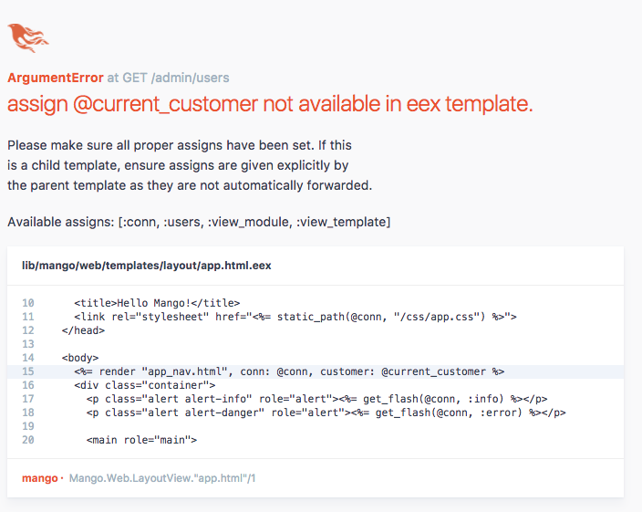

== Manage Admin users

[sidebar]
.User Story #15
--
*As an admin, I want to manage users with administrative access.*

Specifications:

 1. An admin user should be able to do full CRUD operation on the Admin User record.
 2. The following information should be collected when creating a new admin user.

 * Name
 * Email
 * Phone
--

This story is a perfect example of using `phx.gen.html` because our only additional requirement to the generated code is that
the entire CRUD operation should be done by authenticated admin user. Since this requirement can be implemented on top of the generated code, rather than modifying the generated code, we will reap the full benefit of the generator.


Run the command

```
> mix phx.gen.html Administration User users name email:string:unique phone --web Admin
```

This is similar to what we used in the previous chapter to generate support tickets, except this one has a new option `--web Admin`.

When the `--web` option is passed, the generated web-related modules are namespaced with the given module name. Here we passed in `Admin` and the web-related modules are nested under the `Admin` namespace with the files nested under the `admin` folder.

Let's see this in action.

[subs="quotes"]
----
> mix phx.gen.html Administration User users name email:string:unique phone --web Admin
* creating lib/mango/*web*/controllers/*admin*/user_controller.ex
* creating lib/mango/*web*/templates/*admin*/user/edit.html.eex
* creating lib/mango/*web*/templates/*admin*/user/form.html.eex
* creating lib/mango/*web*/templates/*admin*/user/index.html.eex
* creating lib/mango/*web*/templates/*admin*/user/new.html.eex
* creating lib/mango/*web*/templates/*admin*/user/show.html.eex
* creating lib/mango/*web*/views/*admin*/user_view.ex
* creating test/mango/*web*/controllers/*admin*/user_controller_test.exs
* creating lib/mango/administration/user.ex
* creating priv/repo/migrations/20170614162020_create_users.exs
* creating lib/mango/administration/administration.ex
* injecting lib/mango/administration/administration.ex
* creating test/mango/administration/administration_test.exs
* injecting test/mango/administration/administration_test.exs
----

As you can see above, all the files that get generated into the *web* directory are nested within the respective *admin* sub directory.

. Controller file got generated within an `admin` sub directory under the `controllers` directory.
. Template files got generated within an `admin` sub directory under the `templates` directory.
. View file got generated within an `admin` sub directory under the `views` directory

This nesting doesn't happen outside the `web` directory i.e., other files such as context modules and schema files are generated as usual.

After generating the files, you will notice the following message.

[subs="quotes"]
----
Add the resource to your *Admin :browser scope* in lib/mango_web/router.ex:

   scope "/admin", MangoWeb.Admin, as: :admin do
     pipe_through :browser
     ...
     resources "/users", UserController
   end


Remember to update your repository by running migrations:

   $ mix ecto.migrate
----


The instruction says `Add the resource to your *Admin :browser scope*`.
However, we don't have a router scope with `/admin`. We already have two scopes, one for paths that require authentication and an other for paths that don't require authentication. Both these scopes cater to paths required for the frontend. We don't have a scope for grouping the paths for the admin section. Let's create it.

Let's open up the `router.ex` file and add the code as below:

.lib/mango_web/router.ex https://gist.github.com/shankardevy/64f81d2d516490aeff1723853036b7d1#file-router-ex-L47-L51[Link]
```elixir
defmodule MangoWeb.Router do
  (...)

  # Add from here -->
  scope "/admin", MangoWeb.Admin, as: :admin do
    pipe_through :browser

    resources "/users", UserController
  end
  # Up to here <--

end
```

Open up the generated migration file and change the email field type to `citext` as we did in the customers table.

.priv/repo/migrations/20170614162020_create_users.exs https://gist.github.com/shankardevy/073db5d7837ac353f7d39743d8b23732[Link]
```elixir
defmodule Mango.Repo.Migrations.CreateUsers do
  use Ecto.Migration

  def change do
    create table(:users) do
      add :name, :string
      add :email, :citext <1>
      add :phone, :string

      timestamps()
    end

    create unique_index(:users, [:email])
  end
end
```
<1> Change the `:string` type to `:citext` to make the email field case insensitive.

****
In Chapter 5, we added the following line to our migration file to use `citext`.

```
execute "CREATE EXTENSION IF NOT EXISTS citext"
```

We don't have to do this again here because the `citext` extension is already enabled by our previous migration for the Customer Registration user story.
****

Now run, `mix ecto.migrate` to run the migration.

Now if we go to http://localhost:4000/admin/users we see this error.



The line that triggered the error is also highlighted in the code widow. It's the line from the file `lib/mango_web/templates/layout/app.html.eex`

```elixir
<%= render "app_nav.html", conn: @conn, customer: @current_customer %>
```

The error says `@current_customer` is not available in the list of variables available to the template.
Why does it appear now and only in this path? Try visiting other pages, you don't get this error. Didn't we set this variable in the `LoadCustomer` plug? Yes, we did but where did we invoke the plug? We added it to our `:frontend` pipeline which we used in our router scope for "/" path. There in lies the problem.

```elixir
pipeline :frontend do
  plug MangoWeb.Plugs.FetchCart
  plug MangoWeb.Plugs.LoadCustomer
end
```

The `/users` path is added in the `/admin` scope in the router and this scope doesn't use the `:frontend` pipeline. Remember, a plug module is executed only when it's in a pipeline.

Our `:frontend` pipeline is specific for the customer facing site. We don't want to load `FetchCart` and `LoadCustomer` plugs in our `/admin` paths. We will temporarily add the `:frontend` pipeline to our `/admin` scope to avoid the error and we will remove it in the next section as we work on the admin template.

Go back to the router and modify the pipelines used in the `/admin` scope as below:

```elixir
scope "/admin", MangoWeb.Admin, as: :admin do
  pipe_through [:browser, :frontend] <1>

  resources "/users", UserController
end
```
<1> Add `frontend` pipeline to `admin` scope.

Now visit http://localhost:4000/admin/users to see a fully working admin user management system.
Shouldn't we add tests to it? Nope. Code generated through `phx.gen.html` already comes with controller tests and units tests for functions in context module. So there is nothing to test.
If we do make any functional changes in the generated code, then we need to modify the test before it.

We don't need any modification to the generated CRUD code. We do still need to add authentication so that only an admin is allowed to access these paths. We will do that in the subsequent user stories.
