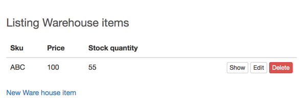
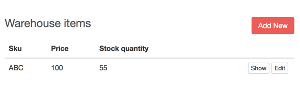
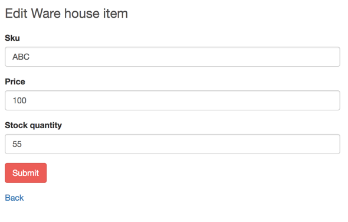
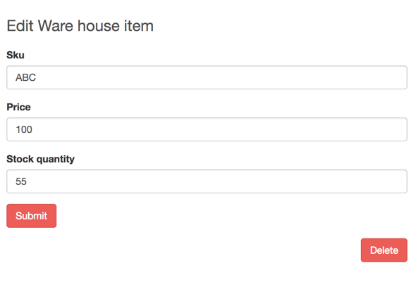
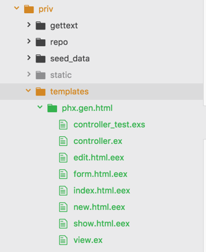
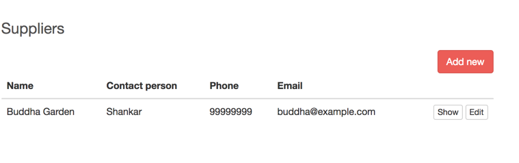
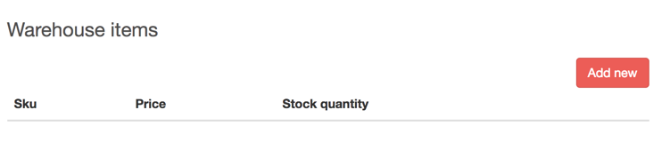

== Customizing CRUD Generator

In this chapter, we will use the Mix task `phx.gen.html` to generate Warehouse Items and Suppliers (User story 20 & 21). We will explore an undocumented feature of Phoenix to customize the autogenerated CRUD interface as per our needs. For example, if we generate a CRUD interface for Warehouse Items using Mix task `phx.gen.html`, it will look like this:



The page title is "Listing Warehouse Items", but we might just need "Warehouse Items" as the title.
The table lists each item with a link to "Show", "Edit" and "Delete". Let's assume that we don't need a "Delete" link on the index page but instead want it inside the "Edit" page.

We can go ahead and make these changes on the generated template files by `phx.gen.html` and modify the index page as shown below:



The "Edit" page by default looks as shown below:



We could modify the HTML template to add the "Delete" button at the bottom of the "Edit" page.



If we wanted a similar behavior for all the CRUD sections, then it's pretty boring to modify all the generated templates by hand, each time making the same kind of changes for different resources. Instead we can modify the templates used by the Mix task `phx.gen.html` so that the generated files for our resources are already in the required format.

The mix task `phx.gen.html` by default looks for files in `priv/templates` in our current project to generate the templates for a resource. If they are not found, it then uses the files in the Phoenix framework.

We can copy the contents of the folder `priv/templates/phx.gen.html` from https://github.com/phoenixframework/phoenix/tree/master/priv/templates/phx.gen.html[Phoenix framework source code] and paste it inside our project's `priv/templates/phx.gen.html` folder.



We will end up with a directory structure as shown above for the `priv` folder inside our project.

Now modify the `index.html.eex` inside the `priv/templates/phx.gen.html` folder as shown below:

.priv/templates/phx.gen.html/index.html.eex https://gist.github.com/shankardevy/02672afdcd643a816c7735fd37dc227b[Link]
```elixir
<h2><%= schema.human_plural %></h2>
<span class="pull-right">
  <%%= link "Add new", to: <%= schema.route_helper %>_path(@conn, :new), class: "btn btn-primary" %> <1>
</span>

<table class="table">
  <thead>
    <tr>
<%= for {k, _} <- schema.attrs do %>      <th><%= Phoenix.Naming.humanize(Atom.to_string(k)) %></th>
<% end %>
      <th></th>
    </tr>
  </thead>
  <tbody>
<%%= for <%= schema.singular %> <- @<%= schema.plural %> do %>
    <tr>
<%= for {k, _} <- schema.attrs do %>      <td><%%= <%= schema.singular %>.<%= k %> %></td>
<% end %>
      <td class="text-right">
        <span><%%= link "Show", to: <%= schema.route_helper %>_path(@conn, :show, <%= schema.singular %>), class: "btn btn-default btn-xs" %></span>
        <span><%%= link "Edit", to: <%= schema.route_helper %>_path(@conn, :edit, <%= schema.singular %>), class: "btn btn-default btn-xs" %></span>
      </td> <2>
    </tr>
<%% end %>
  </tbody>
</table>
```
<1> Move the "New" link to the top and modify the link text.
<2> Remove the "Delete" link from the row.

In the above template, we see a new type of EEx tag i.e., `<%%= %>` (with double `%`) apart from the normal `<%= %>` (with single `%`). The double `%` is an escape operator instructing the EEx engine not to parse the code inside it. So the Elixir code within `<%= %>` tag gets executed by the Mix task, while the code inside `<%%= %>` gets carried over to the generated template file inside `<%= %>` tags. We will explore this with an example.

Consider the following line present in the above template.

```elixir
<%%= for <%= schema.singular %> <- @<%= schema.plural %> do %>
```

To generated a template for a resource such as `warehouse_item`, the line will be transformed as shown below:

```elixir
<%= for warehouse_item <- @warehouse_items do %>
```

We can also modify the `edit.html.eex` template in `priv/templates/phx.gen.html`

.priv/templates/phx.gen.html/edit.html.eex https://gist.github.com/shankardevy/ef1a28877e39fe4b9e155e1e117e11f0[Link]
```elixir
<h2>Edit <%= schema.human_singular %></h2>

<%%= render "form.html", changeset: @changeset,
                        action: <%= schema.route_helper %>_path(@conn, :update, @<%= schema.singular %>) %>

<span class="pull-right"> <1>
  <%%= link "Delete",
       to: <%= schema.route_helper %>_path(@conn, :delete, @<%= schema.singular %>),
       method: :delete,
       data: [confirm: "Are you sure?"],
       class: "btn btn-danger" %>
</span>
```
<1> Add "Delete" link instead of "Back" link.

Now, let's generate the resources for `WarehouseItem` and `Supplier` and see if the Mix task is now using our new templates within our project instead of the ones found in the Phoenix framework.

*WarehouseItem*

```
→ mix phx.gen.html Warehouse WarehouseItem warehouse_items sku price:decimal stock_quantity:integer --web Admin
```

*Supplier*

```
→ mix phx.gen.html Warehouse Supplier suppliers name contact_person phone email --web Admin
```

Add the resources to the `router.ex` file and run `mix ecto.migrate` as instructed by the above commands.

Now create a new supplier at http://localhost:4000/admin/suppliers/new and visit
http://localhost:4000/admin/suppliers to see the new template in action:



Warehouse Items also use our new template.



We have done very minor modifications to the template files in `phx.gen.html`. However, we are not limited to just modifying the HTML templates, we can also modify the generated controller files and even the tests.

Modify `admin_app_nav.html.eex` and add the following navigation links:

https://gist.github.com/shankardevy/68c44f7a22aa9d48fd77acc6d6059702#file-admin_app_nav-html-eex-L22-L28[Link]
```elixir
<li class="dropdown">
  <a href="#" class="dropdown-toggle" data-toggle="dropdown">Warehouse<span class="caret"></span></a>
  <ul class="dropdown-menu">
    <li><%= link "Warehouse Items", to: admin_ware_house_item_path(@conn, :index) %></li>
    <li><%= link "Suppliers", to: admin_supplier_path(@conn, :index) %></li>
  </ul>
</li>
```
