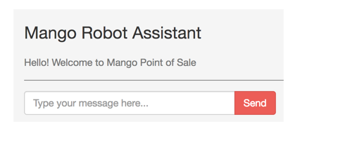
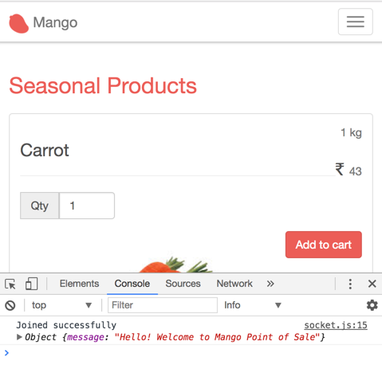
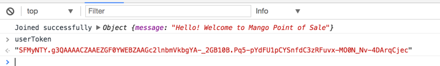
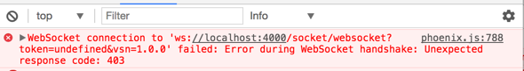

== Authenticating in Chat Room

Right now, we are using the browser console to identify if a socket connection is successful or not. We will change this behavior to display a successful connection message in the chat window and add authentication to ensure that only admin users can send and receive messages in this channel.

Open `bot_channel.ex` and modify the `join` function as shown below and remove all the other functions.

.lib/mango_web/channels/bot_channel.ex  https://gist.github.com/shankardevy/cdd111e5921899a7564d1364625efd21[Link]
```elixir
def join("pos", payload, socket) do
  welcome_text = "Hello! Welcome to Mango Point of Sale"
  {:ok, %{message: welcome_text}, socket}
end
```

Instead of returning a two element tuple, we are now returning a three element tuple. The second element of this tuple will be sent back to the browser as response.

Back to the JS client code

.assets/js/socket.js https://gist.github.com/shankardevy/99481668c30c4bf5603fc4f19fa89386[Link]
```js
(...)
let channel = socket.channel("pos", {})
channel.join()
  .receive("ok", resp => {
    console.log("Joined successfully", resp)
    $("#intro-text").text(resp.message) <1>
  })
  .receive("error", resp => { console.log("Unable to join", resp) })
```
<1> Add this line.

In the above code, the local variable `resp` contains the value returned by the `join` function as a JSON object. We replace the text inside the HTML element inside the chat window with the response message using standard jQuery.

With this change, going to http://localhost:4000/admin we get the successful connection message in the chat window as shown below:



Our chat window is present in the `/admin` path and it's already protected by session based login.
However, this only protects the interface to send and view the messages in the channels. All channel communications that happen in the path `/socket` are unprotected, which means any user can open up a browser console and use it as a client to communicate with `/socket`.

To clarify this point, let's visit http://localhost:4000 with the browser console open.



In the console, we are already seeing the welcome message that is intended only for admin members to see.

Let's fix this with socket authentication. We will use the same technique we used for magic link login and use a Phoenix Token to authenticate the socket connection.

Open DashboardController and modify it as shown below:

.lib/mango_web/controllers/admin/dashboard_controller.ex https://gist.github.com/shankardevy/2a279e044d6dad08b6da6f74c4ef92db[Link]
```elixir
defmodule MangoWeb.Admin.DashboardController do
  use MangoWeb, :controller

  def show(conn, _params) do
    admin = conn.assigns.current_admin
    token = Phoenix.Token.sign(conn, "socket_login", admin.id)
    render conn, "show.html", token: token
  end
end
```

Open the template file `dashboard/show.html.eex` and modify it as shown below:

.lib/mango_web/templates/admin/dashboard/show.html.eex https://gist.github.com/shankardevy/cad8c5d368c2fa518fe0211b34f8283b[Link]
```html
<script>window.userToken = "<%= @token %>";</script>
<div class="chat-box">
  (...)
</div>
```
This will make the token value available in our JS client as `userToken` variable.
Back in the browser navigate to http://localhost:4000/admin. Open the console and check the value of `userToken`.
It should display the token value as shown below:



With this value, the JS client code will now be able to pass this token to the server when making a socket connection.

.assets/js/socket.js
```js
import {Socket} from "phoenix"
let socket = new Socket("/socket", {params: {token: window.userToken}}) <1>
socket.connect()
(...)
```
<1> Since we have now set the value of `userToken`, our request to the socket will contain this token value in the `params` data.

Open the UserSocket module and let's modify the `connect` function so that it checks the token value before connecting to the socket.

.lib/mango_web/channels/user_socket.ex https://gist.github.com/shankardevy/d9616876a2dcf7c92c646e9c69186a07[Link]
```elixir
def connect(%{"token" => token}, socket) do
  case Phoenix.Token.verify(socket, "socket_login", token) do
    {:ok, user_id} ->
      socket = assign(socket, :user_id, user_id)
      {:ok, socket}
    {:error, _} ->
      :error
  end
end
```

****
.Warning on Max Age Not Set
In the above code, we are not using any `max_age` value as we did with magic link login. Phoenix will warn you in this case as shown below:

```
[warn] :max_age was not set on Phoenix.Token.verify/4. A max_age is recommended otherwise tokens are forever valid. Please set it to the amount of seconds the token is valid, such as 86400 (1 day)
```

This is because without a `max_age` value, the token is valid for eternity.
****

With this change, our socket connection is now secured and allows only connections with a valid token. We can verify this by navigating to http://localhost:4000. The browser console will now display this error instead of displaying the welcome message as seen previously.


