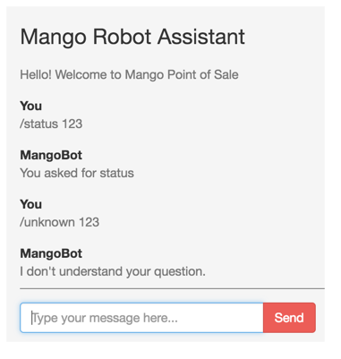
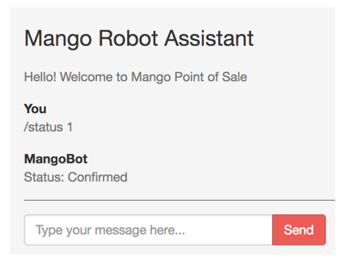
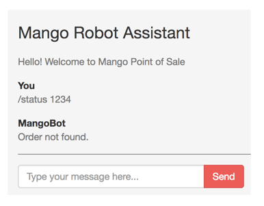

== Chat using Slash Commands

[sidebar]
.User Story #23
--
As an admin, I want to get order status information through slash commands in the chat window.
--

In the last section, we saw how to broadcast new order messages to all clients. So if there are three admin users with their browsers open to the chat window, all of them will get notified of the new order.

In this section, we will implement a 1-on-1 communication between the chat client and the server so that the server responds with a message only to the specific client that made the request. We will learn this by implementing a `slash` command as explained below:

* If the user enters `/status ID` as the chat message, the server should respond with the status of the order for the given ID.


Open `assets/js/socket.js` and add the following code:

.assets/js/socket.js https://gist.github.com/shankardevy/d400d56b3c172eeafaf6e72684e102d8#file-socket-js-L31-L47[Link]
```js
(...)

let input = $('.chat-input > input') <1>
input.on('keypress', event => { <2>
  if(event.keyCode == 13) { <3>
    let message = input.val();
    let command_regex = /^\/(\w+)\s*([\w\s]*)/g <4>
    let parts = command_regex.exec(message)

    renderMessage({message: message}, "You")
    input.val("")

    channel.push(parts[1], { message: parts[2] }).receive(
       "ok", (reply) => renderMessage(reply, "Mango")
     ).receive(
       "error", (reply) => renderMessage(reply, "Mango")
     )
  }
});
```
<1> `input` stores the HTML input field as a jQuery object.
<2> Trigger a new function on keypress event on `input`.
<3> Check if `Enter` key is pressed.
<4> Regex for checking user input and capturing it as `event` and `message`. Read below to understand what is meant by `event` and `message`.

In the above code, we use jQuery to watch the keypress event for the chat window’s input box. If the input key value is `13` i.e., the "Enter" key is pressed, then we use a regex to match the given slash command and capture the event name and message value.

For example, if the slash command given is `/status 123`, then we have `parts[1]` containing the slash command `status` (`event` name in socket parlance) and `parts[2]` containing the argument `123` (`message` value in socket parlance).

We then send a message to the channel room in the format as shown below:

```js
channel.push(event_name, message)
  .receive("ok", function(reply) {})
  .receive("error", function(reply) {})
```

We chain two `receive` functions to the `channel.push`: the first one will match a reply of "ok" from the server and process the given success handler, and the second one will match an "error" from the server and process the error handler.

Open `BotChannel` and add the following functions to handle the request.

.lib/mango_web/channels/bot_channel.ex https://gist.github.com/shankardevy/08cc45216848301a9ae2380be52f8a03#file-bot_channel-ex-L9-L17[Link]
```elixir
defmodule MangoWeb.BotChannel do
  use MangoWeb, :channel

  (...)

  def handle_in("status", payload, socket) do
    reply = %{ message: "You asked for status" }
    {:reply, {:ok, reply}, socket}
  end

  def handle_in(_, _payload, socket) do
    reply = %{ message: "I don't understand your question." }
    {:reply, {:error, reply}, socket}
  end
end
```

The `handle_in/3` function takes the event name as the first argument, the message sent by the client as second argument and the current socket struct as the third arguement. We use two function heads to match on the event name.

The first function matches the event "status", while the second one matches any other event.

The return value from `handle_in/3` is a tuple whose second element contains the message for the client. If the second element is a tuple containing `{:ok, message}`, then the success handler is called in the client JS. If the second element is a tuple containing `{:error, message}`, then the error handler is called in the client JS.

With this setup, open http://localhost:4000/admin and enter `/status 123` and `/unknown 123`. You should now see the replies from the server as shown below:



We get two different messages for the two commands given.

.Recap Channel Communication Control Flow
****
Let's stop here for a moment and recap the entire control flow for channel communication.

. We create a channel handler in the JS client by using the `socket.channel` function which takes in the channel name as an argument. The line `let channel = socket.channel("pos", {})` inside `assets/socket.js` creates this channel handler in JS for the channel name `pos`.
. To establish a connection with the server for a channel, we call the method `channel.join` which communicates with the configured channel module on the server. In the case of the `pos` channel, the configured channel module on the server is `BotChannel` and the function `join` defined in the channel module handles the connection request. If it replies `{:ok, socket}`, then the channel communication is established; if it replies `{:error, reason}` the channel communication aborts.
. Once the channel connection is established, we can send messages to the server on this channel by using the JS client method `channel.push`. The method accepts two arguments: the first one is the event name and the second one is the message. Both these values get passed onto to the server.
. On the server, the channel module must define a function `handle_in/3` whose first argument must match the event name sent by the JS client. The second argument on this function contains the message from the JS client. The third argument is the `socket` struct which works like the `conn` struct and stores the state of the socket connection.
. The `handle_in/3` function should return a tuple with the response to the client request. If the return value is a three element tuple of format `{:reply, {:ok, reply}, socket}`, then the `reply` value is sent to the JS client as the response to the JS request.
****

From here on, it's just a task of finding the order with the given ID and returning the status of the same to complete our `/status ID` command feature.

.lib/mango_web/channels/bot_channel.ex https://gist.github.com/shankardevy/6b57b784e1f055f28a78049508941a67[Link]
```elixir
alias Mango.Sales

def handle_in("status", payload, socket) do
  reply = case Sales.get_order(payload["message"]) do
    nil -> %{ message: "Order not found." }
    order -> %{ message: "Status: #{order.status}"}
  end
  {:reply, {:ok, reply}, socket}
end
```

Add a function to get the order in the Sales context module if you don't have it already.

.lib/mango/sales/sales.ex
```elixir
def get_order(id), do: Repo.get(Order, id)
```

Reply for a valid order ID:



Reply for an invalid order ID:



In the previous section, we saw how broadcast message works. In this section, we learned how to use 1-on-1 chat instead of broadcast. We still haven't used the socket struct to store and retrieve values across multiple chat messages. The next section focuses on explaining this usage.
