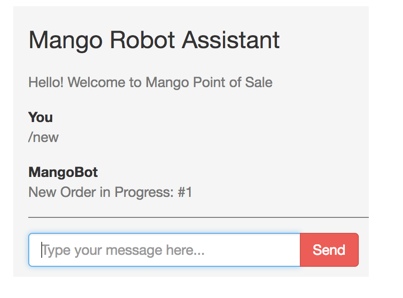
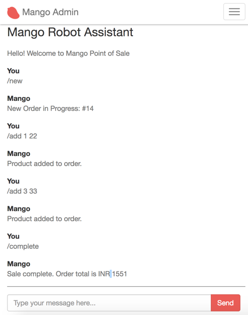

== Implementing Conversational POS


[sidebar]
.User Story #24
--
As an admin, I want to create POS orders through a chat window.
--

In this section, we are going to implement a conversational Point of Sale feature. It's unlikely that we will have something like this in the real world. But for the purpose of our learning, especially to understand the persistent nature of the `socket` struct, this is a good exercise.

The feature we are going to work on behaves like this:

* Admin user types in `/new` to create a new order.
+
System should respond with a message "New Order in Progress: #OrderID".

* Admin user types in `/add productID quantity`.
+
System should find the product by the given id and add the given quantity to the order created previously.
+
If there is no order created previously, then it should give the error message "Please create a new order before proceeding." We are not handling the case of adding invalid product id or missing quantity information to keep our implementation simple. You can try adding these validations as an exercise.

* Admin user types in `/complete`.
+
System should update the order status to "Complete" and respond with a message "Order completed" and it should clear the order details from the socket struct.

Since we already have the necessary JS code to send the commands to the server, we just need to add more functions to handle the new commands described above.

=== Creating Order

.lib/mango_web/channels/bot_channel.ex https://gist.github.com/shankardevy/04fdf946d6a79372f05a1adb1d54a223#file-bot_channel-ex-L18-L23[Link]
```elixir
defmodule MangoWeb.BotChannel do
  use MangoWeb, :channel

  alias Mango.Sales
  (...)

  def handle_in("new", _, socket) do
    order = Sales.create_cart()
    new_socket = socket |> assign(:order, order)
    reply = %{ message: "New Order in Progress: ##{order.id}" }
    {:reply, {:ok, reply}, new_socket}
  end

  def handle_in(_, _payload, socket) do
  (...)
end
```

Ensure that above `handle_in/3` is added before the catch all `handle_in/3` which matches any topic name. When a request comes to this new handler, it creates a new order and stores this order information in the `socket` struct. When we reply, we return this `new_socket` in the tuple. The returned `new_socket` struct becomes the value of the `socket` struct for any subsequent call to this socket.

Let's try this command in the chat window. Type `/new` in the chat window and we get the new order information from the server.



=== Adding Product

.lib/mango_web/channels/bot_channel.ex https://gist.github.com/shankardevy/193802fae44e2610a6ec744eec453183#file-bot_channel-ex-L25-L40[Link]
```elixir
def handle_in("add", payload, socket) do
  item = String.split(payload["message"], " ")

  reply = case [socket.assigns.order, item] do
    [nil, _] ->
      %{ message: "Please create a new order before proceeding." }
    [order, [product_id, quantity]] ->
      {:ok, order} = Sales.add_to_cart(order, %{product_id: product_id, quantity: quantity})
      new_socket = socket |> assign(:order, order)
      %{ message: "Product added to order." }
    _ ->
      %{ message: "Error" }
  end

  {:reply, {:ok, reply}, new_socket}
end
```

In the above code, `socket` should already contain the order information if we have invoked `/new` command prior to invoking the `/add` command. Any value added to `socket` using the `assign/2` function is persisted for the entire life span of the socket connection i.e., until we refresh the browser or navigate to other pages.

With the order information loaded from the `socket` struct, we then proceed with splitting the payload string using a single space to get the product id and quantity information. We pattern match on `[socket.assigns.order, item]` and return appropriate messages for each scenario. We make use of the existing `add_to_cart` function in the `Sales` context module to add products to the order stored in the `socket` struct.

With this above code in place, we can now use the command `/add id quantity`, where `id` is a valid product id and quantity is an integer representing the quantity we wish to add to the order. Here we are using the primary key value of the product to add it to the cart. In a real world scenario this is probably better replaced with the SKU value of the product. Since we have 40 products added through seed data, you can use any integer `1 - 40` as a product `id` for testing this command now.

====
NOTE: As mentioned earlier, we are not validating the product id in this code. If you enter an invalid product `id`, the channel process will crash and restart again. This will also reset the `socket` struct. Any order information stored in the `socket` struct gets lost. If this happens you need to create a new order before trying to add a product again.
====

=== Completing the Order
The last command is relatively simpler. We just need to change the order status to "POS Sale" and remove the order from `socket`. We need a new changeset to update the order to "POS Sale" status.

Add the following function to `lib/mango/sales/sales.ex` to update the order.

.lib/mango/sales/sales.ex https://gist.github.com/shankardevy/c526ba8b9372681031226423b7376ccf#file-sales-ex-L49-L54[Link]
```elixir
def pos_sale_complete(%Order{} = order) do
  order
  |> Order.changeset(%{"status" => "POS Sale"})
  |> Repo.update()
end
```

Now add the `handle_in/3` function for completing the order.

.lib/mango_web/channels/bot_channel.ex https://gist.github.com/shankardevy/d540187673b1dbc6cd9758067be26778[Link]
```elixir
def handle_in("complete", _, socket) do

  reply = case socket.assigns.order do
    nil ->
      %{ message: "Please create a new order before proceeding." }
    order ->
      Sales.pos_sale_complete(order)
      socket = socket |> assign(:order, nil)
      %{ message: "Sale complete. Order total is INR #{order.total}" }
  end

  {:reply, {:ok, reply}, socket}
end
```
We update the `order` using the new function defined in the Sales context and remove the order details from the socket. We pass-in the updated `socket` in our return value so that subsequent calls use the new socket value.

This completes our conversational POS feature. The key point here is that a `socket` struct maintains the state per connection in the server.



Our POS is fully functional. A complete order can be created using the conversational-style POS as shown in the above screenshot.
