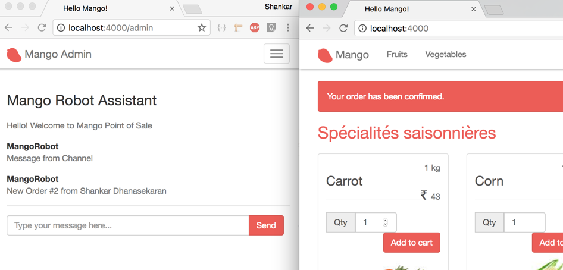
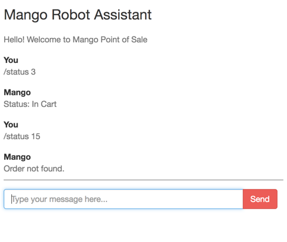

== Iteration Planning

In this chapter, we will work on developing a chat robot which does three things

* Notifies admin for every new order on the online store through a message on the chat window.
* Updates order status by commands received through chat.
* Works as a Point of Sale app by creating orders for customers visiting the store.

We will use Phoenix Channels to work on the above features. Our interface is going to be a typical chat window. However, instead of chatting with a real person, we are going to chat with a virtual robot that can understand and perform certain pre-defined tasks.

Here are some screenshots of what we will work on in this chapter. We will have a chat interface as shown in the images below by the end of this chapter.

.Notified on chat on every new order

.Get Order status by chat

.Create a complete order through chat
image::images/_conversation-c47ea.png[]
