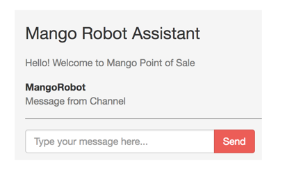

== Getting notified on new orders

[sidebar]
.User Story #22
--
As an admin, I want to see new order notifications on a chat window.
--

The first task we are going to accomplish using Phoenix channels is to get notified whenever there is a new order on the website.

Modify the JS client as shown below:

.assets/js/socket.js
```js
(...)

channel.on('message:new', payload => {
  alert(payload.message)
})

export default socket
```
Let's see it in action, before I explain the code above. Stop any running server and restart using IEx shell `iex -S mix phx.server`. Open http://localhost:4000/admin in a browser and in the IEx console, give the following command:

```
iex> MangoWeb.Endpoint.broadcast! "pos", "message:new", %{message: "Message from Channel"}
```
The moment the above command is given, we get a new alert in the browser window we have opened with the message we sent in the IEx console.

image::images/_new_order-f09ed.png[]

We used the `broadcast!/3` function defined in our Endpoint module to send a message to all clients connected to our server. The function takes in the channel room name as the first argument, the event name as the second argument and a map containing the information we want passed on to the client as the third argument.

In the example above, "pos" is the room name, "message:new" is the event name and the map `%{message: "Message from Channel"}` is the message we want to send across to all clients connected via sockets.

On the JS client end, we have this code:

```js
channel.on('message:new', payload => {
  alert(payload.message)
})
```

The above code gets triggered when the event name matches the first argument given to `channel.on`. So when we broadcasted the message from the IEx shell, the message got received in the JS client. The JS function inside the matching `channel.on` gets triggered giving us the alert popup on the browser.

With these basics in place, we will modify the `channel.on` function to update the chat window with the incoming message, instead of using the JS alert popup.


.assets/js/socket.js https://gist.github.com/shankardevy/906069713b57945314d3c5bc21c03cf9#file-socket-js-L14-L29[Link]
```js
(...)

channel.on('message:new', payload => {
  renderMessage(payload, "MangoRobot")
})

let chatMessages = $("#pos-chat-room")

let renderMessage = (payload, user) => {
  let template = document.createElement("li")
  template.innerHTML = `<div class="chat-body">
      <div class="header">
        <strong class="primary-font">${user}</strong>
      </div>
      <p>${payload.message}</p>
    </div>`
  chatMessages.append(template);
}

export default socket
```

With this above change, let's broadcast a message again from the IEx console.

```
iex> MangoWeb.Endpoint.broadcast! "pos", "message:new", %{message: "Message from Channel"}
```
And this time, we get a nicely formatted message on the chat window.



The broadcast can be done from anywhere in our application code. We used IEx as an example. To notify the admin on a chat window for every new order, we just need to add a broadcast message on the checkout controller.

.lib/mango_web/controllers/checkout_controller.ex https://gist.github.com/shankardevy/4fbdeaadc8dcbe9cc956e784bd80e411[Link]
```elixir
def update(conn, %{"order" => order_params}) do
  order = conn.assigns.cart
  order_params = associate_user_from_session(conn, order_params)
  case Sales.confirm_order(order, order_params) do
    {:ok, order} -> <1>
      message = "New Order ##{order.id} from #{order.customer_name}"
      MangoWeb.Endpoint.broadcast! "pos", "message:new", %{message: message} <2>
      conn
      |> put_flash(:info, "Your order has been confirmed.")
      |> redirect(to: "/")
    (...)
end
```
<1> Modify `{:ok, _}` to `{:ok, order}` so that we can use the order information in the broadcast message.
<2> Add broadcast on successful checkout.

Open two browser windows with the first one loading http://localhost:4000/admin and in the second one complete a checkout process on http://localhost:4000. You will now see a message on the chat window immediately after the order is placed.

image::images/_new_order-9e0a3.png[]
