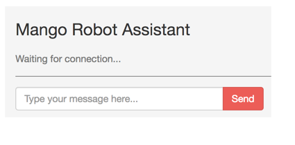
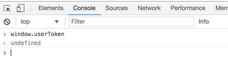
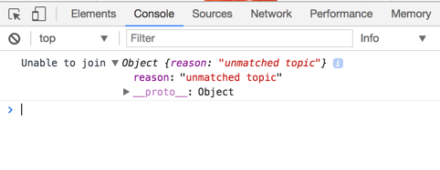
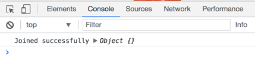

== Setup chat interface and channel

The first step is getting the interface for our chat engine and establishing a connection with the server.
Our chat engine will be available at the `/admin` path. Let's create a simple page at `/admin` and display a chat window. The communication in this chat window will happen through Phoenix Channel.

A Phoenix channel is a stateful keep-alive connection between a JS client and the web server. In a stateless connection like HTTP, the server needs to load information from the cookie file to restore the session data for the client. This happens for every single request. Since Phoenix channels are stateful keep-alive connections, once the client and server perform a handshake with authentication, subsequent messages between the same client and server don't have to authenticate. The server knows the messages are coming from an authenticated channel because the connection between them is not closed.

Phoenix channels make use of Websocket connections natively supported in all modern browsers to keep a two-way communication channel between the client and the server. Since it's a two-way communication channel, the server can also push information to the clients connected to it without the clients asking for the information. This is known as broadcasting.

Create a new route under the `/admin` scope and map it to the `show` action of the DashboardController.

.lib/mango_web/router.ex https://gist.github.com/shankardevy/1f845ca238214bb09ad6bc99d942f410#file-router-ex-L67[Link]
```elixir
scope "/admin", MangoWeb.Admin, as: :admin do
  (...)
  get "/", DashboardController, :show
end
```

Add a controller:

.lib/mango_web/controllers/admin/dashboard_controller.ex https://gist.github.com/shankardevy/5b936e8c1362ed9a0dfbda827ee6e714[Link]
```elixir
defmodule MangoWeb.Admin.DashboardController do
  use MangoWeb, :controller

  def show(conn, _params) do
    render conn, "show.html"
  end
end
```

Add a view:

.lib/mango_web/views/admin/dashboard_view.ex https://gist.github.com/shankardevy/2dedff7b5cf1dc2bce5aafaa8a91f7f9[Link]
```elixir
defmodule MangoWeb.Admin.DashboardView do
  use MangoWeb, :view
end
```

Finally, let's create a template with the following HTML for displaying the chat window. Since the CSS styles are already present, the following HTML will display a nicely themed chat window.

.lib/mango_web/templates/admin/dashboard/show.html.eex https://gist.github.com/shankardevy/a90c10f40f1530508bdb6edaa056d826[Link]
```html
<div class="chat-box">
  <h3>Mango Robot Assistant</h3>
  <ul id="pos-chat-room" class="chat">
    <li>
      <div class="chat-body">
        <p id="intro-text">Waiting for connection...</p>
      </div>
    </li>
  </ul>
  <div class="chat-input input-group">
    <input id="btn-input" type="text" class="form-control" placeholder="Type your message here...">
    <span class="input-group-btn">
      <button class="btn btn-primary" id="btn-chat">
        Send</button>
    </span>
  </div>
</div>
```

Now visit, http://localhost:4000/admin. You should see a chat window as shown below:



The next step in our setup is to establish a connection with the server through proper authentication so that the chat window is accessible only for users with a valid token.

=== Creating a Channel
The main components behind the chat system are

* Phoenix Socket JS client
* Socket
* Channel

The Phoenix Socket JS client is responsible for making a request for socket connections from the browser. If we can compare these components to the router and controllers that we have seen so far, a socket file works like a router file listing all entry points for our chat system and a channel file works like a controller listing all possible actions in that channel. We will see each of these components in detail as we setup our chat system.

The JS client for Phoenix Socket is already available in our project but is not enabled yet. Open `assets/js/app.js` and uncomment the following line:

.assets/js/app.js
```js
(...)
// import socket from "./socket" <1>
```
<1> Remove the preceding `//` to uncomment this line.

The above line imports `socket` from the `socket.js` file present in the same directory. We will work with this file for establishing connection with the server. The contents of `socket.js` is shown below (with comments removed):

.assets/js/socket.js
```js
import {Socket} from "phoenix"
let socket = new Socket("/socket", {params: {token: window.userToken}})
socket.connect()

let channel = socket.channel("topic:subtopic", {})
channel.join()
  .receive("ok", resp => { console.log("Joined successfully", resp) })
  .receive("error", resp => { console.log("Unable to join", resp) })

export default socket
```

Let's understand the first three lines of code in this file.

```
import {Socket} from "phoenix"
```

Here we are importing `Socket` (with capital `S`), a javascript object constructor available in the `phoenix.js` file. This file is already included as a dependency in `package.json` inside the `assets` folder.

.assets/package.json
```js
{
 (...)
  "dependencies": {
    "phoenix": "file:../deps/phoenix", <1>
    "phoenix_html": "file:../deps/phoenix_html"
  }
(...)
}
```
<1> `phoenix.js` included as a dependency.

Using the `Socket` object constructor we will create a new `socket` object (with small `s`) and establish a connection with the server.

```js
let socket = new Socket("/socket", {params: {token: window.userToken}})
```

We are creating a new socket object that connects to the `/socket` path and sends a JSON object as request. A socket connection is created using the Javascript `new` object constructor with the following syntax:

```js
new Socket(socket_path, json_object)
```

If we open up the browser console on Chrome and check for `window.userToken` it will return `undefined`.



So in the above code, we are making a request to the `/socket` path with the JSON value shown below:

```js
{
  token: undefined
}
```

This socket request lands up on the UserSocket module because our `endpoint.ex` module declares that all requests to `/socket` will be handled by the UserSocket module.

.lib/mango_web/endpoint.ex
```elixir
defmodule MangoWeb.Endpoint do
  use Phoenix.Endpoint, otp_app: :mango

  socket "/socket", MangoWeb.UserSocket
  (...)
end
```

Our project already has the `UserSocket` module defined in `lib/mango_web/channels/user_socket.ex` as shown below (with comments removed).

.lib/mango_web/channels/user_socket.ex
```elixir
defmodule MangoWeb.UserSocket do
  use Phoenix.Socket

  transport :websocket, Phoenix.Transports.WebSocket

  def connect(_params, socket) do
    {:ok, socket}
  end

  def id(_socket), do: nil
end
```

The `connect` function defined in this module is the first one to receive the socket request.


```elixir
def connect(_params, socket) do
  {:ok, socket}
end
```
It accepts two arguments: `params` and `socket`. `params` is the value sent by the JS client and `socket` is a struct containing the socket connection information.

`socket` on the server side can be compared to the `conn` struct that we have seen so far in controller modules. Just like how we store variables in the `conn` struct in the controller and retrieve them in the templates, the `socket` struct is a storage place where we can assign various values and then retrieve them when needed.

In the function above, we have ignored the `params` value by prepending it with an ignore operator `_`.

The `connect` function is responsible for deciding if the socket connection can be accepted or not. If it accepts the connection, it should return a tuple `{:ok, socket}` and if it rejects the connection, it should return an atom `:error`.

Currently, the function is accepting all connections without requiring any validation as it just returns a tuple with `:ok`.

We will leave it as it is now and proceed to configuring the Channels. We will come back to this function again to restrict access only for admin users.

If we now visit http://localhost:4000/admin with the browser console opened, we will see the following message:




The message on console says "Unable to join" and the reason being "unmatched topic". This is equivalent to getting a 404 error in an HTTP requests due to an unmatched path in the router.

Let's go back to our JS client and look at the code for creating a connection:
.assets/js/socket.js
```js
import {Socket} from "phoenix"
let socket = new Socket("/socket", {params: {token: window.userToken}})
socket.connect()

let channel = socket.channel("topic:subtopic", {})
channel.join()
  .receive("ok", resp => { console.log("Joined successfully", resp) })
  .receive("error", resp => { console.log("Unable to join", resp) })
```

We have already seen the first three lines of code. The UserSocket module got the request from our socket and it accepted the connection. The error message that we see in the console is "unmatched topic". This is because our JS client is trying to connect to a topic by name "topic:subtopic" which doesn't exist.

```js
let channel = socket.channel("topic:subtopic", {})
```

Topics are managed by creating Channels. We will create a new topic `pos` by creating a new channel and configuring it. The channel name can be any string. Phoenix comes with a Mix task to create a channel. Run the following command to create a channel.

```
→ mix phx.gen.channel Bot
```

.What is a topic?
****
A topic is simply a name for a communication channel. We can create multiple communication channels between the client and the server under different topic names.
****

The above command creates a channel file and test file and produces the following information:
```
* creating lib/mango_web/channels/bot_channel.ex
* creating test/mango_web/channels/bot_channel_test.exs

Add the channel to your `lib/mango_web/channels/user_socket.ex` handler, for example:

    channel "bot:lobby", MangoWeb.BotChannel
```

The file `mango_bot_channel.ex` is the channel file and contains the following code:


.lib/mango_web/channels/bot_channel.ex https://gist.github.com/shankardevy/92720049d6d42f160dbd47ae677f91a8[Link]
```elixir
defmodule MangoWeb.BotChannel do
  use MangoWeb, :channel

  def join("bot:lobby", payload, socket) do
    if authorized?(payload) do
      {:ok, socket}
    else
      {:error, %{reason: "unauthorized"}}
    end
  end

  (...)
end
```

The `join` function takes in three arguments, with the first one being the topic name. Since we want the topic name to be called `pos`, we will modify the above function as shown below:

```elixir
def join("pos", payload, socket) do
  if authorized?(payload) do
    {:ok, socket}
  else
    {:error, %{reason: "unauthorized"}}
  end
end
```

We also need to add an entry in the `UserSocket` module for the new channel that we just created. Open `user_socket.ex` and add the following line:

.lib/mango_web/channels/user_socket.ex https://gist.github.com/shankardevy/d7ceff6a7b1714896a938ebbdf764e40[Link]
```elixir
channel "pos", MangoWeb.BotChannel
```

Back to the JS client, we will modify it to connect to the `pos` topic, instead of the existing `topic:subtopic`.

.assets/js/socket.js https://gist.github.com/shankardevy/3e4d618cd01deef991f9b0c07bd06f3b[Link]
```js
import {Socket} from "phoenix"
let socket = new Socket("/socket", {params: {token: window.userToken}})
socket.connect()

let channel = socket.channel("pos", {}) <1>
channel.join()
  .receive("ok", resp => {
    console.log("Joined successfully", resp)
  })
  .receive("error", resp => { console.log("Unable to join", resp) })
```
<1> Change the topic name to `pos`


Now open http://localhost:4000/admin and we can see the successful connection message on the console.



We have successfully configured a new channel `pos` and connected to it. In the next section, we will work on this established connection to build our chat engine.
